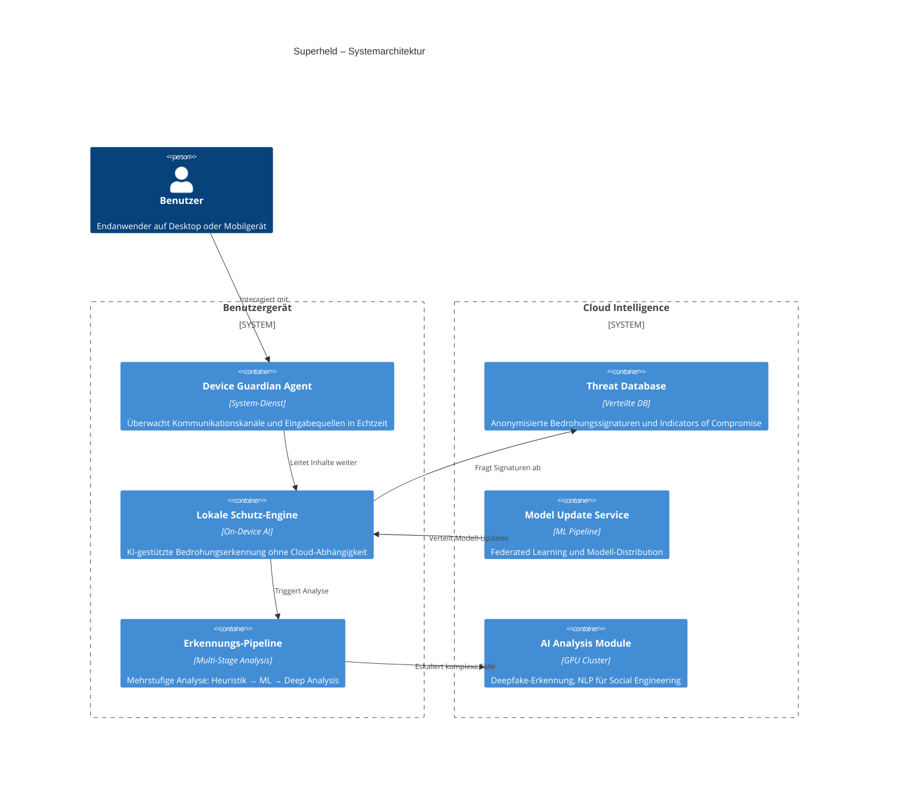
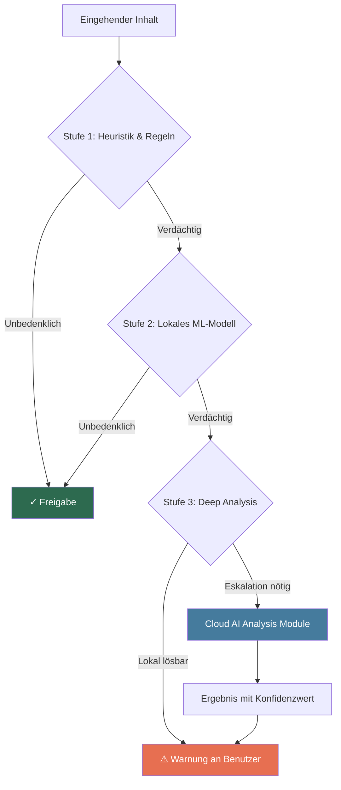

## Architekturübersicht

Die Architektur von superheld.app folgt dem Prinzip **"Local First, Cloud Smart"**: Schutzmaßnahmen greifen direkt auf dem Gerät, bevor sensible Daten jemals das Netzwerk verlassen. Die Cloud dient ausschließlich als Quelle für Modell-Updates und anonymisierte Bedrohungsintelligenz — niemals als Speicherort für personenbezogene Daten.

Das folgende Diagramm zeigt die Kernkomponenten und ihre Beziehungen:

---

## Device Guardian Agent

Der Device Guardian Agent ist ein leichtgewichtiger System-Dienst, der als erste Verteidigungslinie auf dem Gerät des Benutzers arbeitet. Er überwacht relevante Kommunikationskanäle — E-Mail-Eingänge, Messenger-Nachrichten, Browser-Aktivitäten und Datei-Downloads — in Echtzeit.

**Kernaufgaben:**

- **Echtzeitüberwachung** eingehender Nachrichten und Dateien
- **Content Extraction** aus verschiedenen Formaten (E-Mail, Chat, Dokumente)
- **Vorfilterung** offensichtlich unbedenklicher Inhalte zur Ressourcenschonung
- **Benachrichtigungen** bei erkannten Bedrohungen mit kontextbezogenen Handlungsempfehlungen

Der Agent läuft mit minimalen Systemrechten und greift ausschließlich auf die Inhalte zu, die der Benutzer explizit freigegeben hat.

:::note
Der Device Guardian Agent benötigt keine permanente Internetverbindung. Die lokale Schutz-Engine arbeitet vollständig offline — Cloud-Abfragen erfolgen nur für Signatur-Updates und die Eskalation komplexer Fälle.
:::

---

## Lokale Schutz-Engine

Die Lokale Schutz-Engine ist das Herzstück der On-Device-Analyse. Sie führt kompakte, optimierte ML-Modelle direkt auf dem Gerät aus und gewährleistet so Schutz ohne Latenz und ohne Preisgabe persönlicher Daten.

**Eingesetzte Verfahren:**

- **NLP-Modelle** zur Erkennung von Social-Engineering-Mustern in Textnachrichten
- **Bild-Klassifikation** für die Voranalyse verdächtiger Anhänge
- **URL-Analyse** mit Feature-Extraktion (Domain-Alter, Zertifikatsstatus, Ähnlichkeit zu bekannten Marken)
- **Verhaltensanalyse** zur Erkennung ungewöhnlicher Kommunikationsmuster

Die Engine aktualisiert ihre Modelle regelmäßig über den Cloud Model Update Service, wobei nur Modellgewichte übertragen werden — keine Benutzerdaten.

---

## Erkennungs-Pipeline

Die Erkennungs-Pipeline verarbeitet verdächtige Inhalte in drei aufeinander aufbauenden Stufen. Jede Stufe erhöht die Analysetiefe — und nur Inhalte, die eine Stufe nicht eindeutig klassifizieren kann, werden an die nächste weitergereicht.

**Stufe 1 — Heuristik & Regeln:** Schnelle Pattern-Matching-Prüfungen (bekannte Phishing-Domains, verdächtige Absender, offensichtliche Malware-Signaturen). Verarbeitung in unter 10 ms.

**Stufe 2 — Lokales ML-Modell:** Kompakte neuronale Netze analysieren Textinhalt, Absenderverhalten und Metadaten. Verarbeitung in unter 100 ms.

**Stufe 3 — Deep Analysis:** Für Fälle, die das lokale Modell nicht mit ausreichender Konfidenz klassifizieren kann. Umfasst Deepfake-Erkennung in Medieninhalten und fortgeschrittene NLP-Analyse. Bei Bedarf erfolgt eine anonymisierte Eskalation an das Cloud AI Analysis Module.

:::caution
Bei einer Cloud-Eskalation werden ausschließlich anonymisierte Feature-Vektoren übertragen — niemals Klartext-Inhalte, Absenderinformationen oder andere personenbezogene Daten. Der Benutzer wird über jede Eskalation informiert.
:::

---

## Cloud Intelligence

Die Cloud-Komponenten dienen als kollektives Immunsystem: Sie aggregieren anonymisierte Bedrohungsinformationen über alle Installationen hinweg und stellen aktualisierte Erkennungsmodelle bereit.

- **Threat Database:** Enthält Indicators of Compromise (IoC), anonymisierte Bedrohungssignaturen und Reputationsdaten zu Domains und IPs. Wird kontinuierlich aus den anonymisierten Meldungen aller Agenten gespeist.
- **Model Update Service:** Verteilt aktualisierte ML-Modelle an die lokalen Schutz-Engines. Verwendet Federated-Learning-Prinzipien — Modelle werden aus aggregierten Gradienten trainiert, ohne Zugriff auf Rohdaten einzelner Benutzer.
- **AI Analysis Module:** GPU-gestützte Analyse für komplexe Fälle (Deepfake-Erkennung in Video/Audio, fortgeschrittene Social-Engineering-Analyse). Verarbeitet ausschließlich anonymisierte Feature-Vektoren.

---

## Datenfluss & Sicherheitsgrenzen

Die Architektur definiert eine klare Sicherheitsgrenze zwischen dem Benutzergerät und der Cloud. Die folgende Tabelle zeigt, welche Daten diese Grenze passieren und welche ausschließlich lokal verarbeitet werden:

| Datenkategorie | Verarbeitung | Verlässt das Gerät? |
|---|---|---|
| Nachrichteninhalte (E-Mail, Chat) | Lokale Analyse durch Schutz-Engine | **Nein** — niemals |
| Absender- und Empfängerinformationen | Lokale Auswertung | **Nein** — niemals |
| Dateien und Anhänge | Lokaler Scan und Klassifikation | **Nein** — niemals |
| Anonymisierte Feature-Vektoren | Cloud-Eskalation bei unklaren Fällen | **Ja** — nur anonymisiert |
| Bedrohungssignaturen (IoC) | Download aus Threat Database | **Ja** — eingehend, kein Upload persönlicher Daten |
| ML-Modellgewichte | Download vom Model Update Service | **Ja** — eingehend, kein Upload persönlicher Daten |
| Aggregierte Telemetrie | Opt-in-Statistiken (z. B. Anzahl blockierter Bedrohungen) | **Ja** — nur mit expliziter Zustimmung |

:::note
Die Sicherheitsgrenze ist kryptografisch durchgesetzt: Alle Kommunikation zwischen Gerät und Cloud ist mit TLS 1.3 gesichert. Feature-Vektoren werden vor der Übertragung lokal anonymisiert und können nicht auf einzelne Benutzer oder Inhalte zurückgeführt werden.
:::

---

## Datenschutz-Garantien

Die Architektur von superheld.app ist so konzipiert, dass Datenschutz kein Feature ist, sondern eine strukturelle Eigenschaft des Systems:

1. **Keine Rohdaten in der Cloud.** Nachrichteninhalte, Dateien und personenbezogene Metadaten verlassen das Gerät unter keinen Umständen. Die Cloud erhält ausschließlich anonymisierte Feature-Vektoren und aggregierte Statistiken.

2. **Keine Rekonstruktion möglich.** Die Feature-Vektoren, die bei einer Cloud-Eskalation übertragen werden, sind durch Dimensionsreduktion und Differential Privacy so transformiert, dass eine Rücktransformation in den Originalinhalt mathematisch ausgeschlossen ist.

3. **Federated Learning statt zentralem Training.** ML-Modelle werden über aggregierte Gradienten trainiert — kein zentraler Datensatz mit Benutzerdaten existiert.

4. **Vollständige Transparenz.** Jede Cloud-Kommunikation wird im lokalen Aktivitätsprotokoll dokumentiert. Benutzer können jederzeit einsehen, welche Daten übertragen wurden.

5. **Opt-out jederzeit möglich.** Alle Cloud-Funktionen können deaktiviert werden. Die lokale Schutz-Engine arbeitet vollständig autark — mit reduzierter Erkennungsrate bei neuartigen Bedrohungen, aber vollem Datenschutz.

:::caution
Bei deaktivierter Cloud-Anbindung entfällt der Zugang zu aktuellen Bedrohungssignaturen und Modell-Updates. Die lokale Engine arbeitet dann mit dem zuletzt heruntergeladenen Stand. Für maximalen Schutz wird empfohlen, mindestens die Signatur-Updates aktiviert zu lassen.
:::
