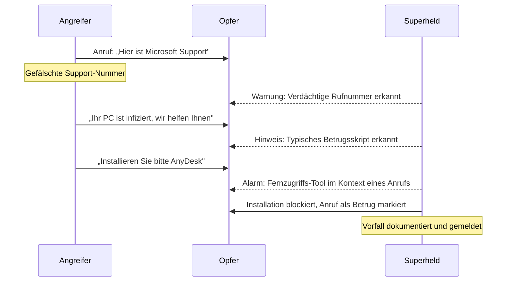

## Übersicht

Die folgenden Szenarien zeigen reale Angriffsmuster, wie sie täglich gegen Privatpersonen eingesetzt werden. Jede Simulation beschreibt den Ablauf eines Angriffs, das damit verbundene Risiko und wie Superheld den Angriff erkennt und abwehrt.

:::note
Alle Szenarien basieren auf dokumentierten Angriffsmustern. Die Erkennungsmechanismen von Superheld arbeiten in Echtzeit und lokal auf dem Gerät — ohne Übertragung persönlicher Daten an externe Server.
:::

---

## 1. Fake IT-Support-Anruf

:::caution
Ein Anrufer gibt sich als Microsoft-Mitarbeiter aus. Er behauptet, dass der Computer des Opfers mit Schadsoftware infiziert sei, und fordert zur Installation eines Fernzugriffs-Tools (z. B. AnyDesk oder TeamViewer) auf. Anschliessend übernimmt der Angreifer die Kontrolle über das Gerät.
:::

**Risiko:** Vollständiger Zugriff auf das Gerät, Diebstahl persönlicher Daten, Bankzugänge und Passwörter. Installation weiterer Schadsoftware. Finanzieller Schaden durch unautorisierte Transaktionen.

:::note
**Erkennung durch Superheld:** Rufnummern-Analyse identifiziert die gespoofte Nummer. Sprachmuster-Erkennung schlägt bei typischen Drucktaktiken und Autoritätsansprüchen an. Bei Erwähnung von Fernzugriffs-Software wird eine zusätzliche Warnstufe ausgelöst.

**Schutzreaktion:** Echtzeit-Warnung während des Gesprächs. Blockierung der Installation von Fernsteuerungs-Tools im Zusammenhang mit dem aktiven Anruf. Dokumentation des Vorfalls zur späteren Meldung.
:::

### Ablaufdiagramm: Fake IT-Support-Anruf

---

## 2. Gefälschte Bank-SMS

:::caution
Das Opfer erhält eine SMS, die angeblich von der Hausbank stammt. Die Nachricht warnt vor einer verdächtigen Kontobewegung und enthält einen Link zu einer täuschend echten, aber gefälschten Login-Seite. Dort werden Zugangsdaten und TAN abgefangen.
:::

**Risiko:** Preisgabe von Online-Banking-Zugangsdaten und TAN. Unautorisierte Überweisungen, vollständige Kontoleerung. Identitätsdiebstahl durch abgegriffene persönliche Daten.

:::note
**Erkennung durch Superheld:** URL-Analyse erkennt die gefälschte Domain (z. B. `sparkasse-sicherheit.xyz` statt `sparkasse.de`). Absendernummer wird mit bekannten Spoofing-Mustern abgeglichen. Der Nachrichteninhalt wird auf typische Phishing-Merkmale geprüft — künstliche Dringlichkeit, generische Anrede, verdächtige Links.

**Schutzreaktion:** Die SMS wird als potenzieller Betrug markiert. Der enthaltene Link wird blockiert. Der Nutzer erhält eine klare Empfehlung, die echte Banking-App oder die offizielle Website direkt zu verwenden.
:::

---

## 3. KI-Stimmbetrug

:::caution
Ein Anruf geht ein, bei dem eine KI-generierte Stimme ein Familienmitglied imitiert. Die gefälschte Stimme klingt emotional aufgelöst und bittet dringend um eine Geldüberweisung — angeblich wegen eines Unfalls oder einer Notsituation im Ausland.
:::

**Risiko:** Überweisung hoher Geldbeträge an Betrüger. Emotionale Belastung durch die vermeintliche Notsituation eines Angehörigen. Preisgabe weiterer persönlicher Informationen im Gespräch.

:::note
**Erkennung durch Superheld:** Stimm-Authentizitätsprüfung analysiert das Audiosignal auf Artefakte synthetischer Sprachgenerierung. Plausibilitätsprüfung gleicht den Anrufkontext mit bekannten Verhaltensmustern ab — ein Familienmitglied, das plötzlich von einer unbekannten Nummer anruft und sofortige Überweisungen fordert, löst eine Warnung aus.

**Schutzreaktion:** Echtzeit-Warnung mit dem Hinweis auf mögliche KI-generierte Stimme. Empfehlung, die Person über einen bekannten Kanal zurückzurufen. Blockierung von Überweisungsversuchen während des verdächtigen Anrufs.
:::

---

## 4. Schädliche App-Installation

:::caution
Der Nutzer erhält eine Benachrichtigung, die ein dringendes System-Update vortäuscht. Die Benachrichtigung leitet zu einer App weiter, die als offizielles Update getarnt ist. Nach der Installation fordert die App umfangreiche Berechtigungen an und beginnt im Hintergrund, Kontakte, Nachrichten, Standortdaten und Tastatureingaben auszulesen.
:::

**Risiko:** Umfassende Überwachung des Geräts — Zugriff auf Kamera, Mikrofon, Kontakte und Nachrichten. Exfiltration sensibler Daten wie Passwörter und Bankdaten. Langfristiger, unbemerkter Zugriff auf das Gerät.

:::note
**Erkennung durch Superheld:** Berechtigungs-Audit erkennt die unverhältnismässige Anforderung von Berechtigungen (Kamera, Mikrofon, Kontakte, SMS) für eine angebliche System-App. Verhaltens-Monitoring identifiziert Datenexfiltration im Hintergrund. Die Installationsquelle ausserhalb des offiziellen App Stores wird als Risikofaktor bewertet.

**Schutzreaktion:** Warnung vor der Installation mit Hinweis auf verdächtige Berechtigungen. Nach Installation: sofortige Benachrichtigung über verdächtige Hintergrundaktivitäten. Empfehlung zur Deinstallation und Anleitung zum Entzug erteilter Berechtigungen.
:::

---

## Weiterführende Informationen

- [Bedrohungsmodell](/experts/threat-model) — Vollständige Übersicht aller Angriffskategorien
- [Privatsphäre & Sicherheit](/experts/privacy-security) — Wie Superheld Daten schützt
- [Konfiguration](/experts/configuration) — Schutzeinstellungen individuell anpassen
