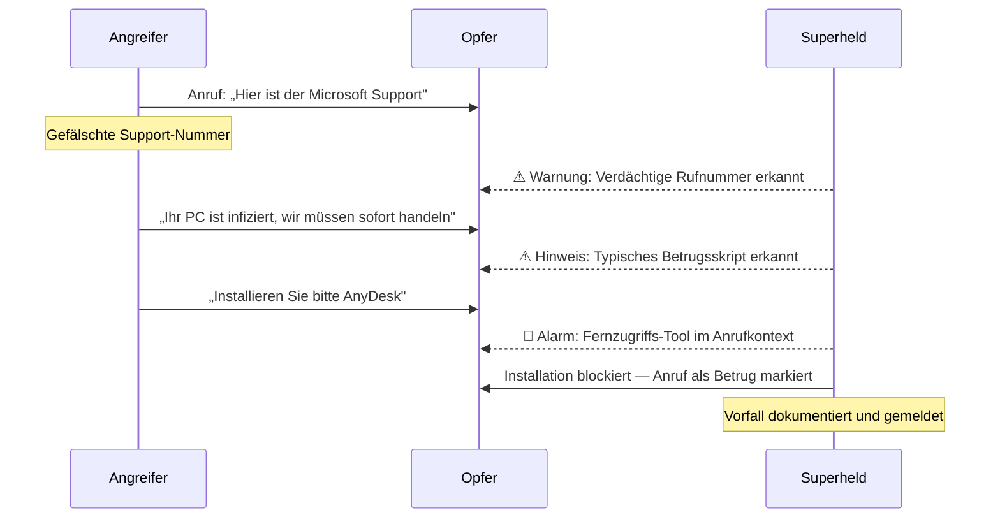

## Übersicht

Die folgenden Szenarien beschreiben reale Angriffsmuster, die täglich gegen Privatpersonen eingesetzt werden. Für jedes Szenario dokumentieren wir die Angriffsbeschreibung, das Risiko, die Erkennungsmethode und die Systemreaktion von Superheld.

:::note
Alle Szenarien basieren auf dokumentierten Angriffsmustern. Die Erkennungsmechanismen von Superheld arbeiten in Echtzeit und lokal auf dem Gerät — ohne Übertragung persönlicher Daten an externe Server.
:::

---

## 1. Fake IT-Support-Anruf

### Angriffsbeschreibung

Ein Anrufer gibt sich als Mitarbeiter von Microsoft, einer Bank oder eines Internetanbieters aus. Er behauptet, dass der Computer des Opfers kompromittiert sei, und drängt auf sofortige Massnahmen. Das Ziel ist, das Opfer zur Installation eines Fernzugriffs-Tools zu bewegen und anschliessend die Kontrolle über das Gerät zu übernehmen.

### Risiko für den Nutzer

Vollständiger Gerätezugriff durch den Angreifer. Diebstahl von Bankzugangsdaten, Passwörtern und persönlichen Dokumenten. Installation von Schadsoftware für langfristigen Zugriff. Finanzieller Schaden durch unautorisierte Transaktionen.

### Erkennungsmethode

Rufnummern-Analyse identifiziert gespoofte Nummern. Sprachmuster-Erkennung schlägt bei typischen Drucktaktiken und Autoritätsansprüchen an. Die Erwähnung von Fernzugriffs-Software im Gesprächskontext löst eine zusätzliche Warnstufe aus.

### Systemreaktion

Echtzeit-Warnung während des Gesprächs. Blockierung der Installation von Fernsteuerungs-Tools im Zusammenhang mit dem aktiven Anruf. Dokumentation des Vorfalls zur späteren Meldung an Behörden.

### Ablaufdiagramm

---

## 2. Remote-Access-Betrug

### Angriffsbeschreibung

Der Angreifer überzeugt das Opfer — oft im Anschluss an einen Fake-Support-Anruf oder über eine gefälschte Warnmeldung im Browser — ein Fernzugriffsprogramm wie TeamViewer, AnyDesk oder QuickSupport zu installieren. Nach der Verbindung navigiert der Angreifer auf dem Gerät des Opfers und greift auf Banking-Portale, Passwort-Manager und persönliche Dateien zu.

### Risiko für den Nutzer

Der Angreifer sieht den Bildschirm in Echtzeit und kann Eingaben tätigen. Bankkonten werden direkt im Browser des Opfers manipuliert. Passwörter und gespeicherte Zugangsdaten werden ausgelesen. Der Angriff wirkt für das Opfer wie „legitime Hilfe".

### Erkennungsmethode

Superheld erkennt die Installation und Aktivierung bekannter Fernzugriffs-Tools. Kontextanalyse verknüpft die Installation mit einem vorausgehenden verdächtigen Anruf oder einer Phishing-Nachricht. Ungewöhnliche Berechtigungsanfragen werden als Risikoindikatoren gewertet.

### Systemreaktion

Warnung vor der Installation mit Hinweis auf den verdächtigen Kontext. Bei aktiver Fernzugriffssitzung: Benachrichtigung über laufende Bildschirmfreigabe. Empfehlung, die Verbindung sofort zu trennen und Passwörter zu ändern.

---

## 3. Schädliche App-Installation

### Angriffsbeschreibung

Das Opfer wird per SMS, E-Mail oder gefälschter Werbeanzeige auf eine App hingewiesen — etwa ein angebliches Sicherheitsupdate, eine Banking-App oder ein nützliches Werkzeug. Die App stammt nicht aus dem offiziellen App Store und fordert nach der Installation umfangreiche Berechtigungen an: Zugriff auf Kontakte, Kamera, Mikrofon und SMS.

### Risiko für den Nutzer

Umfassende Überwachung des Geräts im Hintergrund. Abfangen von SMS-TANs und Zwei-Faktor-Codes. Exfiltration persönlicher Daten wie Fotos, Nachrichten und Standortverlauf. Langfristiger, unbemerkter Zugriff durch den Angreifer.

### Erkennungsmethode

Berechtigungs-Audit erkennt unverhältnismässige Zugriffsanforderungen. Installationsquelle ausserhalb des offiziellen App Stores wird als Risikofaktor bewertet. Verhaltens-Monitoring identifiziert Datenexfiltration und verdächtige Hintergrundprozesse.

### Systemreaktion

Warnung vor der Installation mit Erklärung der angeforderten Berechtigungen. Nach Installation: sofortige Benachrichtigung über verdächtige Hintergrundaktivitäten. Anleitung zur Deinstallation und zum Entzug erteilter Berechtigungen.

---

## 4. Phishing-Link per SMS oder E-Mail

### Angriffsbeschreibung

Das Opfer erhält eine SMS oder E-Mail, die von einer vertrauenswürdigen Stelle zu stammen scheint — etwa der Hausbank, einem Paketdienst oder einer Behörde. Die Nachricht enthält einen Link zu einer täuschend echten Webseite, auf der Login-Daten, Kreditkartennummern oder persönliche Informationen abgefragt werden.

### Risiko für den Nutzer

Preisgabe von Online-Banking-Zugangsdaten und TANs. Kreditkartenmissbrauch durch abgefangene Zahlungsdaten. Identitätsdiebstahl durch Kombination verschiedener persönlicher Daten. Zugang zu weiteren Konten durch Wiederverwendung gleicher Passwörter.

### Erkennungsmethode

URL-Analyse erkennt gefälschte Domains (z. B. `sparkasse-sicherheit.xyz` statt `sparkasse.de`). Absendernummer und -adresse werden mit bekannten Spoofing-Mustern abgeglichen. Nachrichteninhalt wird auf typische Phishing-Merkmale geprüft: künstliche Dringlichkeit, generische Anrede, verdächtige Links.

### Systemreaktion

Die Nachricht wird als potenzieller Betrug markiert. Der enthaltene Link wird blockiert, bevor die Seite geladen wird. Der Nutzer erhält eine Empfehlung, die offizielle App oder Website direkt zu verwenden — niemals über einen zugesandten Link.

---

## Weiterführende Informationen

- [Bedrohungsmodell](/experts/threat-model) — Vollständige Übersicht aller Angriffskategorien
- [Privatsphäre & Sicherheit](/experts/privacy-security) — Wie Superheld Daten schützt
- [Konfiguration](/experts/configuration) — Schutzeinstellungen individuell anpassen
