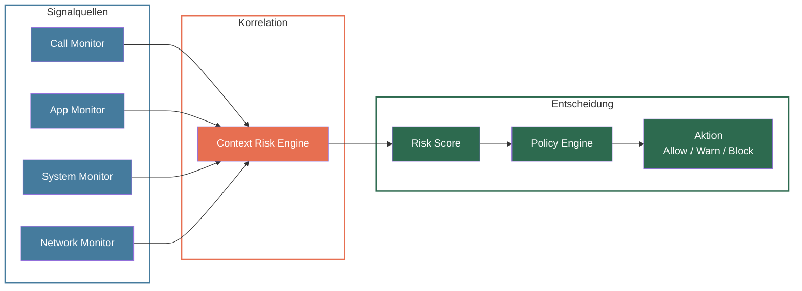

## Übersicht

Die Context Risk Engine ist das Subsystem innerhalb des Device Agent, das mehrere Signale in Echtzeit korreliert, um zusammengesetzte Angriffe zu erkennen, die kein einzelnes Signal allein auslösen würde.

Einzelne Signale — etwa ein eingehender Anruf von einer unbekannten Nummer oder die Installation einer neuen App — können jeweils für sich betrachtet harmlos sein. Erst die **Kombination** von Signalen innerhalb eines bestimmten Zeitfensters ergibt ein Risikobild, das auf einen aktiven Angriff hindeutet.

Die Context Risk Engine wertet situatives Risiko aus, indem sie Signale aus unterschiedlichen Quellen kombiniert:

- **Anrufe** — Anrufstatus, Nummernanalyse, Gesprächsdauer
- **App-Installationen** — Installationsquelle, Berechtigungen, Reputation
- **Systemeinstellungen** — Änderungen an Barrierefreiheit, Geräteadministrator, Entwickleroptionen
- **Netzwerk** — DNS-Anfragen, VPN-Verbindungen, ungewöhnliche Endpunkte

---

## Architektur

Die vier Monitore liefern kontinuierlich normalisierte Signale an die Context Risk Engine. Diese berechnet einen kumulierten **Risk Score**, der an die Policy Engine übergeben wird. Die Policy Engine entscheidet anhand konfigurierbarer Schwellenwerte, welche Aktion ausgeführt wird.

---

## Risikobewertung (Risk Scoring)

Die Context Risk Engine verwendet ein zusammengesetztes Risikomodell mit drei Faktoren:

### Basis-Risikoscore

Jedes Signal besitzt einen eigenen Basis-Risikoscore, der die inhärente Gefährlichkeit des Signals widerspiegelt.

{/* TODO: Exakte Basis-Risikoscores je Signaltyp ergänzen, sobald die Implementierung finalisiert ist. */}

### Temporaler Korrelationsmultiplikator

Treten mehrere Signale innerhalb desselben Zeitfensters auf, wird der kombinierte Risikoscore **multipliziert** statt nur addiert. Je enger die zeitliche Korrelation, desto höher der Multiplikator.

{/* TODO: Exakte Zeitfenstergrößen und Multiplikatorwerte ergänzen (z. B. Fenster = 60 s → Multiplikator 1,5×; Fenster = 10 s → Multiplikator 2,0×). */}

### Kontextmultiplikator

Bestimmte Signalkombinationen sind besonders gefährlich und erhalten einen zusätzlichen Kontextmultiplikator — beispielsweise wenn während eines Anrufs von einer unbekannten Nummer eine Banking-App geöffnet wird.

{/* TODO: Exakte Kontextmultiplikatoren je Signalkombination ergänzen. */}

### Beispielkombinationen

| Signalkombination | Basis-Summe | Temporal | Kontext | Gesamt | Begründung |
|---|---|---|---|---|---|
| Unbekannter Anruf + AnyDesk-Installation | hoch | ×&nbsp;hoch | ×&nbsp;hoch | **kritisch** | Klassisches Fernzugriffs-Szenario |
| Unbekannter Anruf + Banking-App geöffnet | mittel | ×&nbsp;mittel | ×&nbsp;hoch | **hoch** | Potenzieller Vishing-Angriff |
| Sideload-App + Accessibility-Berechtigung | mittel | ×&nbsp;niedrig | ×&nbsp;hoch | **hoch** | Möglicher Overlay-/Keylogger-Angriff |
| Unbekannter Anruf allein | niedrig | — | — | **niedrig** | Einzelsignal, kein Kontext |
| Neue App aus Play Store | niedrig | — | — | **niedrig** | Vertrauenswürdige Quelle, kein Kontext |

{/* TODO: Numerische Risikoscores einsetzen, sobald die Skalierung definiert ist. */}

---

## Beispielszenarien

Die folgenden drei Szenarien zeigen, wie die Context Risk Engine Signale über die Zeit korreliert und den Risikoscore eskaliert.

### Szenario A: Telefonanruf + Fernzugriff-Installation

Ein Angreifer ruft das Opfer an, erzeugt Dringlichkeit und versucht, eine Fernzugriffs-App zu installieren.

| Zeitpunkt | Signal | Quelle | Risikoscore | Aktion |
|---|---|---|---|---|
| T+0 s | Eingehender Anruf von unbekannter Nummer | Call Monitor | niedrig | Allow |
| T+30 s | Dringlichkeitssprache erkannt (Analyse) | Call Monitor | mittel | Allow |
| T+90 s | AnyDesk-Installation gestartet (Sideload) | App Monitor | — | — |
| T+90 s | Korrelation: Anruf + Fernzugriff-App | Context Risk Engine | **kritisch** | **Block** |

**Ergebnis:** Die Context Risk Engine erkennt die Kombination aus laufendem Anruf und Fernzugriff-Installation. Die Installation wird automatisch blockiert, das Ereignis protokolliert und die Schutzperson (Guardian) benachrichtigt.

### Szenario B: Telefonanruf + Banking-Aktion

Ein Angreifer gibt sich als Bankmitarbeiter aus und leitet das Opfer zu einer Überweisung an.

| Zeitpunkt | Signal | Quelle | Risikoscore | Aktion |
|---|---|---|---|---|
| T+0 s | Eingehender Anruf mit gespoofter Banknummer | Call Monitor | niedrig | Allow |
| T+45 s | Banking-App geöffnet | App Monitor | — | — |
| T+45 s | Korrelation: Anruf + Banking-App | Context Risk Engine | hoch | Allow (noch unter Schwelle) |
| T+120 s | Ungewöhnlich hoher Überweisungsbetrag | App Monitor | — | — |
| T+120 s | Korrelation: Anruf + Banking + hoher Betrag | Context Risk Engine | **sehr hoch** | **Warn** |

**Ergebnis:** Dem Benutzer wird eine Warnung mit Kontexterklärung angezeigt. Die Warnung beschreibt, warum die Kombination aus Anruf und Banking-Aktivität verdächtig ist. Der Benutzer entscheidet, ob er fortfahren möchte.

### Szenario C: Unbekannte App + Dringlicher Anruf

Eine per Sideload installierte App fordert kritische Berechtigungen an, gefolgt von einem Anruf.

| Zeitpunkt | Signal | Quelle | Risikoscore | Aktion |
|---|---|---|---|---|
| T+0 s | Unbekannte App per Sideload installiert | App Monitor | mittel | Allow |
| T+10 s | App fordert Accessibility-Berechtigung an | System Monitor | — | — |
| T+10 s | Korrelation: Sideload + Accessibility | Context Risk Engine | hoch | Warn |
| T+60 s | Eingehender Anruf von unbekannter Nummer | Call Monitor | — | — |
| T+60 s | Korrelation: Sideload + Accessibility + Anruf | Context Risk Engine | **kritisch** | **Block** |

**Ergebnis:** Die Accessibility-Berechtigung wird blockiert, die App deaktiviert. Das Gesamtereignis wird als zusammengesetzter Angriff protokolliert und die Schutzperson benachrichtigt.

---

## Policy-Entscheidungen

Der Risk Score wird von der Policy Engine in eine konkrete Aktion übersetzt. Die Schwellenwerte sind pro Policy-Profil konfigurierbar.

| Risk Score | Aktion | Benutzererlebnis |
|---|---|---|
| 0 – 29 | **Allow** | Normaler Betrieb, keine Einschränkung. Ereignis wird protokolliert. |
| 30 – 69 | **Warn** | Warnung mit Kontexterklärung wird angezeigt. Der Benutzer kann die Aktion fortsetzen oder abbrechen. |
| 70 – 100 | **Block** | Automatische Intervention. Die Aktion wird unterbunden, das Ereignis protokolliert und die Schutzperson benachrichtigt. |

{/* TODO: Exakte Schwellenwerte bestätigen. Die oben genannten Bereiche sind vorläufig. */}

:::note
Die Schwellenwerte können pro Policy-Profil angepasst werden. Organisationen oder Schutzpersonen können die Empfindlichkeit erhöhen oder senken — siehe [Konfiguration](/experts/configuration).
:::

---

## Automatische Schutzmaßnahmen

Je nach Ergebnis der Policy-Entscheidung greifen unterschiedliche Schutzmaßnahmen:

### Allow — Protokollierung

- Das Ereignis wird im lokalen Event Log gespeichert.
- Kein sichtbarer Eingriff für den Benutzer.
- Daten stehen für spätere Analyse und Audit zur Verfügung.

### Warn — Warnung mit Kontext

- Dem Benutzer wird eine Warnung angezeigt, die den erkannten Kontext erklärt (z. B. „Sie erhalten gerade einen Anruf und öffnen gleichzeitig Ihre Banking-App").
- Der Benutzer entscheidet selbst, ob er fortfahren oder abbrechen möchte.
- Die Entscheidung des Benutzers wird protokolliert.
- Optional: Schutzperson wird informiert (konfigurierbar).

### Block — Automatische Intervention

- Die erkannte gefährliche Aktion wird automatisch unterbunden (z. B. App-Installation gestoppt, Berechtigung verweigert).
- Das Ereignis wird als hochkritisch protokolliert.
- Die Schutzperson (Guardian) wird sofort benachrichtigt — inklusive Zeitleiste der korrelierten Signale.
- Der Benutzer erhält eine Erklärung, warum die Aktion blockiert wurde.

---

## Weiterführende Informationen

- [Erkennungspipeline](/experts/detection-pipeline) — Signalverarbeitung im Detail
- [Manipulationsschutz](/experts/manipulation-protection) — Schutz vor Social Engineering
- [Fernzugriffsschutz](/experts/remote-access-protection) — Erkennung und Blockierung von Remote-Access-Tools
- [Konfiguration](/experts/configuration) — Policy-Profile und Schwellenwerte anpassen
- [Event-Modell](/experts/event-model) — Struktur und Felder der protokollierten Ereignisse
