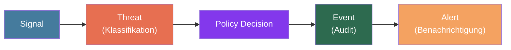

## Übersicht

Superheld basiert auf klar definierten Konzepten, die das gesamte System durchziehen — von der Datenerfassung auf dem Device bis zur Benachrichtigung des Nutzers. Diese Seite definiert die kanonische Terminologie und beschreibt, wie die Konzepte zusammenwirken.

**Kanonische Begriffe:** Signal, Threat, Alert, Event, Policy, Device, Device Agent, Integration, Cloud Enrichment, Confidence Score, Feature-Vektor, Hash.

Diese Begriffe werden in der gesamten Dokumentation einheitlich verwendet. Synonyme sind bewusst vermieden.

---

## Datenlebenszyklus

Jede Sicherheitserkennung durchläuft einen definierten Lebenszyklus:

**Signal → Threat (Klassifikation):** Der Device Agent erfasst Rohdaten (z. B. einen eingehenden Anruf). Die lokale Schutz-Engine extrahiert einen Feature-Vektor aus dem Signal und klassifiziert es als Threat, wenn der resultierende Confidence Score einen konfigurierten Schwellenwert überschreitet.

**Threat → Policy Decision:** Die Policy-Engine prüft den klassifizierten Threat gegen die aktiven Policies des Device. Das Ergebnis bestimmt die Aktion: blockieren, warnen oder zulassen.

**Policy Decision → Event (Audit):** Jede Policy-Entscheidung wird als unveränderlicher Event im Audit-Log festgehalten — unabhängig davon, ob eine Aktion ausgelöst wurde.

**Event → Alert (Benachrichtigung):** Falls die Policy eine Nutzerbenachrichtigung vorsieht, wird ein Alert erzeugt und dem Nutzer mit Kontext, Schweregrad und Handlungsempfehlung angezeigt.

---

## Konzepte im Detail

### Device

Ein **Device** ist jedes Endgerät, das von Superheld geschützt wird: Smartphones, Tablets oder Desktop-Rechner. Jedes Device wird bei der Einrichtung registriert und erhält eine eindeutige Kennung. Der Schutzstatus, die aktiven Policies und die Device-Agent-Version sind pro Device einsehbar.

### Device Agent

Der **Device Agent** ist ein Prozess, der lokal auf jedem geschützten Device läuft. Er überwacht relevante Kommunikationskanäle, erfasst Signals und führt die erste Analysestufe aus — einschließlich Feature-Vektor-Extraktion und lokaler Klassifikation.

:::note
Der Device Agent arbeitet mit minimalen Systemrechten und benötigt keine permanente Internetverbindung. Schutzmaßnahmen greifen auch offline.
:::

### Signal

Ein **Signal** bezeichnet die Rohdaten, die der Device Agent erfasst. Signaltypen umfassen:

- **Anruf-Metadaten** — Rufnummer, Zeitstempel, Anrufdauer
- **App-Installationsereignisse** — neue oder aktualisierte Anwendungen
- **Netzwerkaktivität** — DNS-Anfragen, Verbindungsversuche zu bekannten Malware-Domains
- **Berechtigungsänderungen** — Apps, die neue Systemzugriffe anfordern

Signals werden lokal verarbeitet. Vor einer optionalen Cloud Enrichment werden personenbezogene Daten durch irreversible Transformationen entfernt: Rufnummern und andere Identifikatoren werden per kryptographischem Hash (TODO: konkreten Hash-Algorithmus und Salting-Verfahren mit Engineering-Team klären) in nicht-umkehrbare Werte überführt. Eine Rückberechnung der Originaldaten aus dem Hash ist nach aktuellem Stand der Technik nicht praktikabel.

### Threat

Ein **Threat** ist ein klassifiziertes Sicherheitsereignis, das aus einem oder mehreren Signals abgeleitet wird. Jeder Threat hat:

- einen **Typ** (siehe Bedrohungskategorien unten)
- einen **Schweregrad** (`low`, `medium`, `high`, `critical`)
- einen **Confidence Score** — ein numerischer Wert, der die Zuverlässigkeit der Klassifikation ausdrückt

:::caution
Nicht jedes Signal erzeugt einen Threat. Die Schutz-Engine filtert Signals, deren Confidence Score unter dem konfigurierten Schwellenwert liegt, um Fehlalarme zu minimieren.
:::

### Alert

Ein **Alert** ist eine nutzerseitige Benachrichtigung, die aus einem Threat generiert wird, sofern die zugehörige Policy eine Benachrichtigung vorsieht. Ein Alert enthält:

- Eine verständliche Beschreibung der Bedrohung
- Den Schweregrad und empfohlene Maßnahmen
- Aktionen, die der Nutzer direkt ausführen kann (blockieren, ignorieren, melden)

Alerts werden auf dem Device angezeigt und optional an konfigurierte Integrations weitergeleitet.

### Event

Ein **Event** ist ein unveränderlicher Eintrag im Audit-Log. Jede sicherheitsrelevante Aktion — ob vom System oder vom Nutzer ausgelöst — wird als Event festgehalten. Events sind chronologisch geordnet und können nicht nachträglich verändert oder gelöscht werden.

Events bilden die Grundlage für Compliance-Nachweise und forensische Analysen.

### Policy

Eine **Policy** ist eine Regel, die festlegt, wie die Schutz-Engine auf einen bestimmten Threat-Typ reagiert. Policies steuern:

- Ob ein Threat blockiert, gewarnt oder zugelassen wird
- Ob ein Alert erzeugt wird
- Ob ein Event an eine Integration weitergeleitet wird

Policies können pro Device oder geräteübergreifend definiert werden.

### Integration

Eine **Integration** verbindet Superheld mit einem externen System. Unterstützte Integrationstypen:

- **SIEM** — Events und Threats an ein zentrales Security Information and Event Management weiterleiten
- **Webhooks** — Echtzeit-Benachrichtigungen an beliebige HTTP-Endpunkte senden
- **API** — Programmatischer Zugriff auf Devices, Threats, Alerts und Events

### Cloud Enrichment

**Cloud Enrichment** bezeichnet die optionale Anreicherung lokal extrahierter Feature-Vektoren durch serverseitige Modelle oder Datenbanken. Dabei werden ausschließlich nicht-personenbezogene, gehashte Daten übertragen.

TODO: Federated Learning: Implementierungsstatus mit Engineering-Team klären

### Confidence Score

Der **Confidence Score** ist ein numerischer Wert, den die Schutz-Engine einem klassifizierten Threat zuweist. Er drückt aus, wie zuverlässig die Klassifikation ist. Der Schwellenwert, ab dem ein Signal als Threat eingestuft wird, ist über Policies konfigurierbar.

TODO: Wertebereich und Skala des Confidence Score dokumentieren (z. B. 0.0–1.0 oder 0–100)

### Feature-Vektor

Ein **Feature-Vektor** ist die strukturierte, numerische Repräsentation eines Signals, die als Eingabe für die Klassifikationsmodelle der Schutz-Engine dient. Der Feature-Vektor enthält keine personenbezogenen Rohdaten.

### Hash

Ein **Hash** ist das Ergebnis einer kryptographischen Einwegfunktion, die zur Pseudonymisierung von Identifikatoren (z. B. Rufnummern) verwendet wird. Gehashte Werte ermöglichen den Abgleich mit bekannten Bedrohungsdatenbanken, ohne dass die Originaldaten rekonstruiert werden können.

TODO: Konkreten Hash-Algorithmus und Salting-Verfahren dokumentieren

---

## Kanonische Bedrohungskategorien

TODO: Kanonische Kategorie-Liste mit Produktteam abstimmen

Vorgeschlagene Kategorien:

| Kategorie | Beschreibung |
|---|---|
| `phone_scam` | Betrügerische Anrufe (z. B. Enkeltrick, falsche Behörden) |
| `social_engineering` | Manipulation durch Vertrauenserschleichung über beliebige Kanäle |
| `malicious_app` | Schadsoftware oder Apps mit bösartigem Verhalten |
| `phishing` | Täuschende Nachrichten oder Websites zum Abgreifen von Zugangsdaten |
| `remote_control` | Unerlaubte Fernsteuerung des Device durch Dritte |
| `deepfake` | KI-generierte Stimm- oder Videoimitation zur Identitätstäuschung |

---

## Konzeptübersicht

| Konzept | Definition | Beispiel |
|---|---|---|
| **Device** | Geschütztes Endgerät mit eindeutiger Kennung | iPhone 15 eines Nutzers |
| **Device Agent** | Lokaler Prozess auf dem Device, der Signals erfasst und klassifiziert | Agent v2.4 auf einem Android-Tablet |
| **Signal** | Rohdaten, die der Device Agent erfasst | Eingehender Anruf von einer unbekannten Nummer |
| **Feature-Vektor** | Numerische Repräsentation eines Signals für die Klassifikation | Extrahierte Merkmale eines Anruf-Signals |
| **Threat** | Klassifiziertes Sicherheitsereignis mit Typ, Schweregrad und Confidence Score | `phone_scam` mit Schweregrad `high`, Confidence Score 0.92 |
| **Policy** | Regel, die die Reaktion auf einen Threat-Typ festlegt | Threats vom Typ `remote_control` automatisch blockieren |
| **Event** | Unveränderlicher Audit-Log-Eintrag | „Policy hat Threat #4821 blockiert" |
| **Alert** | Nutzerbenachrichtigung bei einem Threat | „Verdächtiger Anruf erkannt — vermutlich Telefonbetrug" |
| **Integration** | Verbindung zu einem externen System | Webhook an Slack bei kritischen Alerts |
| **Cloud Enrichment** | Optionale serverseitige Anreicherung von Feature-Vektoren | Hash-Abgleich mit Bedrohungsdatenbank |
| **Confidence Score** | Numerischer Zuverlässigkeitswert einer Threat-Klassifikation | 0.92 |
| **Hash** | Kryptographisch pseudonymisierter Identifikator | Gehashte Rufnummer für Datenbank-Abgleich |

---

## Weiterführende Informationen

- [Systemarchitektur](/experts/architecture) — Komponentenübersicht und Deployment-Topologie
- [Bedrohungsmodell](/experts/threat-model) — Angriffskategorien und Erkennungsmethoden
- [Erkennungspipeline](/experts/detection-pipeline) — Vom Signal zum Alert im Detail
- [Schutzrichtlinien](/experts/configuration) — Policies und Integrations einrichten
- [API-Übersicht](/experts/api) — Programmatischer Zugriff auf alle Konzepte
