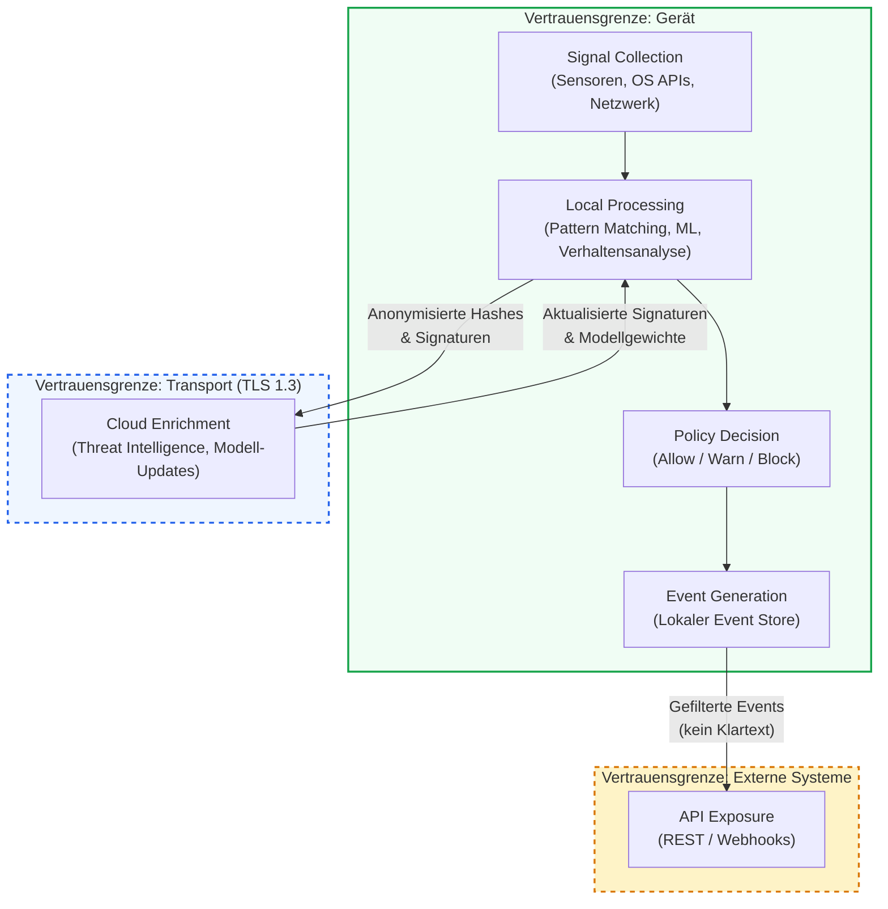

Superheld verarbeitet sensible Kommunikationsdaten — Anrufe, Nachrichten, App-Aktivitäten. Diese Seite dokumentiert den vollständigen Datenfluss vom Moment der Signalerfassung bis zur API-Bereitstellung und macht transparent, welche Daten an welcher Stelle verarbeitet werden und wo die Vertrauensgrenzen verlaufen.

## Datenfluss-Übersicht

Das folgende Diagramm zeigt den vollständigen Datenfluss durch alle Verarbeitungsstufen. Die gestrichelten Linien markieren Vertrauensgrenzen — Punkte, an denen sich das Sicherheitsmodell ändert.

---

## 1. Signal Collection — Signalerfassung

Die erste Stufe erfasst Rohdaten aus den verfügbaren Quellen auf dem Gerät:

- **Gerätesensoren** — Mikrofon-Zugriffsmuster, Bildschirmaktivität, Bewegungssensoren (zur Erkennung von Remote-Control-Szenarien)
- **OS APIs** — Anruflisten, App-Installationen, Accessibility-Events, Benachrichtigungen
- **Netzwerk-Stack** — DNS-Anfragen, Verbindungsmetadaten, TLS-Zertifikatsinformationen

Alle Signale werden ausschließlich lokal erfasst und zwischengespeichert. Rohdaten verlassen zu keinem Zeitpunkt das Gerät.

---

## 2. Local Processing — Lokale Verarbeitung

Die lokale Verarbeitungsstufe analysiert erfasste Signale in drei parallelen Kanälen:

- **Pattern Matching** — Regelbasierter Abgleich gegen bekannte Bedrohungsmuster (bekannte Scam-Nummern, verdächtige App-Signaturen, typische Social-Engineering-Phrasen)
- **ML-Inferenz** — On-Device-Modelle klassifizieren Anrufmuster, App-Verhalten und Netzwerkanomalien in Echtzeit
- **Verhaltensanalyse** — Erkennung ungewöhnlicher Sequenzen: z. B. Anruf von unbekannter Nummer, gefolgt von App-Installation und Accessibility-Freigabe innerhalb kurzer Zeit

:::note
Die gesamte ML-Inferenz läuft auf dem Gerät. Modelle sind für mobile Hardware optimiert (quantisiert, < 50 MB) und verarbeiten Signale in unter 200 ms.
:::

---

## 3. Cloud Enrichment — Cloud-Anreicherung

Die Cloud dient ausschließlich als Quelle für kollektive Bedrohungsintelligenz. Dabei gelten strikte Regeln für die Datenübertragung:

- **Threat-Intelligence-Lookup** — Das Gerät sendet anonymisierte Hashes (z. B. SHA-256 einer Telefonnummer oder App-Signatur) an die Threat-Datenbank und erhält eine Risikobewertung zurück.
- **Modell-Updates** — Aktualisierte ML-Modellgewichte werden als signierte Pakete heruntergeladen und lokal verifiziert.
- **Federated Signals** — Aggregierte, anonymisierte Bedrohungsstatistiken fließen in das kollektive Schutzmodell ein.

:::caution
Es werden ausschließlich anonymisierte Signaturen und Hashes an die Cloud gesendet — niemals Klartext-Inhalte, Telefonnummern im Klartext oder personenbezogene Daten. Jede Cloud-Kommunikation wird im lokalen Aktivitätsprotokoll dokumentiert.
:::

---

## 4. Policy Decision — Richtlinienentscheidung

Basierend auf den Analyseergebnissen trifft die Policy Engine eine Entscheidung:

- **Allow** — Kein Risiko erkannt. Die Aktivität wird ohne Einschränkung zugelassen.
- **Warn** — Erhöhtes Risiko. Der Benutzer erhält eine kontextbezogene Warnung mit Erklärung und Handlungsempfehlung.
- **Block** — Hohes Risiko. Die Aktivität wird aktiv blockiert (z. B. Unterbrechung eines erkannten Scam-Anrufs, Verhinderung einer Fernsteuerungssitzung).

Policies sind konfigurierbar und können durch Administratoren in Unternehmensumgebungen zentral verwaltet werden.

---

## 5. Event Generation — Ereigniserstellung

Jede Policy-Entscheidung erzeugt ein strukturiertes Event, das lokal gespeichert wird:

- **Event-Typ** — Klassifikation der Bedrohung (Scam-Anruf, Malicious App, Remote Control, Social Engineering)
- **Konfidenzwert** — Numerischer Score der Analyse-Engine
- **Entscheidung** — Allow, Warn oder Block
- **Kontext** — Anonymisierte Metadaten zum Auslöser (keine Klartextinhalte)

Events werden lokal verschlüsselt gespeichert (AES-256) und sind nur über authentifizierte Zugriffe abrufbar.

---

## 6. API Exposure — API-Bereitstellung

Für die Integration in bestehende Sicherheitsinfrastrukturen stellt Superheld eine API bereit:

- **REST API** — Abruf von Events, Statistiken und Policy-Status
- **Webhooks** — Echtzeit-Benachrichtigungen bei kritischen Ereignissen
- **SIEM-Integration** — Strukturierte Event-Feeds für Security Information and Event Management Systeme

Die API exponiert ausschließlich aggregierte und anonymisierte Daten — niemals Rohinhalte oder personenbezogene Informationen.

---

## Datentypen-Übersicht

Die folgende Tabelle zeigt alle relevanten Datentypen, ihren Zweck und ob sie das Gerät verlassen:

| Datentyp | Zweck | Verlässt das Gerät | Hinweise |
|---|---|---|---|
| Anruf-Metadaten | Erkennung von Scam-Anrufen | **Teilweise** — SHA-256-Hashes von Rufnummern für Threat-Intelligence-Lookups | Rohe Metadaten (Zeitstempel, Dauer) bleiben lokal |
| App-Signaturen | Erkennung schädlicher Apps | **Ja** — als SHA-256-Hash | Kein App-Name oder Nutzungsverhalten |
| Netzwerkmuster | Erkennung verdächtiger Verbindungen | **Nein** — lokale Analyse | DNS-Hashes können für Lookups gesendet werden |
| Benutzerentscheidungen | Verbesserung der Warnungen | **Nein** — lokales Feedback-Loop | Trainiert das On-Device-Modell |
| Bedrohungsklassifikationen | Event-Erstellung und Reporting | **Ja** — anonymisiert via API | Keine Rückverfolgung auf Einzelpersonen |
| Geräte-Identifikatoren | Lizenzierung und Geräte-Management | **Ja** — verschlüsselt | Kein Tracking, nur Zuordnung zur Lizenz |
| Audio-Inhalte | Echtzeit-Analyse von Anrufen | **Nein** — niemals | Verarbeitung ausschließlich im Arbeitsspeicher |
| Nachrichteninhalte | Erkennung von Social Engineering | **Nein** — niemals | Lokale NLP-Analyse, kein Cloud-Upload |

:::caution
**Kernprinzip: Audio- und Nachrichteninhalte verlassen unter keinen Umständen das Gerät.** Die lokale Analyse arbeitet ausschließlich im flüchtigen Arbeitsspeicher. Nach Abschluss der Analyse werden Rohdaten sofort verworfen. An die Cloud werden zwei Arten von Daten übertragen: (1) **Kryptografische Hashes** (SHA-256) für Threat-Intelligence-Lookups und (2) **anonymisierte Feature-Vektoren** (dimensionsreduziert, mit Differential Privacy) bei Cloud-Eskalation komplexer Fälle. Beide Formate sind nicht auf Originalinhalte rücktransformierbar.
:::
