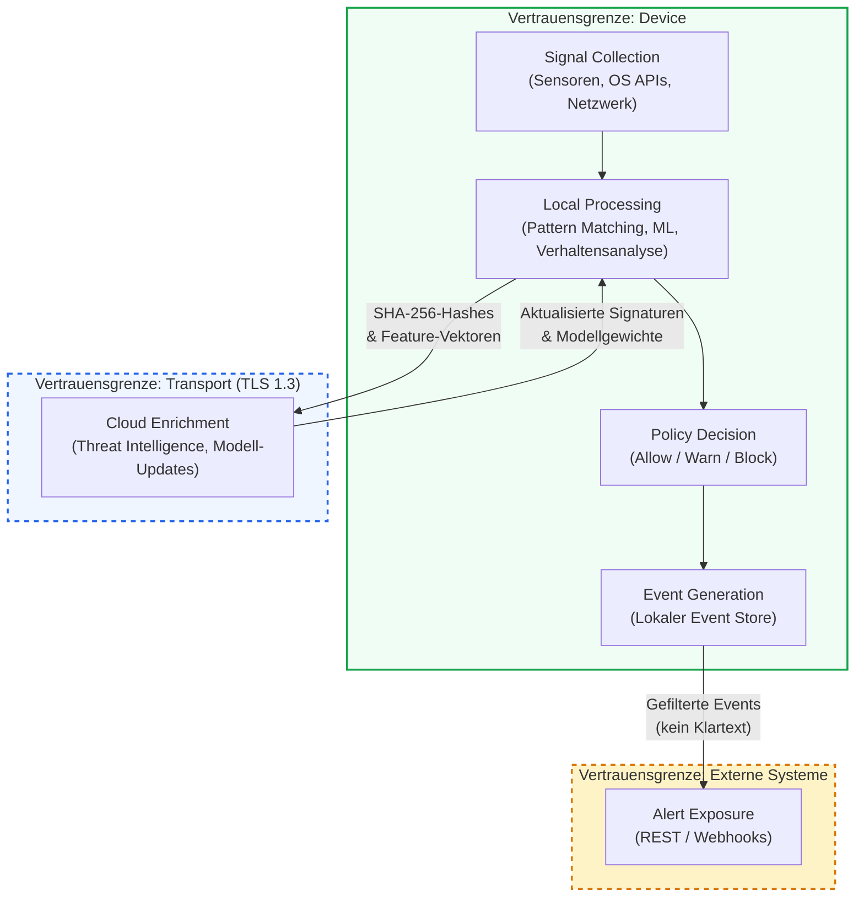

:::note
Diese Seite beschreibt den designierten Datenfluss. Für den aktuellen Implementierungsstand einzelner Komponenten siehe [Roadmap](/experts/roadmap).
:::

Superheld verarbeitet sensible Kommunikationsdaten — Anrufe, Nachrichten, App-Aktivitäten. Diese Seite dokumentiert den Datenfluss vom Moment der Signalerfassung bis zur API-Bereitstellung und macht transparent, welche Daten an welcher Stelle verarbeitet werden und wo die Vertrauensgrenzen verlaufen.

## Datenfluss-Übersicht

Das folgende Diagramm zeigt den Datenfluss durch alle Verarbeitungsstufen. Die gestrichelten Linien markieren Vertrauensgrenzen — Punkte, an denen sich das Sicherheitsmodell ändert.

---

## 1. Signal Collection — Signalerfassung

Die erste Stufe erfasst Signale aus den verfügbaren Quellen auf dem Device:

- **Gerätesensoren** — Mikrofon-Zugriffsmuster, Bildschirmaktivität, Bewegungssensoren (zur Erkennung von Remote-Control-Szenarien)
- **OS APIs** — Anruflisten, App-Installationen, Accessibility-Events, Benachrichtigungen
- **Netzwerk-Stack** — DNS-Anfragen, Verbindungsmetadaten, TLS-Zertifikatsinformationen

Alle Signale werden ausschließlich lokal erfasst und zwischengespeichert. Rohdaten verlassen zu keinem Zeitpunkt das Device.

---

## 2. Local Processing — Lokale Verarbeitung

Die lokale Verarbeitungsstufe analysiert erfasste Signale in drei parallelen Kanälen:

- **Pattern Matching** — Regelbasierter Abgleich gegen bekannte Threat-Muster (bekannte Scam-Nummern, verdächtige App-Signaturen, typische Social-Engineering-Phrasen)
- **ML-Inferenz** — On-Device-Modelle klassifizieren Anrufmuster, App-Verhalten und Netzwerkanomalien und erzeugen einen Confidence Score pro Signal
- **Verhaltensanalyse** — Erkennung ungewöhnlicher Sequenzen: z. B. Anruf von unbekannter Nummer, gefolgt von App-Installation und Accessibility-Freigabe innerhalb kurzer Zeit

---

## 3. Cloud Enrichment — Cloud-Anreicherung (optional)

Die Cloud dient als Quelle für kollektive Threat Intelligence. Es werden zwei Arten von Daten an die Cloud übertragen:

### 3a. SHA-256-Hashes — Threat-Intelligence-Lookups

Das Device sendet kryptografische Hashes (SHA-256) — z. B. von Telefonnummern oder App-Signaturen — an die zentrale Threat Database. Die Antwort enthält Risikobewertungen (z. B. ob eine Rufnummer in bekannten Betrugskampagnen vorkommt).

### 3b. Anonymisierte Feature-Vektoren — Cloud-Eskalation

Bei komplexen Fällen, die lokal nicht eindeutig klassifizierbar sind, sendet der Device Agent anonymisierte Feature-Vektoren an die Cloud zur weiteren Analyse. Feature-Vektoren sind dimensionsreduzierte numerische Repräsentationen, die aus den Signalen abgeleitet werden.

> TODO: Genaue Definition der Feature-Vektoren dokumentieren — welche Merkmale enthalten sind, welche Transformationsverfahren angewendet werden, welche Dimensionsreduktion erfolgt.

Die verwendeten Transformationen sind nach aktuellem Stand der Technik nicht invertierbar — eine Rekonstruktion der Originaldaten aus den Feature-Vektoren ist nicht möglich.

> TODO: Genaue Transformationsverfahren und Differential-Privacy-Parameter dokumentieren.

### Weitere Cloud-Kommunikation

- **Modell-Updates** — Aktualisierte ML-Modellgewichte werden als signierte Pakete heruntergeladen und lokal verifiziert.
- **Federated Learning** — Aggregierte, anonymisierte Threat-Statistiken fließen in das kollektive Schutzmodell ein.

> TODO: Federated Learning — Implementierungsstatus klären. Aktuell dokumentiert als Architekturprinzip; unklar ob in Produktion.

:::caution
Es werden ausschließlich Hashes und anonymisierte Feature-Vektoren an die Cloud gesendet — niemals Klartext-Inhalte, Telefonnummern im Klartext oder personenbezogene Daten. Jede Cloud-Kommunikation wird im lokalen Aktivitätsprotokoll dokumentiert.
:::

---

## 4. Policy Decision — Richtlinienentscheidung

Basierend auf den Analyseergebnissen und dem Confidence Score trifft die Policy Engine eine Entscheidung:

- **Allow** — Kein Risiko erkannt. Die Aktivität wird ohne Einschränkung zugelassen.
- **Warn** — Erhöhtes Risiko. Der Benutzer erhält einen Alert mit Erklärung und Handlungsempfehlung.
- **Block** — Hohes Risiko. Die Aktivität wird aktiv blockiert (z. B. Unterbrechung eines erkannten Scam-Anrufs, Verhinderung einer Fernsteuerungssitzung).

Policies sind konfigurierbar und können durch Administratoren in Unternehmensumgebungen zentral verwaltet werden.

---

## 5. Event Generation — Ereigniserstellung

Jede Policy-Entscheidung erzeugt ein strukturiertes Event, das lokal gespeichert wird:

- **Event-Typ** — Klassifikation des Threat (Scam-Anruf, Malicious App, Remote Control, Social Engineering)
- **Confidence Score** — Numerischer Score der Analyse-Engine (0.0–1.0)
- **Entscheidung** — Allow, Warn oder Block
- **Kontext** — Anonymisierte Metadaten zum Auslöser (keine Klartextinhalte)

Events werden lokal verschlüsselt gespeichert (AES-256) und sind nur über authentifizierte Zugriffe abrufbar.

---

## 6. Alert Exposure — Alert-Bereitstellung

Für die Integration in bestehende Sicherheitsinfrastrukturen stellt Superheld eine API bereit:

- **REST API** — Abruf von Events, Statistiken und Policy-Status
- **Webhooks** — Echtzeit-Alerts bei kritischen Threats
- **SIEM-Integration** — Strukturierte Event-Feeds für Security Information and Event Management Systeme

Die API exponiert ausschließlich aggregierte und anonymisierte Daten — keine Rohinhalte oder personenbezogene Informationen.

---

## Datentypen-Übersicht

Die folgende Tabelle zeigt alle relevanten Datentypen, ihren Zweck und ob sie das Device verlassen:

| Datentyp | Zweck | Verlässt das Device | Form und Umfang |
|---|---|---|---|
| Anruf-Metadaten | Erkennung von Scam-Anrufen | **Teilweise** | SHA-256-Hashes von Rufnummern werden für Threat-Intelligence-Lookups gesendet. Rohe Metadaten (Zeitstempel, Dauer) bleiben lokal. |
| App-Signaturen | Erkennung schädlicher Apps | **Ja** | SHA-256-Hash der App-Signatur. Kein App-Name, kein Nutzungsverhalten. |
| Netzwerkmuster | Erkennung verdächtiger Verbindungen | **Teilweise** | Analyse erfolgt lokal. SHA-256-Hashes von DNS-Anfragen können für Threat-Intelligence-Lookups gesendet werden. |
| Komplexe Analysefälle | Cloud-Eskalation bei uneindeutiger lokaler Klassifikation | **Ja** | Anonymisierte Feature-Vektoren (dimensionsreduziert, nicht invertierbar). Keine Klartextdaten. |
| Benutzerentscheidungen | Verbesserung der lokalen Warnungen | **Nein** | Verbleiben lokal im Feedback-Loop des On-Device-Modells. |
| Threat-Klassifikationen | Event-Erstellung und Reporting | **Ja** | Anonymisierte Events via API. Keine Rückverfolgung auf Einzelpersonen. |
| Device-Identifikatoren | Lizenzierung und Device-Management | **Ja** | Verschlüsselt übertragen. Kein Tracking, nur Lizenzzuordnung. |
| Audio-Inhalte | Echtzeit-Analyse von Anrufen | **Nein** | Verarbeitung ausschließlich im Arbeitsspeicher. Werden nach Analyse sofort verworfen. |
| Nachrichteninhalte | Erkennung von Social Engineering | **Nein** | Lokale NLP-Analyse. Werden nach Analyse sofort verworfen. |

:::caution
**Kernprinzip: Audio- und Nachrichteninhalte verlassen unter keinen Umständen das Device.** Die lokale Analyse arbeitet ausschließlich im flüchtigen Arbeitsspeicher. Nach Abschluss der Analyse werden Rohdaten sofort verworfen. An die Cloud werden ausschließlich zwei Datentypen übertragen: (1) **Kryptografische Hashes** (SHA-256) für Threat-Intelligence-Lookups und (2) **anonymisierte Feature-Vektoren** bei Cloud-Eskalation komplexer Fälle.
:::
