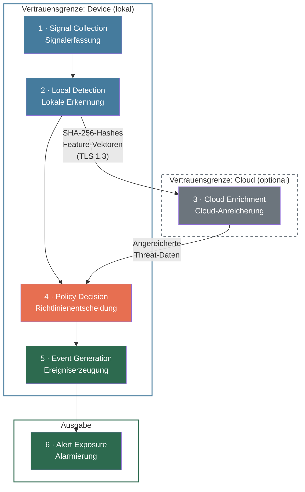

## Übersicht

Die Erkennungspipeline des Device Agent verarbeitet Signale in sechs aufeinander aufbauenden Stufen — von der Signalerfassung bis zur Alert-Ausgabe. Jede Stufe hat definierte Ein- und Ausgaben sowie spezifische Sicherheitseigenschaften.

:::note
Cloud Enrichment (Stufe 3) ist optional und gestrichelt dargestellt. Die Stufen 1, 2, 4, 5 laufen vollständig auf dem Device — Cloud Enrichment verbessert die Erkennung, ist aber nicht erforderlich.
:::

---

## 1 · Signal Collection — Signalerfassung

**Zweck:** Rohdaten aus allen relevanten Quellen des Device sammeln, normalisieren und für die Analyse vorbereiten.

| | Beschreibung |
|---|---|
| **Eingaben** | Betriebssystem-Events (Anrufstatus, App-Installationen, Berechtigungsänderungen), Netzwerkverkehr (DNS-Anfragen, Verbindungsaufbau), Benutzeraktionen (App-Starts, Eingaben in Sicherheitsdialoge) |
| **Ausgaben** | Normalisierte Signale mit Zeitstempel, Quelltyp, Plattformkennung und Kontextmetadaten |

Die Signalerfassung läuft als Hintergrundprozess auf dem Device. Signale werden in einem lokalen Ringpuffer zwischengespeichert, sodass auch bei hoher Systemlast keine Signale verloren gehen.

**Sicherheitseigenschaften:**

- **Datenminimierung ab Stufe 1** — Personenbezogene Inhalte (z. B. Nachrichtentexte, Anrufernamen) werden bereits bei der Erfassung auf das für die Analyse notwendige Minimum reduziert. Nur strukturelle Merkmale (Länge, Häufigkeit, Zeitpunkte) fließen weiter.
- **Kein Netzwerkzugriff** — Die Signalerfassung arbeitet vollständig lokal. Keine Daten verlassen das Device in dieser Stufe.
- **Ringpuffer statt Persistenz** — Rohsignale werden nicht dauerhaft gespeichert. Der Ringpuffer überschreibt ältere Einträge automatisch, wodurch die Angriffsfläche für Datenexfiltration begrenzt wird.
- **Plattformberechtigungen** — Jede Signalquelle erfordert eine explizite OS-Berechtigung (z. B. CallKit auf iOS, Accessibility Service auf Android). Ohne erteilte Berechtigung bleibt die Quelle inaktiv.

---

## 2 · Local Detection — Lokale Erkennung

**Zweck:** Normalisierte Signale klassifizieren und Threat-Kandidaten mit Confidence Score identifizieren.

| | Beschreibung |
|---|---|
| **Eingaben** | Normalisierte Signale aus Stufe 1 |
| **Ausgaben** | Threat-Kandidaten mit Confidence Score (0.0–1.0), Bedrohungskategorie (`phone_scam`, `social_engineering`, `malicious_app`, `phishing`, `remote_control`, `deepfake`) und erkannten Indikatoren |

Die lokale Erkennung kombiniert zwei Erkennungsmethoden:

- **Regelbasierte Heuristiken** — Deterministische Muster (z. B. Spoofing-Rufnummern, bekannte Betrugs-Domains, STIR/SHAKEN-Attestierung). Ziel-Inferenzzeit: < 10 ms.
- **ML-Modelle** — Quantisierte neuronale Netze (< 50 MB) für komplexere Klassifikation (Social-Engineering-Muster in Textnachrichten, verdächtiges App-Verhalten). Ziel-Inferenzzeit: < 100 ms pro Signal.

> TODO: Performance-Kennzahlen mit Engineering bestätigen (Modellgröße < 50 MB, Heuristik < 10 ms, ML < 100 ms, Gesamtlatenz < 200 ms)

**Confidence-Score-Schwellenwerte (Standard):**

| Confidence Score | Aktion | Bedeutung |
|---|---|---|
| 0.0–0.3 | **Allow** | Signal unauffällig, keine Bedrohung erkannt |
| 0.3–0.7 | **Warn** | Verdächtig — Benutzer wird informiert, kann entscheiden |
| 0.7–1.0 | **Block** | Hohe Konfidenz — automatische Schutzmaßnahme |

> TODO: Standard-Schwellenwerte mit Produktteam bestätigen. Sind Schwellenwerte pro Bedrohungskategorie unterschiedlich?

Schwellenwerte sind über die [Policy Engine](/experts/configuration) konfigurierbar.

**Sicherheitseigenschaften:**

- **Vollständig lokal** — Weder Nachrichteninhalte noch Anrufdaten noch Klassifikationsergebnisse verlassen das Device in dieser Stufe.
- **Modellintegrität** — ML-Modelle werden signiert ausgeliefert (OTA-Updates über App Store / Play Store). Der Device Agent verifiziert die Signatur vor dem Laden. Manipulierte Modelle werden abgelehnt.
- **Keine Umgehung durch Downgrade** — Der Agent akzeptiert keine Modellversion, die älter ist als die aktuell geladene (Rollback-Schutz).
- **Adversarial Robustness** — Quantisierte Modelle sind durch ihre reduzierte Präzision weniger anfällig für Gradient-basierte Angriffe. Heuristiken sind regelbasiert und damit nicht durch adversariale Eingaben beeinflussbar.

> TODO: Modellsignatur-Mechanismus mit Engineering bestätigen (Signaturverfahren, Rollback-Schutz-Implementierung)

---

## 3 · Cloud Enrichment — Cloud-Anreicherung (optional)

**Zweck:** Erkennungsqualität durch globale Threat Intelligence verbessern, ohne Klartextdaten an die Cloud zu übermitteln.

| | Beschreibung |
|---|---|
| **Eingaben** | (1) **SHA-256-Hashes** — kryptografische Hashes von Telefonnummern, App-Signaturen oder URLs für Threat-Intelligence-Lookups. (2) **Anonymisierte Feature-Vektoren** — dimensionsreduzierte, transformierte Repräsentationen bei Eskalation lokal uneindeutiger Fälle. |
| **Ausgaben** | Angereicherte Threat-Daten: globale Verbreitungsinformationen, bekannte Kampagnenzuordnungen, aktuelle Indicators of Compromise (IoC) |

Diese Stufe ist vollständig optional und kann vom Benutzer oder Administrator deaktiviert werden. Es werden ausschließlich zwei Datentypen an die Cloud gesendet:

1. **Kryptografische Hashes (SHA-256)** — Die Cloud vergleicht Hashes gegen die zentrale Threat Database und antwortet mit Risikobewertung und Kontextinformationen (z. B. ob eine Rufnummer in bekannten Betrugskampagnen vorkommt). Klartext-Rufnummern oder -Inhalte werden nicht übertragen.

2. **Anonymisierte Feature-Vektoren** — Bei Fällen, die lokal nicht eindeutig klassifizierbar sind, werden Feature-Vektoren zur Cloud-Eskalation gesendet. Diese durchlaufen Dimensionsreduktion und Transformation, bevor sie das Device verlassen.

> TODO: Genaue Definition der Feature-Vektoren dokumentieren — Transformationen, Dimensionalität, Differential-Privacy-Parameter (ε, δ). Siehe [IMPLEMENTATION_FACTS §4](/IMPLEMENTATION_FACTS.md).

**Sicherheitseigenschaften:**

- **Kein Klartext verlässt das Device** — Ausschließlich Hashes und transformierte Vektoren werden übertragen. Eine Rekonstruktion der Originaldaten aus SHA-256-Hashes ist nach aktuellem Stand der Technik nicht praktikabel.
- **Transport: TLS 1.3** — Alle Verbindungen zur Cloud verwenden TLS 1.3 mit Certificate Pinning. Downgrade auf ältere TLS-Versionen wird abgelehnt.
- **Opt-out ohne Funktionsverlust** — Wird Cloud Enrichment deaktiviert, arbeitet die Pipeline mit den lokal verfügbaren Modellen und Signaturen weiter. Die Erkennungsrate kann sinken, aber die grundlegende Schutzfunktion bleibt erhalten.
- **Keine Korrelation** — Cloud-Anfragen enthalten keine Device-ID oder Benutzerkennung. Lookups sind zustandslos und nicht über mehrere Anfragen hinweg verknüpfbar.

> TODO: Bestätigen, ob Cloud-Anfragen tatsächlich keine Device-ID enthalten oder ob ein anonymisierter Token verwendet wird.

---

## 4 · Policy Decision — Richtlinienentscheidung

**Zweck:** Konfigurierte Schutzrichtlinien auf Threat-Kandidaten anwenden und eine deterministische Aktionsentscheidung treffen.

| | Beschreibung |
|---|---|
| **Eingaben** | Threat-Kandidaten mit Confidence Scores (aus Stufe 2) + angereicherte Threat-Daten (aus Stufe 3, falls verfügbar) + konfigurierte Policies (Schwellenwerte, Allowlists, Blocklists, Profilregeln) |
| **Ausgaben** | Aktionsentscheidung je Kandidat: **Allow**, **Warn** oder **Block** — inklusive Verweis auf die auslösende Policy |

Die Policy Engine evaluiert jeden Threat-Kandidaten gegen die konfigurierte Policy-Hierarchie:

1. **Blocklists / Allowlists** — Sofortige Entscheidung bei bekannten Einträgen (höchste Priorität).
2. **Profilregeln** — Familienprofile (Kind, Jugendlich, Senior) definieren profilspezifische Schwellenwerte und Einschränkungen.
3. **Organisationsrichtlinien** — In MDM-verwalteten Umgebungen können Administratoren organisationsweite Mindeststandards definieren, die Benutzer nicht unterschreiten können.
4. **Benutzerdefinierte Schwellenwerte** — Innerhalb des erlaubten Rahmens können Benutzer eigene Empfindlichkeiten anpassen.

**Sicherheitseigenschaften:**

- **Deterministisch und nachvollziehbar** — Jede Entscheidung dokumentiert die auslösende Regel, den Confidence Score und die Policy-ID. Gleiche Eingaben erzeugen immer gleiche Ausgaben.
- **Fail-closed** — Kann die Policy Engine einen Threat-Kandidaten nicht evaluieren (z. B. korrupte Policy-Datei), wird standardmäßig **Block** angewendet.
- **Policy-Integrität** — Policy-Dateien werden bei jedem Laden gegen eine Prüfsumme validiert. Manipulierte Policies werden abgelehnt und die letzte gültige Konfiguration wird beibehalten.
- **Privilegien-Hierarchie** — Administratorrichtlinien können von Endbenutzern nicht überschrieben werden. Das verhindert, dass ein Angreifer den Schutz über die UI herabsetzt.

---

## 5 · Event Generation — Ereigniserzeugung

**Zweck:** Jede Pipeline-Entscheidung als unveränderlichen Audit-Log-Eintrag persistieren.

| | Beschreibung |
|---|---|
| **Eingaben** | Aktionsentscheidungen aus Stufe 4 mit allen Kontextdaten (Threat-Kategorie, Confidence Score, angewandte Policy, Zeitstempel) |
| **Ausgaben** | Unveränderliche [Events](/experts/event-model) im lokalen Event Store — mit `event_id`, Zeitstempel, Entscheidung, `policy_id`, `threat_category`, `severity` und `indicators` |

Jede Entscheidung — auch **Allow** — wird als Event-Datensatz im lokalen Event Store gespeichert. Events folgen dem kanonischen [Event-Schema](/experts/event-model) und bilden den Audit-Trail für Compliance-Anforderungen, Forensik und nachträgliche Analyse.

**Sicherheitseigenschaften:**

- **Append-only** — Der Event Store ist ein ausschließlich wachsendes Log. Einmal geschriebene Events können weder überschrieben noch gelöscht werden (bis zur konfigurierten Retention-Grenze).
- **Kryptografische Verkettung** — Jeder Event-Datensatz enthält den Hash des vorherigen Eintrags. Nachträgliche Manipulation (Löschen, Umordnen, Einfügen) ist erkennbar.
- **Lokale Persistenz** — Events werden zunächst lokal gespeichert. Die Synchronisierung mit der Cloud (für API-Zugriff und Webhooks) erfolgt erst in Stufe 6 und nur für Events, die die konfigurierte Severity-Schwelle überschreiten.
- **Datensparsamkeit** — Events enthalten die für Audit und Analyse notwendigen Felder, aber keine Klartext-Nachrichteninhalte oder Anrufaufzeichnungen. Die `indicators`-Felder referenzieren Muster, nicht Originaldaten.

> TODO: Retention-Zeiträume bestätigen. Siehe [IMPLEMENTATION_FACTS §6](/IMPLEMENTATION_FACTS.md).

---

## 6 · Alert Exposure — Alarmierung

**Zweck:** Erkannte Threats an Benutzer, Administratoren und externe Systeme ausliefern.

| | Beschreibung |
|---|---|
| **Eingaben** | Events aus Stufe 5, die die Severity-Schwelle für Alarmierung überschreiten |
| **Ausgaben** | Push-Benachrichtigungen an Endbenutzer, Webhook-Payloads an konfigurierte HTTPS-Endpunkte, API-Antworten über `GET /api/v1/events` |

Die Alert-Ausgabe stellt sicher, dass erkannte Threats die richtigen Empfänger über die richtigen Kanäle erreichen:

| Kanal | Empfänger | Zustellgarantie |
|---|---|---|
| **Push-Benachrichtigung** | Endbenutzer (Gerät) | Best-effort über OS-Push-Dienst |
| **In-App-Alert** | Endbenutzer (Gerät) | Lokal, sofort verfügbar |
| **Familien-Alert** | Elternteil / Vormund | Push + optionale E-Mail |
| **Webhook** | SIEM, Ticketing, benutzerdefinierte Endpunkte | At-least-once, HMAC-signiert ([Details](/experts/webhooks)) |
| **API-Polling** | Integratoren, SOC-Teams | Cursor-basiert über `/events` ([Details](/experts/integrator-quickstart)) |

**Sicherheitseigenschaften:**

- **Webhook-Signierung** — Alle Webhook-Payloads werden mit HMAC-SHA256 signiert (`X-Superheld-Signature`). Empfänger müssen die Signatur mittels Constant-Time-Vergleich verifizieren. Details: [Webhooks](/experts/webhooks).
- **Keine Alert-Unterdrückung** — Ein kompromittierter Prozess kann lokale Alerts nicht unterdrücken, da Push-Benachrichtigungen über den OS-Push-Dienst (APNs / FCM) zugestellt werden, nicht über die App selbst.
- **Zustellgarantie für Webhooks** — Fehlgeschlagene Webhook-Zustellungen werden mit exponentiellem Backoff wiederholt. Nach Erschöpfung der Retries erfolgt eine Eskalation in die Dead Letter Queue (DLQ).
- **Offline-Pufferung** — Bei fehlender Netzwerkverbindung werden Webhook-Payloads und API-Synchronisierungen lokal zwischengespeichert und bei Wiederherstellung der Verbindung in chronologischer Reihenfolge nachgeliefert.

> TODO: Webhook-Header (`X-Superheld-Timestamp`, `X-Superheld-Event-Id`) und Retry-Verhalten bestätigen. Siehe [API_FACTS §5](/API_FACTS.md).

---

## Offline-Verhalten

Der Device Agent ist für den Offline-Betrieb konzipiert. Bei fehlender Netzwerkverbindung gilt:

| Stufe | Verfügbarkeit | Auswirkung |
|---|---|---|
| 1 · Signal Collection | Vollständig lokal | Keine Einschränkung |
| 2 · Local Detection | Vollständig lokal | Erkennung basiert auf zuletzt geladenem Modell- und Signaturstand |
| 3 · Cloud Enrichment | **Übersprungen** | Kein Zugriff auf Threat Database, keine Feature-Vektor-Eskalation. Erkennungsrate sinkt bei neuartigen Bedrohungen |
| 4 · Policy Decision | Vollständig lokal | Keine Einschränkung |
| 5 · Event Generation | Vollständig lokal | Events werden im lokalen Event Store gespeichert |
| 6 · Alert Exposure | Teilweise eingeschränkt | Lokale Alerts funktionieren. Webhooks und API-Zustellung werden gepuffert und bei Reconnect nachgeliefert |

> TODO: Auswirkung auf Erkennungsrate ohne Cloud Enrichment quantifizieren (z. B. Baseline-Erkennungsrate vs. mit Enrichment)

---

## End-to-End-Latenz

Die Pipeline ist auf Echtzeit-Schutz ausgelegt. Ziel-Latenzen:

| Pfad | Ziel-Latenz |
|---|---|
| Signal → Block (lokal, ohne Cloud) | < 200 ms |
| Signal → Block (mit Cloud Enrichment) | < 500 ms |
| Event → Webhook-Zustellung | < 5 s |

> TODO: Latenz-Ziele mit Engineering bestätigen

---

## Weiterführende Informationen

- [Kernkonzepte](/experts/core-concepts) — Signal, Threat, Alert, Event, Policy — die Grundbausteine
- [Event-Modell](/experts/event-model) — Kanonisches Event-Schema und Lebenszyklus
- [Systemarchitektur](/experts/architecture) — Gesamtarchitektur und Komponentenübersicht
- [Datenflüsse und Vertrauensgrenzen](/experts/data-flows) — Welche Daten das Device verlassen
- [Bedrohungsmodell](/experts/threat-model) — Angriffskategorien und Mitigationen
- [Webhooks](/experts/webhooks) — Signierung, Zustellung, Replay-Schutz
- [Schutzrichtlinien](/experts/configuration) — Policy-Konfiguration und Schwellenwerte
