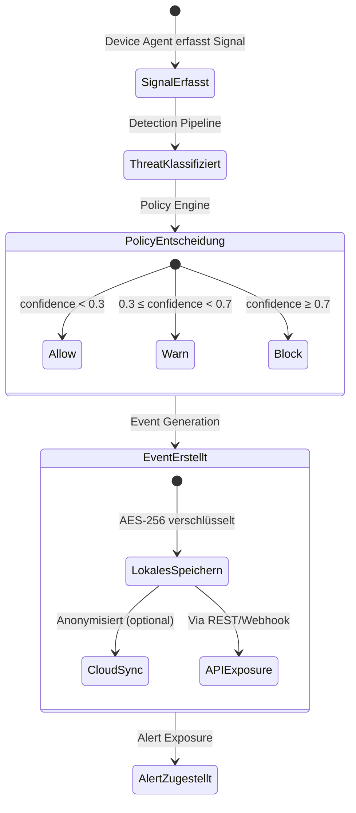

## Übersicht

Diese Seite definiert die zentralen Datenobjekte der Superheld-Plattform, ihre Felder, Lebenszyklen und Beziehungen zueinander. Das Event-Modell ist die Grundlage für API-Responses, Webhook-Payloads und SIEM-Integration.

## Datenobjekte

### Signal

- **Definition:** Ein einzelnes, vom Device Agent erfasstes Eingangsdatum (OS-Event, Netzwerk-Metadatum, Benutzerinteraktion).
- **Lebenszyklus:** Signals werden ausschließlich lokal erfasst, verarbeitet und nach Analyse verworfen. Sie werden nicht persistent gespeichert und nicht über die API exponiert.
- **Felder:** Nicht standardisiert — Signals sind interne Eingaben der Detection Pipeline.

### Threat

- **Definition:** Eine klassifizierte Bedrohung, die aus einem oder mehreren Signals abgeleitet wurde.
- **Felder:**

| Feld | Typ | Pflicht | Beschreibung |
|---|---|---|---|
| `threat_id` | string | Ja | Eindeutige ID (Format: `thr_...`) |
| `threat_category` | enum | Ja | Kanonische Kategorie: `phone_scam`, `social_engineering`, `malicious_app`, `phishing`, `remote_control`, `deepfake` |
| `confidence` | float | Ja | Confidence Score (0.0–1.0) |
| `severity` | enum | Ja | `low`, `medium`, `high`, `critical` |
| `device_id` | string | Ja | Zugehöriges Gerät |
| `detected_at` | string (ISO 8601) | Ja | Zeitpunkt der Erkennung |
| `description` | string | Nein | Menschenlesbare Beschreibung |
| `indicators` | array[string] | Nein | IOCs (SHA-256-Hashes, Signatur-IDs) |
| `status` | enum | Ja | `active`, `resolved`, `dismissed` |

:::note[TODO]
Threat-Schema mit Engineering-Team als stabil bestätigen.
:::

### Event

- **Definition:** Ein strukturierter, persistierter Datensatz, der eine Policy-Entscheidung dokumentiert.
- **Kanonisches Schema:**

```json
{
  "event_id": "evt_7f2a9c",
  "timestamp": "2026-03-14T14:32:08Z",
  "device_id": "dev_3c8a1f",
  "threat_category": "phishing",
  "confidence": 0.94,
  "action_taken": "block",
  "policy_id": "pol_default",
  "severity": "high",
  "description": "Gefälschte Login-Seite erkannt und blockiert.",
  "indicators": ["sha256:a1b2c3d4e5f6..."],
  "metadata": {
    "agent_version": "2.4.1",
    "model_version": "detect-v3.2",
    "device_platform": "macos",
    "tenant_id": "org_5e9d2a"
  }
}
```

- **Event-Felder:**

| Feld | Typ | Pflicht | Beschreibung |
|---|---|---|---|
| `event_id` | string | Ja | Eindeutige ID (Format: `evt_...`) |
| `timestamp` | string (ISO 8601) | Ja | Zeitpunkt der Policy-Entscheidung |
| `device_id` | string | Ja | Zugehöriges Gerät |
| `threat_category` | enum | Ja | Kanonische Bedrohungskategorie |
| `confidence` | float | Ja | Confidence Score (0.0–1.0) |
| `action_taken` | enum | Ja | `allow`, `warn`, `block` |
| `policy_id` | string | Ja | Angewandte Policy |
| `severity` | enum | Ja | `low`, `medium`, `high`, `critical` |
| `description` | string | Nein | Menschenlesbare Beschreibung (redaktiert) |
| `indicators` | array[string] | Nein | IOCs |
| `metadata` | object | Nein | Agent-Version, Modell-Version, Plattform, Tenant-ID |

- **Mutabilität:** Events sind nach Erstellung unveränderlich (immutable). Korrekturen werden als neue Events mit Referenz auf das Original erstellt.

:::note[TODO]
Korrektur-Mechanismus mit Engineering bestätigen.
:::

- **Aufbewahrung:** Lokal 90 Tage, Cloud 180 Tage (TODO: bestätigen). Siehe [Telemetrie & Logging](/experts/telemetry).

### Policy

- **Definition:** Eine konfigurierbare Regel, die bestimmt, wie auf erkannte Threats reagiert wird.
- **Felder:**

| Feld | Typ | Pflicht | Beschreibung |
|---|---|---|---|
| `policy_id` | string | Ja | Eindeutige ID (Format: `pol_...`) |
| `name` | string | Ja | Anzeigename |
| `threat_categories` | array[enum] | Ja | Betroffene Bedrohungskategorien |
| `action` | enum | Ja | `allow`, `warn`, `block` |
| `confidence_threshold` | float | Nein | Mindest-Confidence für Auslösung |
| `enabled` | boolean | Ja | Aktiv/Inaktiv |

:::note[TODO]
Policy-Schema mit Engineering bestätigen.
:::

### Alert

- **Definition:** Eine Benachrichtigung an den Benutzer oder ein externes System über ein erkanntes Event.
- **Kanäle:** Push-Notification, E-Mail, Webhook, SIEM
- **Felder:**

| Feld | Typ | Pflicht | Beschreibung |
|---|---|---|---|
| `alert_id` | string | Ja | Eindeutige ID |
| `event_id` | string | Ja | Referenziertes Event |
| `channel` | enum | Ja | `push`, `email`, `webhook`, `siem` |
| `delivered_at` | string (ISO 8601) | Nein | Zustellzeitpunkt |
| `status` | enum | Ja | `pending`, `delivered`, `failed` |

:::note[TODO]
Alert-Schema und Zustellstatus-Tracking mit Engineering bestätigen.
:::

### Device

- **Definition:** Ein registriertes Endgerät mit installiertem Device Agent.
- **Felder:**

| Feld | Typ | Pflicht | Beschreibung |
|---|---|---|---|
| `device_id` | string | Ja | Eindeutige ID (Format: `dev_...`) |
| `platform` | enum | Ja | `ios`, `android`, `windows`, `macos`, `linux` |
| `agent_version` | string | Ja | Version des Device Agent |
| `last_seen` | string (ISO 8601) | Ja | Letzter Kontaktzeitpunkt |
| `status` | enum | Ja | `active`, `inactive`, `quarantined` |
| `name` | string | Nein | Vom Benutzer vergebener Name |

:::note[TODO]
Device-Schema mit Engineering bestätigen.
:::

## Lebenszyklus



:::note
Confidence-Schwellenwerte sind Standard-Defaults und per Policy konfigurierbar.
:::

:::note[TODO]
Standard-Schwellenwerte mit Produktteam bestätigen.
:::

## Schema-Versionierung

:::note[TODO]
Versionierungsstrategie für Event-Schemas dokumentieren (z.B. Schema-Version im Payload, Abwärtskompatibilitätsgarantien).
:::

## Querverweise

- [Kernkonzepte](/experts/core-concepts) — Begriffsdefinitionen
- [Telemetrie & Logging](/experts/telemetry) — Aufbewahrung und Redaktion
- [API-Übersicht](/experts/api) — REST-Endpunkte für Events und Threats
- [SIEM-Integration](/experts/siem-integration) — Webhook-Payload und Mapping
- [Glossar](/experts/glossary) — Kanonische Terminologie
- [OpenAPI-Spezifikation](/openapi.yaml) — Maschinenlesbares Schema
