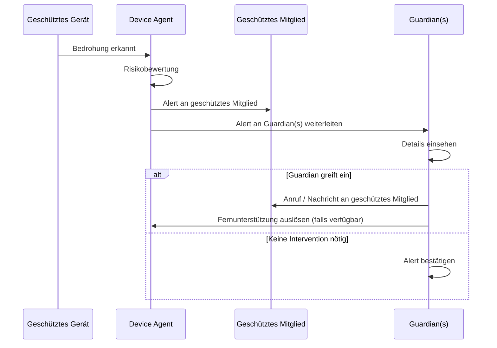
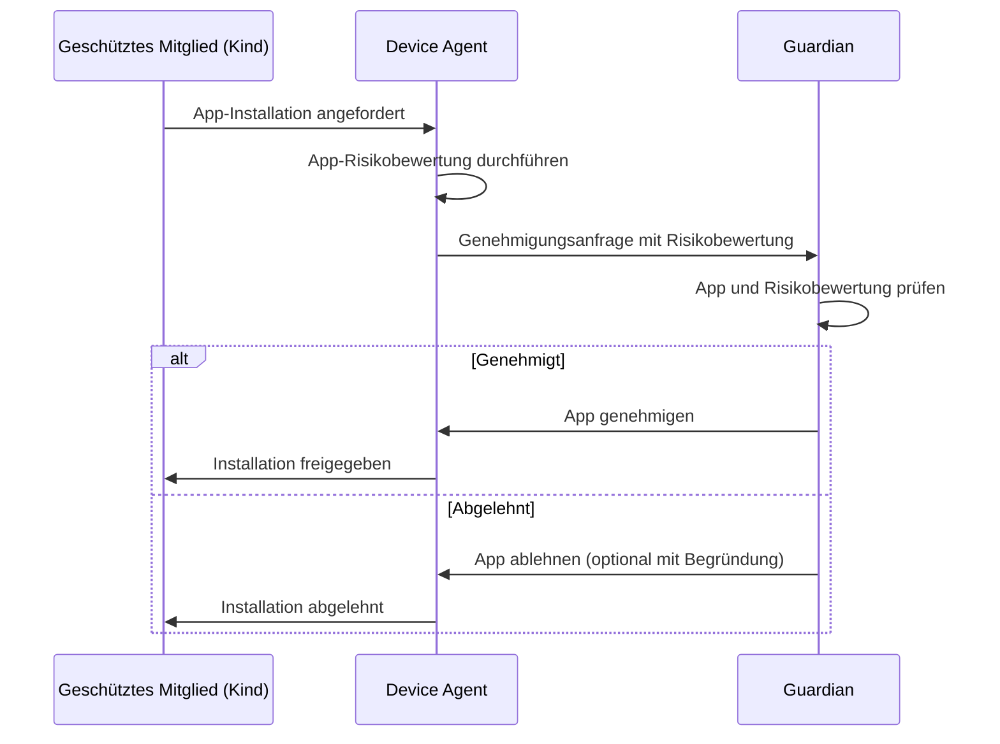
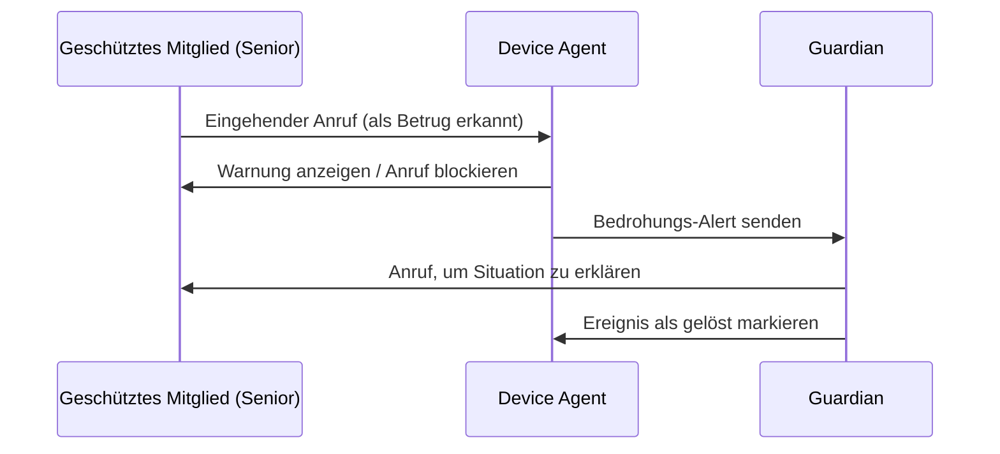
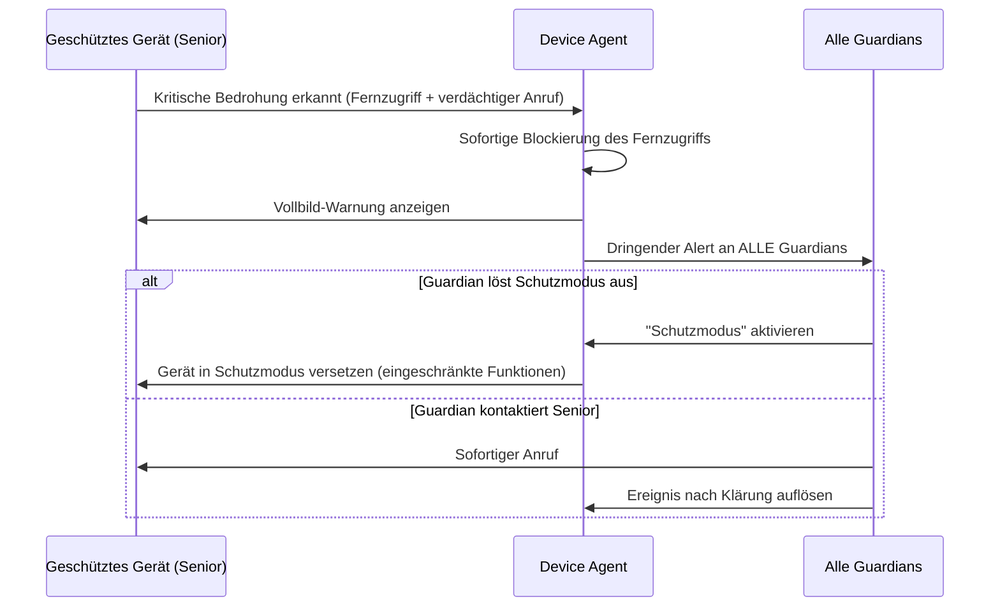

## Übersicht

Vulnerable Nutzergruppen — ältere Menschen, Kinder und weniger technikaffine Familienmitglieder — werden überproportional häufig Ziel von Betrugsversuchen. Das Guardian-Netzwerk ermöglicht es vertrauenswürdigen Kontakten (Familienmitglieder, Betreuer), Benachrichtigungen zu erhalten, bei Bedarf einzugreifen und gefährdete Nutzer aktiv zu schützen — ohne deren Privatsphäre oder Selbstbestimmung einzuschränken.

Das Guardian-Netzwerk ist eine optionale Funktion innerhalb der Familienprofile von Superheld. Es verbindet geschützte Mitglieder mit ihren Guardians über ein klar definiertes Rollen- und Berechtigungsmodell.

---

## Rollen im Guardian-Netzwerk

| Rolle | Beschreibung | Beispiel |
|---|---|---|
| **Geschütztes Mitglied** | Der Nutzer, der geschützt wird. Erhält weiterhin alle eigenen Benachrichtigungen und behält volle Kontrolle über das eigene Gerät. | Großelternteil, Kind |
| **Guardian** | Vertrauensperson, die Benachrichtigungen empfängt und auf bestimmte Ereignisse reagieren kann (genehmigen, ablehnen, kontaktieren). | Elternteil, erwachsenes Kind |
| **Administrator** | Kann Schutzrichtlinien für die gesamte Familiengruppe verwalten, Guardians hinzufügen/entfernen und Schutzstufen anpassen. | Familienoberhaupt, IT-affines Familienmitglied |

### Einwilligungsmodell

Das Guardian-Netzwerk basiert auf einem expliziten Einwilligungsmodell:

- **Geschützte Mitglieder müssen der Guardian-Überwachung ausdrücklich zustimmen.** Eine Einrichtung ohne Zustimmung des geschützten Mitglieds ist nicht möglich.
- Bei Minderjährigen unter dem gesetzlichen Mindestalter (TODO: Altersgrenze mit Rechtsabteilung bestätigen) erfolgt die Zustimmung durch den Erziehungsberechtigten.
- Die Zustimmung kann jederzeit widerrufen werden (siehe [Datenschutz im Guardian-Netzwerk](#datenschutz-im-guardian-netzwerk)).

:::note
Das Einwilligungsmodell stellt sicher, dass das Guardian-Netzwerk ein Werkzeug zur Unterstützung ist — nicht zur Überwachung.
:::

---

## Alert-Weiterleitung

Wenn eine Bedrohung auf dem Gerät eines geschützten Mitglieds erkannt wird, durchläuft die Benachrichtigung einen definierten Weiterleitungsprozess.

### Ablauf

### Weitergeleitete Alert-Typen

| Alert-Typ | Beschreibung | Weitergeleitet an Guardian |
|---|---|---|
| **Bedrohungs-Alerts** | Erkannte Betrugsversuche, Malware, verdächtige Anrufe | Ja (abhängig von Schutzstufe) |
| **App-Installationsanfragen** | Neue App soll installiert werden (bei aktivierter Genehmigungspflicht) | Ja |
| **Einstellungsänderungen** | Sicherheitsrelevante Einstellungen werden geändert (z.B. unbekannte Quellen aktiviert) | Ja |
| **Wochenberichte** | Zusammenfassung der Sicherheitslage des geschützten Geräts | Ja |

---

## Interventions-Workflows

### a) App-Genehmigung

Dieser Workflow wird aktiviert, wenn für ein geschütztes Mitglied die Genehmigungspflicht für App-Installationen aktiv ist (Standard bei Kindern unter 13).

### b) Bedrohungseskalation

Typischer Ablauf, wenn ein älteres Familienmitglied einen Betrugsanruf erhält.

### c) Notfall-Intervention

Wird ausgelöst bei kritischen Bedrohungen, z.B. wenn ein Fernzugriffs-Tool während eines verdächtigen Anrufs auf dem Gerät eines Seniors aktiviert wird.

:::caution
TODO: Mit dem Engineering-Team bestätigen, ob die Fernauslösung des „Schutzmodus" (Remote-Lockdown) bereits implementiert ist oder sich in Planung befindet. Falls ja: Genaue Funktionseinschränkungen im Schutzmodus dokumentieren.
:::

---

## Familienprofile und Schutzstufen

Jedes Familienprofil hat eine Standard-Schutzstufe, die automatisch angewendet wird. Administratoren können diese Stufen individuell anpassen.

| Profil | Altersgruppe | Schutzstufe | App-Genehmigung | Guardian-Alerts | Fernzugriff-Blockierung |
|---|---|---|---|---|---|
| **Kind** | < 13 Jahre | Maximal | Alle Installationen erfordern Genehmigung | Alle Bedrohungsstufen | Strikt (keine Ausnahmen) |
| **Jugendlich** | 13–17 Jahre | Erhöht | Nur bei Hochrisiko-Apps | Hoch und Kritisch | Strikt (autorisierte Tools möglich) |
| **Erwachsener** | 18+ Jahre | Minimal | Keine Genehmigung erforderlich | Nur Kritisch | Standard (autorisierte Tools möglich) |
| **Senior** | Individuell | Erhöht | Optional (empfohlen) | Hoch und Kritisch | Strikt (autorisierte Tools möglich) |

:::note
Die Zuordnung des Profils „Senior" erfolgt nicht automatisch anhand des Alters, sondern wird bewusst vom Nutzer oder Administrator gewählt. So wird vermieden, dass ältere Nutzer ungewollt als schutzbedürftig eingestuft werden.
:::

---

## Datenschutz im Guardian-Netzwerk

Der Schutz der Privatsphäre hat im Guardian-Netzwerk höchste Priorität. Guardians erhalten nur die Informationen, die für den Schutz notwendig sind.

### Was Guardians sehen können

- Bedrohungs-Alerts (Typ, Schweregrad, Zeitpunkt)
- App-Genehmigungsanfragen (App-Name, Risikobewertung)
- Sicherheitsrelevante Einstellungsänderungen
- Wöchentliche Zusammenfassungen

### Was Guardians NICHT sehen können

- Nachrichteninhalte (SMS, Messenger, E-Mail)
- Anrufinhalte oder -aufzeichnungen
- Browserverlauf
- Standortdaten (TODO: Klären, ob Standort-Benachrichtigung in Familienprofilen eine Ausnahme bildet)
- Fotos, Dateien oder sonstige persönliche Inhalte

### Widerruf und Kontrolle

- Geschützte Mitglieder können den Guardian-Zugang **jederzeit** widerrufen — sofort und ohne Begründung.
- Alle Guardian-Interaktionen (Alerts, Genehmigungen, Ablehnungen, Schutzmodus-Aktivierungen) werden im **Audit-Trail** protokolliert.
- Geschützte Mitglieder können den Audit-Trail jederzeit einsehen.

### Mindestalter für Selbstverwaltung

Ab einem bestimmten Alter können Jugendliche ihren Guardian-Schutz eigenständig verwalten und anpassen.

:::caution
TODO: Mindestalter für eigenständige Verwaltung mit Rechtsabteilung und Product-Team bestätigen. Mögliche Schwelle: 16 Jahre (DSGVO-Altersgrenze für Einwilligung in Datendienste variiert je nach EU-Mitgliedstaat zwischen 13 und 16 Jahren).
:::

---

## Weiterführende Informationen

- [Schutzrichtlinien](/experts/configuration) — Detaillierte Konfiguration aller Schutzregeln und Familienprofile
- [Manipulationsschutz](/experts/manipulation-protection) — Wie Superheld soziale Manipulation und Betrugsversuche erkennt
- [Fernzugriffsschutz](/experts/remote-access-protection) — Schutz vor nicht autorisiertem Fernzugriff
- [Datenschutz & Sicherheit](/experts/privacy-security) — Umfassende Datenschutz-Architektur und Sicherheitsmodell
- [Einrichtung](/getting-started/setup) — Erste Schritte mit Superheld und Familienprofilen
