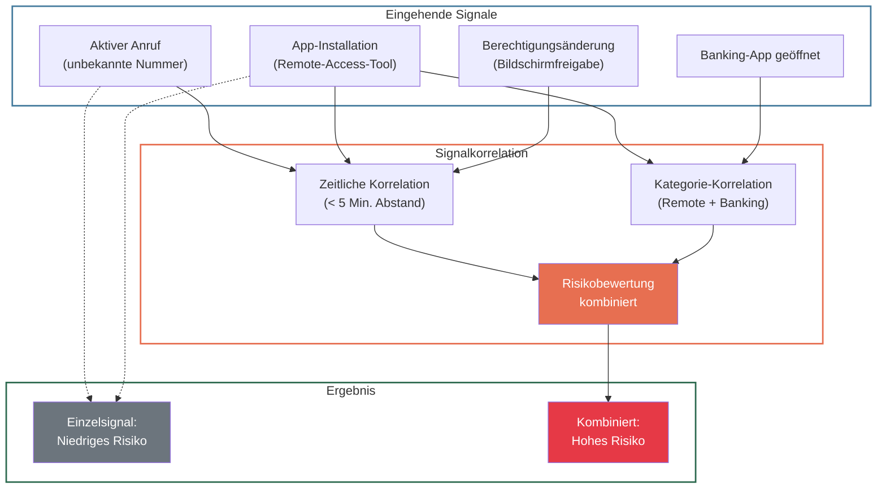
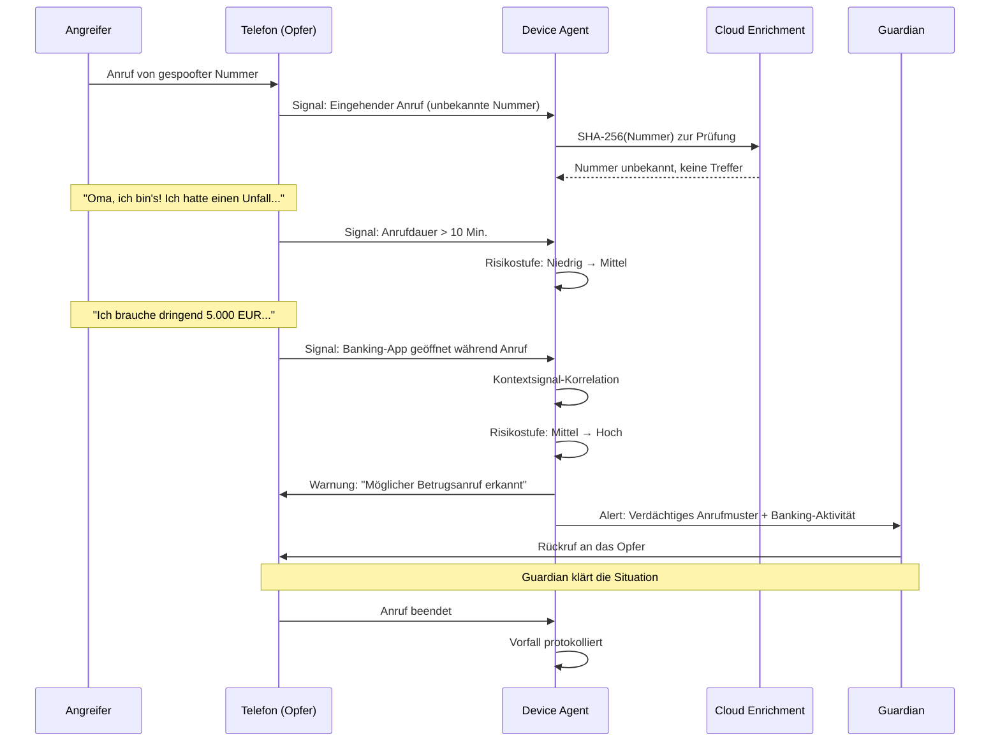

## Übersicht

Manipulationsangriffe zielen nicht auf technische Schwachstellen, sondern auf den Menschen selbst. Angreifer nutzen psychologische Muster — Vertrauen, Dringlichkeit, Autoritätshörigkeit — um ihre Opfer zu Handlungen zu bewegen, die sie unter normalen Umständen nie ausführen würden. Diese Angriffe sind besonders gefährlich, weil sie klassische technische Schutzmaßnahmen wie Firewalls oder Antivirensoftware vollständig umgehen.

Superheld erkennt Manipulationsversuche durch die Kombination von Verhaltensanalyse, Kontextsignalen und optionaler Cloud-basierter Reputations-Intelligence. Dieses Dokument beschreibt die erkennbaren Manipulationstypen, die Erkennungsansätze sowie die daraus resultierenden Schutzmaßnahmen.

---

## Erkennbare Manipulationstypen

TODO: Erkennungsraten pro Manipulationstyp mit Security-Team quantifizieren

| Manipulationstyp | Beschreibung | Beispielangriff | Threat Category |
|---|---|---|---|
| **Social Engineering** (Vertrauenserschleichung) | Der Angreifer baut über längere Zeit Vertrauen auf, um das Opfer zu einer schädlichen Handlung zu bewegen. | Ein Anrufer gibt sich als Bankmitarbeiter aus und bittet um Verifizierung der Kontodaten, nachdem er bereits persönliche Informationen aus sozialen Netzwerken zusammengetragen hat. | `social_engineering` |
| **Scam-Anrufe** (Telefonbetrug) | Massenanrufe mit vorbereiteten Skripten, häufig mit Rufnummernspoofing. | Das Opfer erhält einen Anruf von einer angeblichen Polizeidienststelle, die vor einem laufenden Ermittlungsverfahren warnt und zur Sicherung der Wertsachen auffordert. | `phone_scam` |
| **Remote-Access-Betrug** (Fernzugriffsbetrug) | Der Angreifer überzeugt das Opfer, eine Fernzugriffssoftware zu installieren, und übernimmt dann die Kontrolle über das Gerät. | Ein vermeintlicher Microsoft-Techniker ruft an, meldet ein Sicherheitsproblem und bittet um die Installation von AnyDesk oder TeamViewer. | `remote_control` |
| **Dringlichkeitsmanipulation** (Urgency Manipulation) | Der Angreifer erzeugt künstlichen Zeitdruck, um kritisches Nachdenken zu unterbinden. | Eine SMS warnt vor der sofortigen Sperrung des Bankkontos, falls nicht innerhalb von 30 Minuten ein Link aufgerufen wird. | `phishing` |
| **Autoritätsimitation** (Authority Impersonation) | Der Angreifer gibt sich als Autoritätsperson oder Institution aus (Behörde, Bank, Polizei, Vorgesetzter). | Ein Deepfake-Videoanruf imitiert den Enkel des Opfers und bittet unter Tränen um eine Sofortüberweisung. | `deepfake` |

---

## Erkennungsansätze

### Verhaltensanalyse

Superheld analysiert Verhaltensmuster direkt auf dem Gerät (On-Device), um Anomalien zu erkennen, die auf einen laufenden Manipulationsversuch hindeuten. Die Analyse erfolgt lokal — keine Rohdaten verlassen das Gerät.

TODO: Konkrete ML-Modellarchitektur und Trainingsdetails mit dem Entwicklungsteam abstimmen

**Verhaltensbasierte Signale:**

| Signal | Beschreibung | Risikobewertung |
|---|---|---|
| **Anrufdauer + App-Installation** | Während eines aktiven Telefonats wird eine neue App installiert (insbesondere Remote-Access-Tools). | Hoch |
| **Schnelle Berechtigungsänderungen** | Mehrere sicherheitsrelevante Berechtigungen werden innerhalb kurzer Zeit erteilt (z. B. Bildschirmfreigabe, Zugriffsrechte). | Hoch |
| **Banking-App während Telefonat** | Eine Banking- oder Finanz-App wird während eines laufenden Anrufs geöffnet und aktiv genutzt. | Mittel–Hoch |
| **Unbekannte Nummer + lange Gesprächsdauer** | Ein Anruf von einer unbekannten Nummer dauert ungewöhnlich lange (> 10 Minuten). | Mittel |
| **App-Sideloading** | Installation einer App aus einer unbekannten Quelle (nicht über den offiziellen App Store). | Mittel |
| **Unübliche Nutzungszeiten** | Sicherheitsrelevante Aktionen finden zu ungewöhnlichen Zeiten statt (z. B. nachts). | Niedrig–Mittel |

TODO: Schwellenwerte und Gewichtungen der einzelnen Signale mit dem Produktteam definieren

### Kontextsignale

Die eigentliche Stärke der Erkennung liegt in der Korrelation mehrerer Signale. Einzelne Signale können harmlos sein — erst ihre Kombination ergibt ein verdächtiges Muster.

**Beispiel einer Compound-Erkennung:**

> Aktiver Anruf von unbekannter Nummer + Installation von AnyDesk + Erteilung der Bildschirmfreigabe = **Remote-Access-Betrug mit hoher Wahrscheinlichkeit**

Superheld erkennt diese Signalkombination innerhalb von Sekunden und kann den Nutzer oder den Guardian warnen, bevor der Angreifer die Kontrolle übernimmt.

### Reputations-Intelligence

In der optionalen Cloud-Enrichment-Stufe (siehe [Erkennungspipeline](/experts/detection-pipeline)) gleicht Superheld SHA-256-Hashes gegen eine zentrale Threat-Datenbank ab. Dabei werden **keine Rohdaten** an die Cloud übermittelt — ausschließlich kryptografische Hashes.

**Abgeglichene Datentypen:**

| Datentyp | Hash-Verfahren | Prüfung gegen |
|---|---|---|
| Telefonnummern | SHA-256(normalisierte Nummer) | Bekannte Scam-Nummern, Callcenter-Datenbanken |
| URLs | SHA-256(kanonische URL) | Phishing-Domains, bekannte Betrugsseiten |
| App-Signaturen | SHA-256(APK-Signatur / Bundle-ID) | Bekannte Malware, trojanisierte Apps |

TODO: Größe und Aktualisierungsfrequenz der Threat-Datenbank mit dem Backend-Team klären

**Ablauf:**

1. Der Device Agent berechnet den SHA-256-Hash lokal auf dem Gerät.
2. Der Hash wird über TLS 1.3 an den Cloud-Dienst übermittelt.
3. Die Cloud antwortet mit Reputationsdaten (bekannt/unbekannt, Risikostufe, zugehörige Threat Category).
4. Der Device Agent integriert die Reputationsdaten in die lokale Risikobewertung.

Ist die Cloud-Anbindung deaktiviert oder nicht erreichbar, arbeitet Superheld ausschließlich mit lokaler Erkennung. Die Cloud-Stufe verbessert die Erkennungsqualität, ist aber nicht erforderlich.

---

## Schutzmaßnahmen

| Bedrohungstyp | Erkennungsmethode | Reaktion |
|---|---|---|
| **Scam-Anruf** (bekannte Nummer) | Reputations-Intelligence (Hash-Lookup) | **Block** — Anruf wird blockiert, Guardian wird informiert |
| **Scam-Anruf** (unbekannte Nummer + Verhaltensmuster) | Verhaltensanalyse + Kontextsignale | **Warn** — Nutzer erhält Warnhinweis während des Anrufs |
| **Remote-Access-Betrug** | Kontextsignale (Anruf + Remote-Tool-Installation) | **Alert** — Guardian wird sofort benachrichtigt, Nutzer wird gewarnt |
| **Dringlichkeitsmanipulation** (Phishing-Link) | Reputations-Intelligence + Verhaltensanalyse | **Block** — Link wird blockiert, Nutzer wird informiert |
| **Autoritätsimitation** (Deepfake) | Verhaltensanalyse + Kontextsignale | **Warn** — Nutzer erhält Hinweis auf mögliche Imitation |
| **Social Engineering** (langfristiger Vertrauensaufbau) | Verhaltensanalyse (Anomalien über Zeit) | **Alert** — Guardian wird informiert, wenn ungewöhnliche Muster erkannt werden |

TODO: False-Positive-Raten je Bedrohungstyp und Reaktionsstufe mit dem Security-Team ermitteln

**Reaktionsstufen:**

- **Alert** — Der Guardian wird über das Guardian-Netzwerk benachrichtigt. Der Nutzer wird nicht direkt unterbrochen, aber der Guardian kann eingreifen.
- **Warn** — Der Nutzer erhält eine deutlich sichtbare Warnung auf dem Gerät. Die Aktion wird nicht blockiert, aber der Nutzer wird zur Vorsicht aufgefordert.
- **Block** — Die Aktion wird automatisch unterbunden (z. B. Anruf blockiert, Link gesperrt). Der Nutzer und der Guardian werden informiert.

---

## Beispiel: Typischer Enkeltrick-Angriff

Der sogenannte Enkeltrick ist eine der häufigsten Betrugsmaschen, bei der sich ein Anrufer als Enkel oder naher Verwandter ausgibt und um dringende finanzielle Hilfe bittet. Folgendes Szenario zeigt, wie Superheld diesen Angriff erkennt und abwehrt:

**Ablauf im Detail:**

1. Der Angreifer ruft mit einer gespooften Nummer an. Der Device Agent erfasst das Signal.
2. Der SHA-256-Hash der Nummer wird (optional) gegen die Cloud-Datenbank geprüft — in diesem Fall ohne Treffer.
3. Nach über 10 Minuten Gesprächsdauer mit einer unbekannten Nummer steigt die Risikostufe.
4. Als das Opfer die Banking-App öffnet, korreliert der Agent die Signale: unbekannte Nummer + langes Gespräch + Banking-App = hohes Betrugsrisiko.
5. Der Nutzer erhält eine Warnmeldung auf dem Bildschirm.
6. Der Guardian wird parallel über das Guardian-Netzwerk informiert und kann eingreifen.

---

## Grenzen der Erkennung

Superheld kann nicht alle Formen von Manipulation erkennen. Transparenz über diese Grenzen ist essenziell für eine realistische Sicherheitserwartung.

| Einschränkung | Erklärung |
|---|---|
| **Persönliche Manipulation (Face-to-Face)** | Angriffe, die im direkten persönlichen Kontakt stattfinden, erzeugen keine digitalen Signale auf dem Gerät und sind daher nicht erkennbar. |
| **Verschlüsselte Kanäle ohne OS-Integration** | Manipulation über Ende-zu-Ende-verschlüsselte Messenger (z. B. Signal, WhatsApp), bei denen das Betriebssystem keinen Einblick in Anrufe oder Nachrichten gewährt, kann nur eingeschränkt über Verhaltenssignale erkannt werden. |
| **Langfristiges Grooming** | Sehr langsam aufgebaute Manipulationsbeziehungen (über Wochen oder Monate) können unterhalb der Erkennungsschwellen bleiben, da einzelne Interaktionen jeweils unauffällig erscheinen. |
| **Plattformbeschränkungen (iOS)** | Auf iOS sind die verfügbaren Betriebssystem-Signale eingeschränkter als auf Android. Bestimmte Signale (z. B. laufende Anrufe, installierte Apps) stehen nur begrenzt zur Verfügung. |
| **Neue, unbekannte Angriffsmuster** | Angriffe, die keinem bekannten Muster entsprechen und keine typischen Signalkombinationen auslösen, werden möglicherweise nicht erkannt. |
| **Einwilligung des Opfers** | Wenn das Opfer den Angreifer bewusst autorisiert (z. B. Fernzugriff aktiv erlaubt und Warnungen ignoriert), kann Superheld die Aktion nicht dauerhaft blockieren. |

TODO: Quantitative Analyse der Erkennungslücken mit dem Security-Team durchführen

---

## Weiterführende Informationen

- [Bedrohungsmodell](/experts/threat-model) — Vollständige Bedrohungsanalyse mit Angreifertypen und Angriffsoberflächen
- [Erkennungspipeline](/experts/detection-pipeline) — Technische Details der sechsstufigen Signalverarbeitung
- [Schutz vor Fernzugriff](/experts/remote-access-protection) — Detaillierte Beschreibung der Remote-Access-Erkennung
- [Guardian-Netzwerk](/experts/guardian-network) — Funktionsweise des Benachrichtigungs- und Schutznetzwerks
- [Konfiguration](/experts/configuration) — Einstellungsmöglichkeiten für Erkennungsschwellen und Reaktionsstufen
