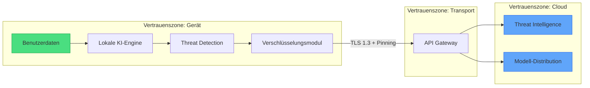

Superheld wurde mit einem klaren Grundsatz entwickelt: Deine Daten gehören dir. Diese Seite beschreibt unsere Datenschutz-Architektur, das Sicherheitsmodell und die technischen Maßnahmen, die deine Privatsphäre schützen.

## Datenschutz-Prinzipien

Superheld folgt den Prinzipien **Privacy by Design** und **Privacy by Default**. Datenschutz ist kein nachträgliches Feature, sondern Grundlage jeder Architekturentscheidung.

- **Datenminimierung** — Wir erheben ausschließlich Daten, die für den Betrieb des Dienstes zwingend erforderlich sind.
- **Kein Tracking, keine Werbung** — Superheld enthält keine Analytics-Tracker, keine Werbe-SDKs und keine Drittanbieter-Pixel. Unser Geschäftsmodell basiert ausschließlich auf Abonnements.
- **DSGVO-Konformität** — Alle Verarbeitungsprozesse entsprechen der Datenschutz-Grundverordnung (DSGVO). Du hast jederzeit das Recht auf Auskunft, Berichtigung, Löschung und Datenportabilität.

:::note
Superheld setzt keine Cookies zu Marketingzwecken ein. Es gibt keinen Consent-Banner, weil es nichts gibt, dem du zustimmen müsstest.
:::

## Datenverarbeitung

### Was erhoben wird

Wir beschränken die Datenerhebung auf das absolute Minimum:

- **Account-Daten** — E-Mail-Adresse und verschlüsseltes Passwort zur Authentifizierung.
- **Geräte-Metadaten** — Betriebssystem und App-Version für Kompatibilitätsprüfungen.
- **Anonymisierte Nutzungsmetriken** — Aggregierte, nicht rückverfolgbare Statistiken (z. B. Anzahl aktiver Installationen).

### Was NICHT erhoben wird

- Keine Standortdaten
- Keine Kontakte oder Adressbücher
- Keine Inhalte deiner Dateien oder Nachrichten
- Keine Tastatureingaben oder Bildschirmaufnahmen
- Keine biometrischen Daten

### Aufbewahrung und Verarbeitung

| Datentyp | Verarbeitungsort | Aufbewahrungsdauer |
|---|---|---|
| Account-Daten | EU-Server (Frankfurt) | Bis zur Kontolöschung |
| Geräte-Metadaten | EU-Server (Frankfurt) | 90 Tage |
| Anonymisierte Metriken | EU-Server (Frankfurt) | 12 Monate, dann aggregiert |
| Threat-Signaturen | Lokal auf dem Gerät | Bis zum nächsten Update |
| KI-Analysedaten | Ausschließlich lokal | Werden nicht gespeichert |

:::caution
Nach der Löschung deines Kontos werden alle personenbezogenen Daten innerhalb von 30 Tagen unwiderruflich entfernt. Backups werden nach spätestens 90 Tagen überschrieben.
:::

## Lokaler Schutz

Der Kern von Superheld arbeitet direkt auf deinem Gerät. Die KI-basierte Analyse von Bedrohungen läuft vollständig lokal — keine Inhalte werden an externe Server übertragen.

- **On-Device-KI** — Maschinelle Lernmodelle werden lokal ausgeführt. Die Analyse von E-Mails, Links und Anhängen erfolgt auf dem Gerät selbst.
- **Keine Datenexfiltration** — Persönliche Inhalte (Nachrichten, Dateien, Browserverlauf) verlassen dein Gerät zu keinem Zeitpunkt.
- **Lokale Bedrohungserkennung** — Phishing-Erkennung, Malware-Analyse und Verhaltensanomalien werden geräteseitig erkannt. Das Modell arbeitet auch ohne Internetverbindung.

## Cloud-Dienste

Bestimmte Funktionen erfordern eine kontrollierte Kommunikation mit unserer Infrastruktur. Dabei gelten strenge Regeln:

- **Anonymisierte Signaturen** — Wenn eine neue Bedrohung lokal erkannt wird, sendet Superheld ausschließlich einen anonymisierten Hash an unsere Threat-Intelligence-Plattform. Es werden keine Inhalte, Dateinamen oder Nutzerdaten übertragen.
- **Threat-Intelligence-Updates** — Das Gerät empfängt regelmäßig aktualisierte Bedrohungsdatenbanken, um auch offline aktuelle Signaturen zu verwenden.
- **Modell-Updates** — KI-Modelle werden als signierte Pakete ausgeliefert und lokal verifiziert, bevor sie aktiviert werden.
- **Transportverschlüsselung** — Jede Kommunikation mit der Cloud erfolgt über TLS 1.3 mit Certificate Pinning. Replay-Angriffe und MITM-Attacken werden wirksam verhindert.

## Sicherheitsmodell

### Trust Boundaries

Das folgende Diagramm zeigt die Vertrauensgrenzen innerhalb der Superheld-Architektur:

Persönliche Daten existieren ausschließlich innerhalb der Geräte-Vertrauenszone. Die Cloud erhält nie Zugang zu entschlüsselten Inhalten.

### Verschlüsselung

- **At Rest** — Alle lokalen Daten werden mit AES-256 verschlüsselt. Schlüssel werden im Secure Enclave (iOS) bzw. Keystore (Android) gespeichert.
- **In Transit** — TLS 1.3 mit Perfect Forward Secrecy. Certificate Pinning verhindert die Nutzung manipulierter Zertifikate.

### Authentifizierung und Zugriffskontrolle

- Zwei-Faktor-Authentifizierung (TOTP, Hardware-Keys)
- Biometrische Entsperrung (Face ID, Fingerabdruck)
- Session-Management mit automatischem Timeout
- Rollenbasierte Zugriffskontrolle für Team-Accounts

### Incident Response

Im Falle eines Sicherheitsvorfalls folgen wir einem definierten Prozess:

1. **Erkennung** — Automatisierte Monitoring-Systeme und Community-Reports.
2. **Eindämmung** — Betroffene Systeme werden innerhalb von Minuten isoliert.
3. **Benachrichtigung** — Betroffene Nutzer werden innerhalb von 72 Stunden gemäß DSGVO Art. 34 informiert.
4. **Behebung** — Patches werden als priorisierte Updates ausgeliefert.
5. **Post-Mortem** — Öffentlicher Bericht mit Root-Cause-Analyse.

:::note
Sicherheitslücken können verantwortungsvoll an security@superheld.app gemeldet werden. Wir betreiben ein Responsible-Disclosure-Programm und reagieren innerhalb von 48 Stunden.
:::

### Open-Source-Verpflichtung

Der Quellcode von Superheld ist öffentlich einsehbar auf [GitHub](https://github.com/benediktpoller/superheld-app). Transparenz ist die Grundlage für Vertrauen. Jede Verschlüsselungsimplementierung, jede Netzwerkanfrage und jede Datenzugriffsentscheidung kann unabhängig überprüft werden.

---

**Kontakt bei Sicherheitsfragen:** security@superheld.app
**Datenschutz-Anfragen:** privacy@superheld.app
**Transparenzberichte:** [superheld.app/transparency](https://superheld.app/transparency)
