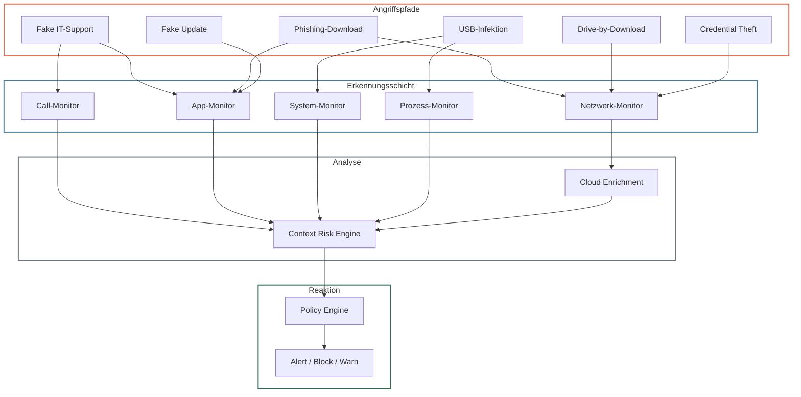
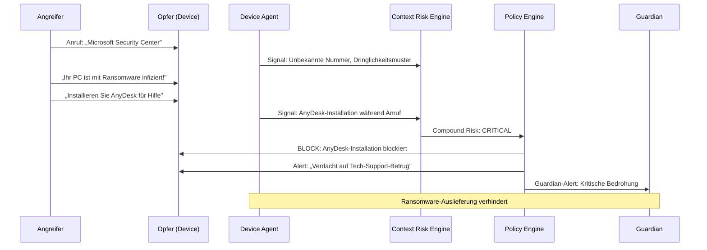

Ransomware zählt zu den zerstörerischsten Bedrohungen für Endgeräte. Superheld erkennt Ransomware nicht durch klassische Signaturerkennung wie ein Virenscanner, sondern durch die Analyse der **Angriffspfade**, über die Ransomware auf ein Gerät gelangt — und greift ein, bevor die Verschlüsselung beginnt.

:::note
Superheld ersetzt keinen dedizierten Endpoint-Detection-and-Response-Dienst (EDR). Der Schwerpunkt liegt auf der Erkennung und Blockierung der Social-Engineering- und Installations-Vektoren, über die Ransomware typischerweise ausgeliefert wird. Siehe [Scope und Nicht-Ziele](/experts/scope-non-goals).
:::

---

## Angriffspfade und Erkennung

### 1 · Fake-IT-Support-Betrug

| | |
|---|---|
| **Angriffsablauf** | Anruf von angeblichem Microsoft-/Apple-Support → Erzeugung von Panik ("Ihr Gerät ist infiziert") → Aufforderung zur Installation von Fernzugriffs-Software → Angreifer installiert Ransomware über Remote-Session |
| **Bedrohungskategorie** | `remote_control` + `phone_scam` |
| **Schweregrad** | Critical |

**Erkennungssignale:**

| Signal | Quelle | Gewicht |
|---|---|---|
| Anruf von unbekannter Nummer mit langer Dauer | Call-Monitor | Mittel |
| Installation einer Fernzugriffs-App während aktivem Anruf | App-Monitor + Call-Monitor | Critical (Compound) |
| Fernzugriffs-Session wird aufgebaut | Prozess-Monitor | Hoch |
| Rufnummer in Scam-Datenbank | Cloud Enrichment | Bestätigung |

**Superheld-Mitigation:**

- **Block** — Installation der Fernzugriffs-App wird blockiert, solange ein Anruf aktiv ist
- **Alert** — "Verdacht auf Tech-Support-Betrug. Legen Sie auf."
- **Guardian-Alert** — Vertrauenspersonen werden sofort benachrichtigt
- **Event** — Vorfall wird im Audit-Trail dokumentiert

Details: [Fernzugriffsschutz](/experts/remote-access-protection)

---

### 2 · Phishing-Downloads

| | |
|---|---|
| **Angriffsablauf** | E-Mail oder SMS mit dringendem Vorwand ("Rechnung", "Paket", "Kontosperrung") → Link zu gefälschter Website → Download einer als PDF/Rechnung getarnten ausführbaren Datei → Ausführung startet Verschlüsselung |
| **Bedrohungskategorie** | `phishing` + `malicious_app` |
| **Schweregrad** | High |

**Erkennungssignale:**

| Signal | Quelle | Gewicht |
|---|---|---|
| URL mit Homoglyph-Angriff oder kürzlich registrierter Domain | ML-Modell (Stufe 2) | Hoch |
| URL in Phishing-Datenbank | Cloud Enrichment | Hoch |
| Nachricht mit Dringlichkeitsmerkmal + URL | ML-Modell (Stufe 2) | Multiplikator |
| Download einer ausführbaren Datei von unbekannter Quelle | App-Monitor | Hoch |

**Superheld-Mitigation:**

- **Block** — Zugriff auf erkannte Phishing-Seiten wird blockiert
- **Warn** — Bei verdächtigen Downloads: "Diese Datei stammt von einer unbekannten Quelle"
- **Anzeige** — Tatsächliche Ziel-URL wird dem Benutzer angezeigt
- **Cloud-Abgleich** — SHA-256-Hash der heruntergeladenen Datei wird gegen Malware-Datenbank geprüft

> TODO: Präzisieren, ob Blockierung auf DNS-Ebene, Browser-Ebene oder App-Ebene erfolgt

---

### 3 · Drive-by-Downloads

| | |
|---|---|
| **Angriffsablauf** | Besuch einer kompromittierten oder bösartigen Website → Exploit-Kit analysiert Browser/OS-Schwachstellen → Automatischer Download und Ausführung von Ransomware ohne Benutzerinteraktion |
| **Bedrohungskategorie** | `malicious_app` |
| **Schweregrad** | High |

**Erkennungssignale:**

| Signal | Quelle | Gewicht |
|---|---|---|
| Verbindung zu bekanntem Exploit-Kit-Server | Netzwerk-Monitor + Cloud Enrichment | Hoch |
| Unerwarteter Download ohne Benutzerinteraktion | App-Monitor | Hoch |
| Neue unbekannte App wird ohne Store-Installation gestartet | App-Monitor | Mittel |
| DNS-Anfrage an verdächtige Domain | Netzwerk-Monitor | Mittel |

**Superheld-Mitigation:**

- **Block** — Verbindungen zu bekannten Exploit-Kit-Domains werden blockiert
- **Warn** — Bei unerwarteten Downloads ohne Benutzerinteraktion
- **Netzwerk-Analyse** — Verdächtige DNS-Anfragen und Verbindungsaufbauten werden erkannt

> TODO: Umfang der Netzwerk-Analyse mit Engineering bestätigen (DNS-Monitoring vs. Deep Packet Inspection vs. nur Metadaten)

---

### 4 · Gefälschte Software-Updates

| | |
|---|---|
| **Angriffsablauf** | Pop-up oder Benachrichtigung imitiert ein System-Update ("Kritisches Sicherheitsupdate erforderlich") → Benutzer lädt vermeintliches Update herunter → Datei ist Ransomware-Dropper → Ausführung startet Verschlüsselung |
| **Bedrohungskategorie** | `social_engineering` + `malicious_app` |
| **Schweregrad** | High |

**Erkennungssignale:**

| Signal | Quelle | Gewicht |
|---|---|---|
| App-Installation aus unbekannter Quelle (Sideload) | App-Monitor | Hoch |
| Installationsquelle ist nicht der offizielle Store | App-Monitor | Mittel |
| App fordert übermäßige Berechtigungen | App-Monitor | Mittel |
| App-Signatur unbekannt oder nicht verifizierbar | App-Monitor + Cloud Enrichment | Hoch |

**Superheld-Mitigation:**

- **Block** — Sideload-Installationen werden je nach Profil blockiert oder erfordern explizite Genehmigung
- **Warn** — "Dieses Update stammt nicht aus dem offiziellen Store"
- **Cloud-Abgleich** — SHA-256-Hash wird gegen Malware-Datenbank geprüft
- **Familienprofil** — Bei Kind/Senior-Profilen: automatische Blockierung aller Sideloads

---

### 5 · Credential Theft (Zugangsdaten-Diebstahl)

| | |
|---|---|
| **Angriffsablauf** | Phishing-Mail mit Link zu gefälschter Login-Seite → Benutzer gibt Unternehmens- oder Cloud-Zugangsdaten ein → Angreifer nutzt Zugangsdaten für Remote-Zugriff auf das Gerät → Installation von Ransomware über legitimen Remote-Zugang (RDP, VPN) |
| **Bedrohungskategorie** | `phishing` |
| **Schweregrad** | High |

**Erkennungssignale:**

| Signal | Quelle | Gewicht |
|---|---|---|
| URL imitiert bekannte Login-Seite (Homoglyph, Typosquatting) | ML-Modell (Stufe 2) | Hoch |
| SSL-Zertifikat verdächtig (DV-only, kurze Laufzeit, kürzlich ausgestellt) | Netzwerk-Monitor | Mittel |
| Domain in Phishing-Datenbank | Cloud Enrichment | Hoch |
| Formular auf unbekannter Domain fragt nach Passwort | ML-Modell (Stufe 2) | Hoch |

**Superheld-Mitigation:**

- **Block** — Zugriff auf erkannte Phishing-Login-Seiten blockieren
- **Warn** — "Diese Seite ähnelt [echte-domain.de], ist aber eine andere Domain"
- **Anzeige** — Tatsächliche Domain wird prominent angezeigt

---

### 6 · USB-Infektionen

| | |
|---|---|
| **Angriffsablauf** | Präparierter USB-Stick wird angeschlossen (z. B. als Werbegeschenk, "verlorener" Stick) → Automatische Ausführung eines Ransomware-Droppers über AutoRun oder HID-Emulation (Rubber Ducky) → Verschlüsselung beginnt |
| **Bedrohungskategorie** | `malicious_app` |
| **Schweregrad** | High |
| **Plattformen** | Windows, macOS, Linux (mobile Geräte nicht betroffen) |

**Erkennungssignale:**

| Signal | Quelle | Gewicht |
|---|---|---|
| Neues USB-Gerät verbunden | System-Monitor | Niedrig (Kontext) |
| Ausführbare Datei wird von externem Datenträger gestartet | Prozess-Monitor | Hoch |
| Unbekanntes HID-Gerät sendet Tastatureingaben | System-Monitor | Critical |
| Prozess mit erhöhten Rechten gestartet nach USB-Verbindung | Prozess-Monitor | Hoch |

**Superheld-Mitigation:**

- **Warn** — Bei Ausführung von Programmen von externen Datenträgern
- **Block** — Bei erkannter HID-Emulation (Rubber Ducky / BadUSB)
- **Event** — USB-Ereignisse werden im Audit-Trail dokumentiert

> TODO: USB-Monitoring-Umfang mit Engineering bestätigen. Ist HID-Emulationserkennung implementiert?

---

### 7 · Massenverschlüsselung (Ransomware-Payload)

| | |
|---|---|
| **Angriffsablauf** | Ransomware ist bereits auf dem Gerät aktiv → Massenhaftes Umbenennen und Verschlüsseln von Dateien → Lösegeldforderung wird angezeigt |
| **Bedrohungskategorie** | `malicious_app` |
| **Schweregrad** | Critical |

:::caution
Die Erkennung aktiver Massenverschlüsselung ist **nicht der primäre Schutzansatz** von Superheld. Superheld fokussiert auf die Erkennung und Blockierung der Angriffspfade 1–6, die der Verschlüsselung vorausgehen. Für die Erkennung laufender Verschlüsselungsprozesse sind dedizierte EDR-/Antivirus-Lösungen besser geeignet.
:::

**Erkennungssignale (eingeschränkt):**

| Signal | Quelle | Gewicht |
|---|---|---|
| Unbekannter Prozess mit hoher Dateisystem-Aktivität | Prozess-Monitor | Hoch |
| Massenhaftes Umbenennen von Dateien (bekannte Ransomware-Endungen) | System-Monitor | Critical |
| Ungewöhnlich hohe CPU-Auslastung durch unbekannten Prozess | System-Monitor | Mittel |

**Superheld-Mitigation:**

- **Alert** — Sofortige Warnung bei Anzeichen von Massenverschlüsselung
- **Guardian-Alert** — Alle Vertrauenspersonen werden benachrichtigt
- **Empfehlung** — "Trennen Sie das Gerät sofort vom Netzwerk und wenden Sie sich an IT-Support"

> TODO: Umfang der Dateisystem-Überwachung mit Engineering bestätigen. Welche Plattformen unterstützen Dateisystem-Monitoring?

---

## Erkennungsarchitektur

Das folgende Diagramm zeigt, wie Superheld die verschiedenen Ransomware-Angriffspfade über die [Erkennungspipeline](/experts/detection-pipeline) abfängt:

---

## Beispiel: Ransomware über Tech-Support-Betrug

---

## Schutzwirkung nach Angriffspfad

| Angriffspfad | Primäre Erkennung | Schutzwirkung | Einschränkungen |
|---|---|---|---|
| Fake IT-Support | Call + App-Korrelation | Hoch — Blockierung vor Fernzugriff | Angreifer ohne Fernzugriffs-Tool (z. B. mündliche Anleitung) |
| Phishing-Downloads | URL-Analyse + Cloud-Abgleich | Hoch — Blockierung vor Download | Unbekannte Phishing-Domains ohne Cloud-Eintrag |
| Drive-by-Downloads | Netzwerk-Analyse + Cloud-Abgleich | Mittel — abhängig von Exploit-Kit-Erkennung | Zero-Day-Exploits ohne bekannte Signatur |
| Fake Updates | Sideload-Erkennung + Signaturprüfung | Hoch — Sideload-Blockierung bei restriktiven Profilen | Benutzer mit Experten-Modus kann Sideloads erlauben |
| Credential Theft | Phishing-URL-Erkennung | Hoch — Blockierung der Phishing-Seite | Perfekte Domain-Imitation ohne Cloud-Eintrag |
| USB-Infektionen | Prozess-/System-Monitor | Mittel — plattformabhängig | Nur Desktop-Plattformen, eingeschränkter Umfang |
| Massenverschlüsselung | Dateisystem-Monitor | Niedrig — nicht primärer Schutzansatz | Dedizierte EDR-/AV-Lösung empfohlen |

---

## Empfehlungen für maximalen Ransomware-Schutz

1. **Superheld als erste Verteidigungslinie** — Erkennung und Blockierung der Angriffspfade, bevor Ransomware auf das Gerät gelangt
2. **Betriebssystem-Updates** — Aktuelles OS schließt bekannte Schwachstellen, die Drive-by-Downloads ausnutzen
3. **Dedizierter Virenscanner** — Für die Erkennung bereits installierter Malware auf Desktop-Systemen (z. B. Windows Defender)
4. **Regelmäßige Backups** — Offline-Backups sind der letzte Schutz gegen erfolgreiche Verschlüsselung
5. **Restriktive Familienprofile** — Kind- und Senior-Profile blockieren Sideloads und erfordern Guardian-Genehmigung

---

## Weiterführende Informationen

- [Erkennungspipeline](/experts/detection-pipeline) — Die sechs Stufen der Signalverarbeitung
- [Context Risk Engine](/experts/context-risk-engine) — Compound-Risk-Bewertung durch Signalkorrelation
- [Fernzugriffsschutz](/experts/remote-access-protection) — Schutz vor Remote-Access-Betrug
- [Schutz vor Manipulation](/experts/manipulation-protection) — Erkennung psychologischer Manipulation
- [Bedrohungsmodell](/experts/threat-model) — Alle Bedrohungskategorien im Detail
- [Scope und Nicht-Ziele](/experts/scope-non-goals) — Was Superheld schützt und was nicht
- [Apps & Plattformen](/experts/apps) — Plattformspezifische Schutzfunktionen
