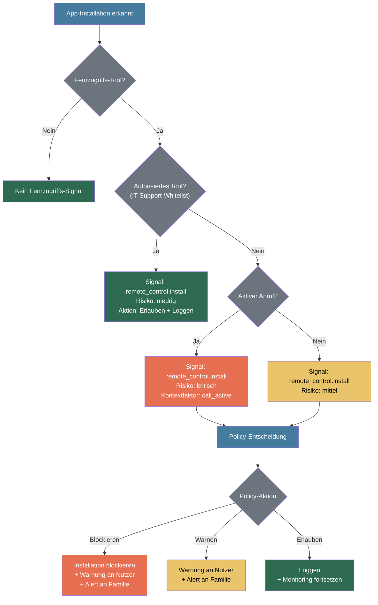
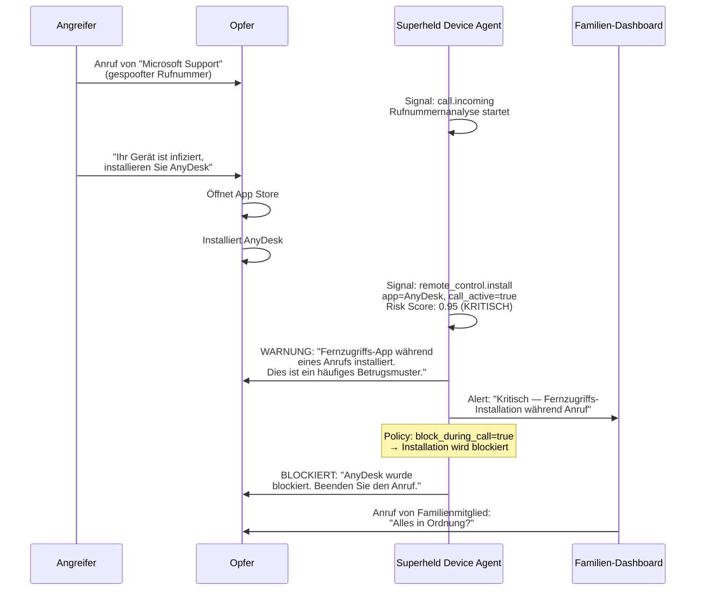

Fernzugriffsbasierte Betrugsangriffe gehören zu den gefährlichsten Angriffsarten, da sie Angreifern vollständige Kontrolle über das Gerät des Opfers geben. Superheld erkennt und unterbindet den Einsatz von Fernzugriffs-Software im Kontext von Betrug über die Bedrohungskategorie `remote_control`.

---

## Übersicht

Fernzugriffs-Betrug folgt einem typischen Muster: Angreifer überzeugen ihre Opfer — häufig per Telefon — eine Fernwartungssoftware wie AnyDesk, TeamViewer oder QuickSupport zu installieren. Sobald die Verbindung steht, übernehmen sie die Kontrolle über das Gerät und können:

- **Banking-Apps** öffnen und Überweisungen auslösen
- **Zugangsdaten** auslesen oder ändern
- **Malware** installieren, die auch nach Beendigung der Sitzung aktiv bleibt
- **Persönliche Daten** exfiltrieren (Fotos, Kontakte, Dokumente)
- **Sicherheitseinstellungen** deaktivieren (z. B. Bildschirmsperre, Zwei-Faktor-Authentifizierung)

Superheld adressiert diese Bedrohung mit einer mehrschichtigen Erkennung, die Installationen, Prozesse und den situativen Kontext korreliert.

---

## Erkannte Fernzugriffs-Software

Die folgende Tabelle listet die überwachten Fernzugriffs-Tools und ihre Erkennungsmethoden:

TODO: Package IDs und Bundle IDs mit dem Engineering-Team verifizieren und vervollständigen

| App | Package ID (Android) | Bundle ID (iOS) | Erkennungsmethode |
|---|---|---|---|
| **AnyDesk** | `com.anydesk.anydeskandroid` | `com.anydesk.AnyDesk` | Installationsüberwachung, Prozessüberwachung |
| **TeamViewer** | `com.teamviewer.teamviewer.market.mobile` | `com.teamviewer.TeamViewer` | Installationsüberwachung, Prozessüberwachung |
| **QuickSupport** | `com.teamviewer.quicksupport.market` | `com.teamviewer.QuickSupport` | Installationsüberwachung, Prozessüberwachung |
| **Chrome Remote Desktop** | `com.google.chromeremotedesktop` | TODO | Installationsüberwachung, Prozessüberwachung |
| **Microsoft Remote Desktop** | `com.microsoft.rdc.androidx` | `com.microsoft.rdc.macos` | Installationsüberwachung, Prozessüberwachung |
| **Zoho Assist** | `com.zoho.assist.agent` | TODO | Installationsüberwachung, Prozessüberwachung |
| **Weitere Screen-Sharing-Apps** | TODO: Vollständige Liste | TODO | Installationsüberwachung, Accessibility-Service-Erkennung |

TODO: Weitere relevante Fernzugriffs-Tools identifizieren (z. B. RustDesk, Splashtop, LogMeIn, ConnectWise ScreenConnect)

---

## Erkennungsmechanismen

Superheld setzt drei Erkennungsschichten ein, die zusammen eine zuverlässige Erkennung von Fernzugriffs-Betrug ermöglichen.

### a) Installationserkennung

Der Device Agent überwacht App-Installationen in Echtzeit. Wird eine bekannte Fernzugriffs-App installiert, erzeugt der Agent ein Signal vom Typ `remote_control.install`.

Entscheidend ist die Kontextzuordnung: Findet die Installation **während eines aktiven Telefonats** statt, eskaliert der Risk Score drastisch — dieses Muster ist ein starkes Indiz für einen laufenden Betrugsangriff.

```
Signal: remote_control.install
  app: "AnyDesk"
  package_id: "com.anydesk.anydeskandroid"
  call_active: true
  risk_score: 0.95
```

### b) Prozessüberwachung

Auf Plattformen, die dies unterstützen, erkennt der Agent nicht nur die Installation, sondern auch die **aktive Nutzung** von Fernzugriffs-Software:

- **Android:** Über den Accessibility Service werden aktive Fernzugriffs-Sitzungen erkannt
- **Windows / macOS / Linux:** Prozessüberwachung erkennt laufende Fernzugriffs-Prozesse und aktive Netzwerkverbindungen

TODO: Genaue Erkennungsmethoden je Plattform mit dem Engineering-Team abstimmen

Wenn eine aktive Remote-Session erkannt wird, erzeugt der Agent ein Signal vom Typ `remote_control.session_active`.

### c) Kontextkorrelation

Die Context Risk Engine korreliert Fernzugriffs-Signale mit anderen Signalen, um die tatsächliche Bedrohungslage präzise einzuschätzen:

| Signalkombination | Risikobewertung | Begründung |
|---|---|---|
| Aktiver Anruf + Fernzugriffs-Installation | **Kritisch** | Klassisches Tech-Support-Betrugsmuster |
| Aktive Remote-Session + Banking-App geöffnet | **Kritisch** | Direkter Zugriff auf Finanzdaten |
| Aktive Remote-Session + Änderung von Sicherheitseinstellungen | **Hoch** | Angreifer versucht, Schutzmaßnahmen zu deaktivieren |
| Fernzugriffs-Installation ohne aktiven Anruf | **Mittel** | Möglicherweise legitimite Nutzung (IT-Support) |
| Autorisiertes Tool (Whitelist) aktiv | **Niedrig** | Als IT-Support-Tool freigegeben |

---

## Erkennungsablauf

Das folgende Diagramm zeigt den Erkennungsablauf bei Installation einer Fernzugriffs-App:



---

## Policy-Konfiguration

Administratoren und Familien-Manager können den Fernzugriffsschutz an ihre Bedürfnisse anpassen.

### Standardverhalten

| Einstellung | Standardwert | Beschreibung |
|---|---|---|
| `remote_access.block_during_call` | `true` | Fernzugriffs-Installationen während aktiver Anrufe blockieren |
| `remote_access.warn_on_install` | `true` | Bei jeder Fernzugriffs-Installation warnen |
| `remote_access.authorized_tools` | `[]` | Liste autorisierter Fernzugriffs-Tools (z. B. für IT-Support) |
| `remote_access.block_session_with_banking` | `true` | Remote-Sessions bei geöffneter Banking-App blockieren |

### Autorisierte Tools

Für Szenarien mit legitimem IT-Support können bestimmte Fernzugriffs-Tools auf eine Whitelist gesetzt werden:

```json
{
  "remote_access": {
    "authorized_tools": [
      {
        "package_id": "com.teamviewer.teamviewer.market.mobile",
        "name": "TeamViewer",
        "reason": "IT-Abteilung Firma"
      }
    ]
  }
}
```

Autorisierte Tools erzeugen weiterhin Signale, werden aber mit niedrigem Risiko bewertet und nicht blockiert.

### Standard-Policies je Profil

| Profil | Blockierung bei Anruf | Warnung bei Installation | Session + Banking blockieren |
|---|---|---|---|
| **Standard (Erwachsene)** | Ja | Ja | Ja |
| **Kinder** | Ja | Ja | Ja |
| **Senioren** | Ja (verschärft) | Ja (verschärft) | Ja |
| **IT-versiert** | Warnung statt Blockierung | Ja | Ja |

TODO: Exakte Policy-Standardwerte mit dem Produktteam finalisieren

---

## Beispiel: Tech-Support-Betrug

Das folgende Szenario zeigt einen typischen Tech-Support-Betrugsablauf und Superhelds Eingreifen in jeder Phase.

### Szenario

Ein Angreifer ruft an und gibt sich als Microsoft-Mitarbeiter aus. Er behauptet, der Computer des Opfers sei mit einem Virus infiziert, und fordert zur Installation von AnyDesk auf.



### Chronologie

1. **Anruf eingehend** — Superheld erfasst den eingehenden Anruf und beginnt die Rufnummernanalyse
2. **App-Installation** — Während des Anrufs wird AnyDesk installiert; der Agent erkennt das Muster
3. **Risikobewertung** — Die Kombination aus aktivem Anruf und Fernzugriffs-Installation ergibt einen kritischen Risk Score
4. **Nutzerwarnung** — Das Opfer wird unmittelbar über das Betrugsmuster informiert
5. **Familienalarm** — Vertrauenspersonen erhalten einen Echtzeit-Alert
6. **Blockierung** — Gemäß Policy wird die Fernzugriffs-App blockiert

---

## Plattformunterschiede

Die Erkennungsfähigkeiten variieren je nach Plattform aufgrund unterschiedlicher Betriebssystem-APIs:

TODO: Exakte Fähigkeiten je Plattform mit dem Engineering-Team verifizieren

| Fähigkeit | Android | iOS | Windows | macOS | Linux |
|---|---|---|---|---|---|
| **Installationsüberwachung** | Ja (PackageManager) | Eingeschränkt (URL-Schemes) | Ja (Installer-Hooks) | Ja (Installer-Hooks) | Ja (Package-Manager-Hooks) |
| **Prozessüberwachung** | Ja (Accessibility Service) | Nein | Ja (Prozessliste) | Ja (Prozessliste) | Ja (Prozessliste) |
| **Erkennung aktiver Sessions** | Ja (Accessibility Service) | Nein | Ja (Netzwerk-Monitoring) | Ja (Netzwerk-Monitoring) | Ja (Netzwerk-Monitoring) |
| **Anruferkennung** | Ja (PhoneStateListener) | Eingeschränkt (CallKit) | TODO | TODO | TODO |
| **Automatische Blockierung** | Ja | Eingeschränkt (MDM) | TODO | TODO | TODO |
| **Kontextkorrelation** | Vollständig | Eingeschränkt | Teilweise | Teilweise | Teilweise |

### Plattformspezifische Hinweise

- **Android** bietet die umfassendsten Erkennungsmöglichkeiten durch den Accessibility Service, der sowohl Installationen als auch aktive Fernzugriffs-Sitzungen erkennen kann
- **iOS** ist aufgrund der Sandbox-Architektur eingeschränkt — Installationserkennung ist nur über URL-Schemes und MDM möglich, Anruferkennung nur über CallKit
- **Windows / macOS / Linux** ermöglichen Prozessüberwachung und Netzwerk-Monitoring, die genaue Erkennungstiefe variiert jedoch je nach Betriebssystemversion und Berechtigungen

TODO: Desktop-Plattform-Erkennungsfähigkeiten detailliert dokumentieren

---

## Weiterführende Informationen

- [Bedrohungsmodell](/experts/threat-model) — Vollständiges Bedrohungsmodell mit allen Angreiferkategorien
- [Erkennungspipeline](/experts/detection-pipeline) — Technische Details zur Signalverarbeitung
- [Context Risk Engine](/experts/context-risk-engine) — Funktionsweise der Kontextkorrelation
- [Manipulationsschutz](/experts/manipulation-protection) — Schutz vor psychologischer Manipulation
- [Konfiguration](/experts/configuration) — Vollständige Policy-Referenz
- [Plattformfähigkeiten](/experts/platform-capabilities) — Detaillierter Plattformvergleich
