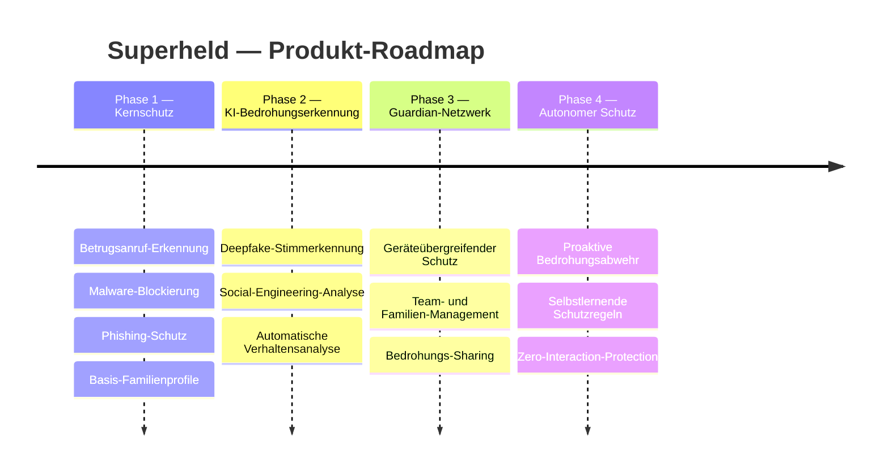

## Produktvision

Superheld entwickelt sich schrittweise von einer fokussierten Schutzlösung gegen Betrugsanrufe und Malware hin zu einer vollständig autonomen Sicherheitsplattform. Jede Phase baut auf der vorherigen auf und erweitert den Schutzumfang, ohne die Kernprinzipien — lokale Verarbeitung, Datenschutz und Benutzerfreundlichkeit — zu kompromittieren.

---

## Phase 1 — Kernschutz *(aktuell)*

Die erste Phase legt das Fundament: zuverlässiger Schutz vor den häufigsten digitalen Bedrohungen. Betrugsanrufe, Malware und Phishing-Versuche werden in Echtzeit erkannt und blockiert. Gleichzeitig ermöglichen Basis-Familienprofile eine erste Mitnutzung durch Angehörige.

- **Betrugsanruf-Erkennung** — Analyse eingehender Anrufe gegen bekannte Betrugsmuster und Spoofing-Datenbanken
- **Malware-Blockierung** — Lokaler Scan von Downloads und Installationen auf schädliche Inhalte
- **Phishing-Schutz** — URL-Analyse und Erkennung gefälschter Webseiten in Echtzeit
- **Basis-Familienprofile** — Gemeinsame Nutzung des Schutzes innerhalb einer Familie mit individuellen Einstellungen

:::note
Phase 1 ist vollständig verfügbar. Alle Schutzfunktionen arbeiten lokal auf dem Gerät — ohne Cloud-Abhängigkeit für die Kernanalyse.
:::

---

## Phase 2 — KI-Bedrohungserkennung

Phase 2 hebt die Erkennung auf ein neues Niveau durch den Einsatz fortschrittlicher KI-Modelle. Deepfake-Stimmen werden in Echtzeit identifiziert, und Social-Engineering-Versuche werden durch kontextbezogene Analyse erkannt, bevor sie Schaden anrichten können.

- **Deepfake-Stimmerkennung** — Analyse von Audio-Streams auf Artefakte synthetischer Sprachgenerierung
- **Social-Engineering-Analyse** — Kontextbezogene Erkennung von Manipulationsversuchen über alle Kommunikationskanäle
- **Automatische Verhaltensanalyse** — Erkennung ungewöhnlicher Muster im Geräte- und Kommunikationsverhalten
- **Erweiterte Benachrichtigungen** — Kontextreiche Warnungen mit konkreten Handlungsempfehlungen und Risikobewertung

---

## Phase 3 — Guardian-Netzwerk

Das Guardian-Netzwerk verbindet mehrere Geräte und Nutzer zu einem gemeinsamen Schutzverbund. Familien und Teams profitieren von zentralen Richtlinien und geteilter Bedrohungsintelligenz — eine auf einem Gerät erkannte Bedrohung schützt sofort alle verbundenen Geräte.

- **Geräteübergreifender Schutz** — Einheitlicher Schutzstatus über Smartphone, Tablet und Desktop hinweg
- **Team- und Familien-Management** — Zentrale Verwaltung von Schutzprofilen mit rollenbasiertem Zugriff
- **Zentrale Schutzrichtlinien** — Einheitliche Sicherheitsregeln für alle Geräte im Netzwerk
- **Bedrohungs-Sharing zwischen Geräten** — Erkannte Bedrohungen werden anonymisiert im Netzwerk geteilt

:::note
Im Guardian-Netzwerk bleibt das Prinzip der lokalen Verarbeitung erhalten. Geräte tauschen ausschließlich anonymisierte Bedrohungssignaturen aus — niemals persönliche Daten oder Nachrichteninhalte.
:::

---

## Phase 4 — Autonomer Schutz

Die finale Phase macht Superheld zu einem vollständig autonomen Schutzsystem. Bedrohungen werden nicht nur erkannt, sondern proaktiv vorhergesagt und abgewehrt. Selbstlernende Regeln passen sich kontinuierlich an neue Angriffsvektoren an — ohne manuelles Eingreifen des Nutzers.

- **Proaktive Bedrohungsabwehr** — Vorausschauende Erkennung und Neutralisierung potenzieller Angriffe, bevor sie stattfinden
- **Selbstlernende Schutzregeln** — Adaptive Regelwerke, die sich automatisch an das individuelle Nutzungsverhalten und neue Bedrohungstypen anpassen
- **Predictive Threat Intelligence** — KI-gestützte Vorhersage kommender Angriffswellen auf Basis globaler Bedrohungsdaten
- **Zero-Interaction-Protection** — Vollständig autonomer Schutz, der keine Benutzerinteraktion erfordert

---

## Weiterführende Informationen

- [Systemarchitektur](/experts/architecture) — Technischer Aufbau und Datenflüsse
- [Bedrohungsmodell](/experts/threat-model) — Angriffskategorien und Erkennungsmethoden
- [Privatsphäre & Sicherheit](/experts/privacy-security) — Datenschutz-Garantien über alle Phasen hinweg
