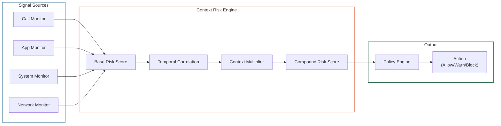

## Purpose

This specification defines the Context Risk Engine (CRE): how it correlates multiple signals into compound risk scores, the scoring model, temporal/context multipliers, and decision thresholds.

**Audience:** Detection/ML engineers, security auditors.

---

## In-Scope / Out-of-Scope

| In-Scope | Out-of-Scope |
|---|---|
| Risk scoring model (base + multipliers) | Individual detector implementation |
| Temporal correlation windows | Event persistence and delivery |
| Context multiplier definitions | Policy hierarchy and conflict resolution |
| Decision thresholds and actions | Cloud Enrichment internals |

---

## Architecture



---

## Risk Scoring Model

The compound risk score is computed from three factors:

### 1. Base Risk Score

Each individual signal carries an inherent danger rating.

| Signal Type | Base Score | Source |
|---|---|---|
| Call from unknown number | `TODO-ENG-023` | Call Monitor |
| Call from known fraud database | `TODO-ENG-023` | Call Monitor + Cloud |
| Urgency language detected | `TODO-ENG-023` | ML NLP (Stage 2) |
| App installation (sideload) | `TODO-ENG-023` | App Monitor |
| App installation (official store) | `TODO-ENG-023` | App Monitor |
| Remote access app detected | `TODO-ENG-023` | App Monitor |
| Banking app opened | `TODO-ENG-023` | App Monitor |
| Phishing URL detected | `TODO-ENG-023` | Network Monitor |
| Unknown HID device | `TODO-ENG-023` | System Monitor |

> `TODO-ENG-023`: Provide base risk scores for each signal type (numerical values 0–100).

### 2. Temporal Correlation Multiplier

When multiple signals occur within the same time window, their risk scores are **multiplied, not added**. This reflects the exponentially increased danger of simultaneous threat indicators.

| Time Window | Multiplier | Rationale |
|---|---|---|
| `TODO-ENG-024` | `TODO-ENG-024` | Short-window correlation (e.g., call + app install within 2 minutes) |
| `TODO-ENG-024` | `TODO-ENG-024` | Medium-window correlation |
| `TODO-ENG-024` | `TODO-ENG-024` | Long-window correlation (multi-hour attack) |

> `TODO-ENG-024`: Provide temporal correlation windows (in seconds/minutes) and their multiplier values.

### 3. Context Multiplier

Specific signal combinations are classified as extra dangerous, receiving additional multipliers.

| Signal Combination | Context Multiplier | Rationale |
|---|---|---|
| Active call + remote access app install | `TODO-ENG-025` | Classic tech-support scam pattern |
| Active call + banking app opened | `TODO-ENG-025` | Bank impersonation pattern |
| Sideload + accessibility permission request | `TODO-ENG-025` | Malware installation pattern |
| Unknown call + urgency language + transfer attempt | `TODO-ENG-025` | Financial fraud pattern |

> `TODO-ENG-025`: Provide context multiplier values for each signal combination.

---

## Decision Thresholds

### Standard Thresholds (Preliminary)

| Compound Risk Score | Action | Guardian Notification |
|---|---|---|
| 0–29 | **Allow** (logged, no visible intervention) | No |
| 30–69 | **Warn** (user sees explanation + decision prompt) | Optional (configurable) |
| 70–100 | **Block** (automatic intervention) | Yes (immediate) |

> `TODO-ENG-026`: Confirm final threshold values. Do thresholds differ per threat category or profile (child/senior/adult)?

### Actions Detail

| Action | User Experience | Audit |
|---|---|---|
| **Allow** | No visible intervention | Event logged with full context |
| **Warn** | User sees context explanation + recommendation. User can proceed or abort. | Event logged with user decision |
| **Block** | Automatic intervention (app install stopped, permission denied, connection blocked) | Event logged. Guardian notified with timeline. |

---

## Compound Score Computation

```
compound_score = Σ(base_scores) × temporal_multiplier × context_multiplier
```

Where:
- `Σ(base_scores)` = sum of all active signal base scores in the current evaluation window
- `temporal_multiplier` = multiplier based on time proximity of signals (≥ 1.0)
- `context_multiplier` = multiplier for known dangerous combinations (≥ 1.0)

The compound score is clamped to the range [0, 100].

> `TODO-ENG-027`: Confirm scoring formula. Is it additive-then-multiplicative as described, or does each signal independently produce a compound score?

---

## Example Scenarios

### Scenario A: Call + Remote Access Install (Tech-Support Scam)

| Time | Event | Signal Score | Running Compound | Action |
|---|---|---|---|---|
| T+0s | Incoming call from unknown number | Low | Low | Allow |
| T+30s | Urgency language detected in call context | Medium | Medium | Allow |
| T+90s | AnyDesk installation attempted during active call | High | **Critical** (temporal × context multiplier) | **Block** + Guardian Alert |

### Scenario B: Call + Banking Action (Bank Impersonation)

| Time | Event | Signal Score | Running Compound | Action |
|---|---|---|---|---|
| T+0s | Incoming call from spoofed bank number | Low | Low | Allow |
| T+45s | Banking app opened during call | Medium | Medium | Allow |
| T+120s | Unusually high transfer amount initiated | High | **Very High** (temporal × context multiplier) | **Warn** + Context Explanation |

### Scenario C: Sideload + Accessibility + Unknown Call

| Time | Event | Signal Score | Running Compound | Action |
|---|---|---|---|---|
| T+0s | Sideloaded app installed | Medium | Medium | Allow |
| T+10s | App requests accessibility permission | High | High (context multiplier: sideload + accessibility) | **Warn** |
| T+60s | Incoming call from unknown number | Medium → **Critical** | **Critical** (three-signal compound) | **Block** + Disable App + Guardian Alert |

---

## Latency Targets

| Component | Target | Status |
|---|---|---|
| Signal ingestion → base score | < 10 ms | `TODO-ENG-028` |
| Temporal correlation evaluation | < 5 ms | `TODO-ENG-028` |
| Context multiplier lookup | < 1 ms | `TODO-ENG-028` |
| Total CRE evaluation | < 20 ms | `TODO-ENG-028` |

> `TODO-ENG-028`: Confirm CRE latency targets and measured P95/P99 values.

---

## Failure Modes

| Failure | Impact | Mitigation |
|---|---|---|
| Signal source unavailable | Incomplete compound score | CRE evaluates available signals only. Reduced correlation but no false silence. |
| Temporal window missed | Late signal not correlated | Configurable window extension. Late signals trigger re-evaluation. |
| Context multiplier misconfigured | Over-blocking or under-blocking | Policy Engine validates multiplier ranges. Out-of-range values rejected. |
| CRE process crash | No compound scoring | Signals fall through to Policy Engine with individual scores. Fail-open for allow, fail-closed for high-confidence threats. |

---

## Related Specifications

- [Detection Engine](/experts/spec/detection-engine) — Produces the signals that CRE correlates
- [Policy Engine](/experts/spec/policy-engine) — Consumes compound risk scores for action decisions
- [Context Risk Engine](/experts/context-risk-engine) — Public documentation
