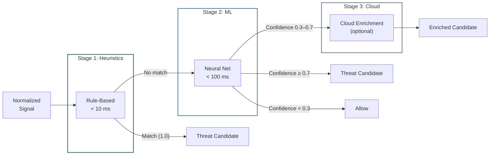

## Purpose

This specification defines the detection engine: rule-based detectors vs. ML classifiers vs. reputation lookups, their inputs/outputs, confidence scoring, and evasion resistance.

**Audience:** Detection/ML engineers, security auditors.

---

## In-Scope / Out-of-Scope

| In-Scope | Out-of-Scope |
|---|---|
| Detector types and their inputs/outputs | ML model architectures and training data |
| Confidence scoring and calibration | Cloud Enrichment API internals |
| Evasion considerations and mitigations | Policy evaluation logic (see [Policy Engine](/experts/spec/policy-engine)) |
| Detection pipeline stage mapping | Event persistence and delivery |

---

## Detector Types

### 1. Rule-Based Heuristics (Stage 1)

**Runtime:** Local device, deterministic
**Target latency:** < 10 ms per signal

| Input | Output | Examples |
|---|---|---|
| Normalized signal (call metadata, URL, app signature) | Match/no-match + confidence (0.0 or 1.0) | Known fraud number database, malicious domain signatures, STIR/SHAKEN attestation failure |

**Characteristics:**
- Deterministic: identical inputs → identical outputs
- No gradients: immune to adversarial ML attacks
- High precision, limited recall (only catches known patterns)
- Updated via signed threat signature packages

### 2. ML Classifiers (Stage 2)

**Runtime:** Local device, neural network inference
**Target latency:** < 100 ms per signal
**Model size:** < 50 MB (quantized INT8/FP16)

| Input | Output | Examples |
|---|---|---|
| Feature-extracted signal representation | Confidence score (0.0–1.0) + threat category | Social engineering NLP patterns in text, suspicious app behavior analysis, URL feature extraction (domain age, certificate status, brand similarity) |

**Characteristics:**
- Probabilistic: outputs continuous confidence scores
- Quantized models: reduced susceptibility to gradient-based adversarial attacks
- Model integrity: signed delivery, signature verification before loading, no-downgrade (rollback protection)
- Regular updates via Model Update Service (signed packages)

**ML capabilities deployed:**
| Capability | Method | Input |
|---|---|---|
| Social engineering detection | NLP models | Text messages (in-memory, discarded after) |
| Suspicious attachment pre-analysis | Image classification | Attachment metadata and thumbnails |
| URL analysis | Feature extraction | Domain age, certificate status, brand similarity, homoglyph detection |
| Behavioral analysis | Pattern recognition | Communication patterns, app usage anomalies |

> `TODO-ENG-015`: Confirm model architecture family (transformer, CNN, etc.) and quantization format (TFLite, ONNX, CoreML).
> `TODO-ENG-016`: Confirm model update frequency (weekly, monthly, on-demand).

### 3. Cloud Enrichment / Reputation Lookups (Stage 3)

**Runtime:** Cloud (optional, stateless)
**Trigger:** Only when local detection yields ambiguous confidence (0.3–0.7 range)

| Input | Output | Purpose |
|---|---|---|
| SHA-256 hash of phone number | Risk assessment + campaign attribution | Known fraud number lookup |
| SHA-256 hash of domain/URL | Risk assessment + threat category | Known phishing/malware domain lookup |
| SHA-256 hash of app signature | Risk assessment + distribution info | Known malware signature lookup |
| Anonymized feature vector | Complex classification result | Deepfake detection, advanced NLP for novel attacks |

**Characteristics:**
- Stateless: no device ID or user ID in requests
- Plaintext never transmitted
- Feature vectors: dimensionality-reduced, irreversibly transformed before transmission

> `TODO-ENG-017`: Confirm feature vector transformation method (hashing, random projection, quantization).
> `TODO-ENG-018`: Confirm differential privacy parameters (ε, δ) if DP is applied to feature vectors.
> `TODO-ENG-019`: Confirm cloud enrichment SLA (latency target, availability target).

---

## Detection Pipeline Mapping

**Escalation rule:** Only signals that cannot be classified with sufficient confidence advance to the next stage. This minimizes latency and data exposure.

---

## Confidence Scoring

### Score Semantics

| Range | Interpretation | Default Action |
|---|---|---|
| 0.0–0.3 | No threat detected | Allow |
| 0.3–0.7 | Suspicious, insufficient confidence | Warn (user informed) |
| 0.7–1.0 | High confidence threat | Block (automatic protection) |

**Calibration:** Confidence scores represent the model's estimated probability that the signal is a true threat. A score of 0.8 means the model estimates an 80% probability.

> `TODO-ENG-020`: Confirm that confidence scores are calibrated (i.e., predicted probabilities match observed frequencies). Describe calibration method.
> `TODO-ENG-021`: Confirm whether thresholds differ per threat category.

### Compound Confidence (Context Risk Engine)

When the [Context Risk Engine](/experts/spec/context-risk-engine-spec) correlates multiple signals, it produces a compound risk score that supersedes individual confidence scores. The compound score uses multiplicative combination, not additive.

---

## Evasion Considerations

| Evasion Technique | Affected Detector | Mitigation |
|---|---|---|
| **Known number rotation** | Rule-based (fraud database) | Cloud Enrichment updates database continuously. ML models detect behavioral patterns independent of number. |
| **Domain rotation (< 24h)** | Rule-based (domain reputation) | ML URL analysis uses feature extraction (domain age, certificate, brand similarity) independent of reputation database. |
| **Adversarial text perturbation** | ML NLP classifiers | Quantized models less susceptible to gradient attacks. Multiple feature families (not solely text embedding). |
| **Legitimate tool abuse** (PowerShell, curl) | App signature matching | Behavioral analysis detects anomalous usage patterns of legitimate tools (e.g., PowerShell executing encoded commands during active call). |
| **Slow escalation** (multi-day) | Temporal correlation | Context Risk Engine tracks risk accumulation over configurable time windows. |
| **Encrypted channel attacks** | Content-based detection | Metadata analysis (timing, patterns, contact reputation) provides partial detection without content access. |

---

## Failure Modes

| Failure | Impact | Mitigation |
|---|---|---|
| Model file corrupted | ML detection unavailable | Signature verification rejects corrupted models. Agent falls back to rule-based detection only. |
| Model too old | Reduced detection of novel threats | No-downgrade policy enforces forward-only updates. Agent warns user about outdated models after configurable period. |
| Cloud unreachable | No Stage 3 enrichment | Ambiguous signals (0.3–0.7) default to Warn action instead of Block. User informed of reduced protection. |
| Rule database empty | No heuristic detection | ML detection still operational. Agent flags missing database as error condition. |
| Confidence miscalibration | Elevated false positives or false negatives | Continuous model evaluation against labeled validation sets. Calibration drift triggers model update. |

> `TODO-ENG-022`: Confirm fallback behavior when both rule database and ML model are unavailable simultaneously.

---

## Related Specifications

- [Device Agent](/experts/spec/device-agent) — Signal collection feeding the detection engine
- [Context Risk Engine](/experts/spec/context-risk-engine-spec) — Compound risk scoring from multiple detections
- [Policy Engine](/experts/spec/policy-engine) — How detection outputs map to actions
- [Detection Pipeline](/experts/detection-pipeline) — Public documentation of the 6-stage pipeline
