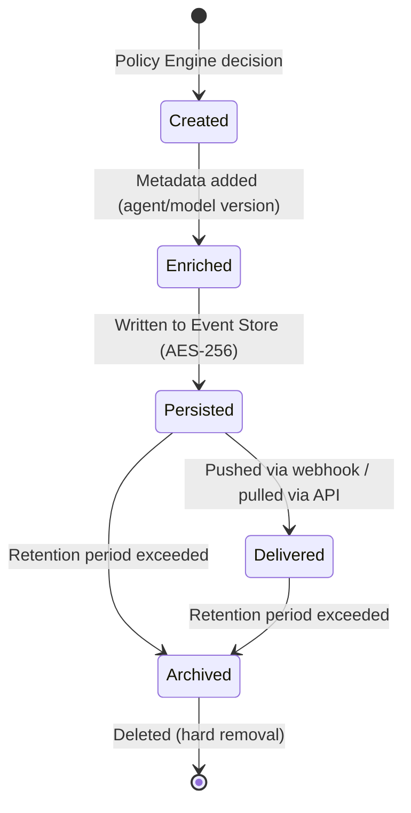

## Purpose

This specification defines the event pipeline: event lifecycle (creation → enrichment → persistence → delivery → archival), immutability guarantees, delivery semantics, and schema contracts.

**Audience:** Backend engineers, integration architects.

---

## In-Scope / Out-of-Scope

| In-Scope | Out-of-Scope |
|---|---|
| Event lifecycle and state machine | Detection logic and scoring |
| Schema contracts (Event, Threat, Device, Policy, Alert) | Policy evaluation rules |
| Delivery guarantees (API, webhooks) | Cloud Enrichment processing |
| Retention and redaction | GUI/dashboard implementation |

---

## Event Lifecycle

### Lifecycle Stages

| Stage | Description | Storage |
|---|---|---|
| **Created** | Policy Engine emits action decision with full context | In-memory |
| **Enriched** | Metadata added: agent version, model version, platform, tenant ID | In-memory |
| **Persisted** | Written to local Event Store. AES-256 encrypted. Append-only, cryptographically chained. | Device (encrypted) |
| **Delivered** | Pushed via webhook (HMAC-SHA256 signed) or pulled via REST API (cursor-based) | Cloud relay (transient) |
| **Archived** | Local retention expired. Cloud copy retained per retention policy. | Cloud (EU — Frankfurt) |
| **Deleted** | Hard removal after retention period. Irreversible. | None |

---

## Immutability

- **Append-only:** Events cannot be modified after creation
- **Cryptographic chaining:** Each event contains a hash of the previous event, forming a tamper-evident chain
- **No updates:** Corrections are recorded as new events with a reference to the original event ID
- **Encryption at rest:** AES-256. Keys stored in secure enclave (iOS) or keystore (Android)

> `TODO-ENG-030`: Confirm chaining algorithm (SHA-256 of previous event?). Confirm whether chain is verified at read time or only at audit time.

---

## Recording Policy

**Every detection decision is logged as an event — including Allow decisions.** This ensures a complete audit trail.

| Decision | Recorded? | Delivered? |
|---|---|---|
| Allow | Yes (local Event Store) | No (filtered out by default for webhooks/API) |
| Warn | Yes | Yes (if severity ≥ configured threshold) |
| Block | Yes | Yes (always) |

---

## Schema Contracts

### Event Object

| Field | Type | Required | Description |
|---|---|---|---|
| `event_id` | string | Yes | Format: `evt_...`. Globally unique. |
| `timestamp` | string (ISO 8601) | Yes | Policy decision timestamp |
| `device_id` | string | Yes | Format: `dev_...`. Associated device. |
| `threat_category` | enum | Yes | `phone_scam`, `social_engineering`, `malicious_app`, `phishing`, `remote_control`, `deepfake` |
| `confidence` | float (0.0–1.0) | Yes | Detection confidence |
| `action_taken` | enum | Yes | `allow`, `warn`, `block` |
| `policy_id` | string | Yes | Format: `pol_...`. Applied policy. |
| `severity` | enum | Yes | `low`, `medium`, `high`, `critical` |
| `description` | string | No | Human-readable, redacted for external delivery |
| `indicators` | array[string] | No | IOCs: SHA-256 hashes, signature IDs |
| `metadata` | object | No | See Metadata object below |

### Metadata Object

| Field | Type | Description |
|---|---|---|
| `agent_version` | string | Device Agent version (e.g., "2.4.1") |
| `model_version` | string | ML model version (e.g., "detect-v3.2") |
| `device_platform` | enum | `ios`, `android`, `windows`, `macos`, `linux` |
| `tenant_id` | string | Format: `org_...`. Organization ID. |

### Threat Object

| Field | Type | Required | Description |
|---|---|---|---|
| `threat_id` | string | Yes | Format: `thr_...` |
| `threat_category` | enum | Yes | Canonical threat category |
| `confidence` | float (0.0–1.0) | Yes | Highest confidence from related events |
| `severity` | enum | Yes | `low`, `medium`, `high`, `critical` |
| `device_id` | string | Yes | Associated device |
| `detected_at` | string (ISO 8601) | Yes | First detection timestamp |
| `description` | string | No | Human-readable |
| `indicators` | array[string] | No | IOCs |
| `status` | enum | Yes | `active`, `resolved`, `dismissed` |

### Device Object

| Field | Type | Required | Description |
|---|---|---|---|
| `device_id` | string | Yes | Format: `dev_...` |
| `platform` | enum | Yes | `ios`, `android`, `windows`, `macos`, `linux` |
| `agent_version` | string | Yes | Current agent version |
| `last_seen` | string (ISO 8601) | Yes | Last contact timestamp |
| `status` | enum | Yes | `active`, `inactive`, `quarantined` |
| `name` | string | No | User-assigned display name |

### Policy Object

| Field | Type | Required | Description |
|---|---|---|---|
| `policy_id` | string | Yes | Format: `pol_...` |
| `name` | string | Yes | Display name |
| `threat_categories` | array[enum] | Yes | Applicable categories |
| `action` | enum | Yes | `allow`, `warn`, `block` |
| `confidence_threshold` | float | No | Minimum confidence to trigger |
| `enabled` | boolean | Yes | Active/inactive |

### Alert Object

| Field | Type | Required | Description |
|---|---|---|---|
| `alert_id` | string | Yes | Unique ID |
| `event_id` | string | Yes | Referenced event |
| `channel` | enum | Yes | `push`, `email`, `webhook`, `siem` |
| `delivered_at` | string (ISO 8601) | No | Delivery timestamp |
| `status` | enum | Yes | `pending`, `delivered`, `failed` |

> `TODO-ENG-031`: Confirm schema stability for all objects above. Confirm versioning strategy for schema changes.

---

## Delivery Guarantees

### Webhook Delivery

| Property | Value |
|---|---|
| Semantics | At-least-once (duplicates possible) |
| Ordering | No ordering guarantee (use `timestamp` for sorting) |
| Signing | HMAC-SHA256 (`X-Superheld-Signature`) |
| Replay protection | Consumer should reject events > 5 min old |
| Idempotency | Use `event_id` as deduplication key |
| Retry policy | 5 retries with exponential backoff (10s, 30s, 90s, 270s, 810s) |
| Dead Letter Queue | Failed events queued for manual replay |

> `TODO-ENG-032`: Confirm `X-Superheld-Timestamp` header presence. Confirm dedicated Idempotency-Key header or use `event_id` only.
> `TODO-ENG-033`: Confirm DLQ manual replay availability in dashboard.

### API Delivery

| Property | Value |
|---|---|
| Method | `GET /api/v1/events` |
| Pagination | Cursor-based (`cursor` + `limit` parameters) |
| Filtering | `since` (ISO 8601 timestamp), `severity`, `threat_category` |
| Response | JSON array with `has_more` and `cursor` fields |

---

## Retention Policy

| Data Type | Location | Retention | Status |
|---|---|---|---|
| Detection events (local) | Device (AES-256) | 90 days | `TODO-ENG-034` |
| Detection events (cloud) | EU (Frankfurt) | 180 days | `TODO-ENG-034` |
| Audit logs | EU | 12 months | `TODO-ENG-034` |
| Aggregated metrics | EU | 24 months (then anonymized) | `TODO-ENG-034` |

> `TODO-ENG-034`: Confirm all retention periods and hard deletion SLA.

**Deletion:** Irreversible. Can be requested early via dashboard or API. Account deletion triggers full data removal within 30 days, backup overwrite within 90 days.

---

## Redaction (Before External Delivery)

| Data Type | Redaction Method |
|---|---|
| PII (email, name, phone) | Replaced with placeholder |
| Message content | Not included in telemetry |
| URLs | Transmitted as SHA-256 hashes (full URL stays local) |
| IP addresses | Truncated to /24 (IPv4) or /48 (IPv6) |

Applies to cloud transmission and external delivery only. Local Event Store retains full unredacted data (AES-256 encrypted).

---

## Failure Modes

| Failure | Impact | Mitigation |
|---|---|---|
| Event Store full | Cannot persist new events | Ring buffer: oldest events overwritten. High-severity events prioritized. |
| Webhook endpoint unreachable | Events not delivered | Retry with exponential backoff. DLQ after 5 failures. Events persist locally. |
| API unavailable | Integrators cannot poll | Events buffered locally. Chronological redelivery on reconnect. |
| Encryption key unavailable | Cannot read/write Event Store | Agent enters safe mode. New events buffered in memory until key available. |
| Chain integrity violation | Tamper detected | Agent logs integrity error. Affected events flagged. Re-chaining from last verified event. |

---

## Related Specifications

- [Policy Engine](/experts/spec/policy-engine) — Produces the action decisions that become events
- [API Contract](/experts/spec/api-contract) — REST API for event consumption
- [Telemetry Schema](/experts/spec/telemetry-schema) — PII classification and redaction details
- [Webhooks](/experts/webhooks) — Public webhook integration guide
