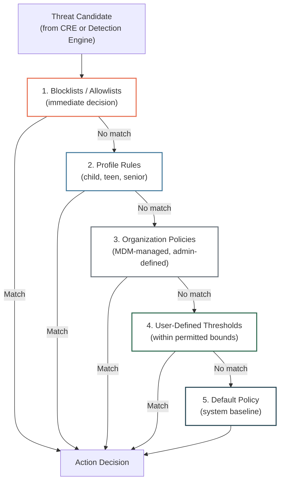

## Purpose

This specification defines the Policy Engine: evaluation model, priority hierarchy, action catalog, conflict resolution, and fail-closed semantics.

**Audience:** Security engineers, platform engineers.

---

## In-Scope / Out-of-Scope

| In-Scope | Out-of-Scope |
|---|---|
| Policy evaluation order and conflict resolution | Detection and scoring logic |
| Action catalog (warn/block/approve/notify) | Event persistence and delivery |
| Profile types and inheritance | Cloud Enrichment processing |
| Safety constraints (lockout prevention) | GUI/UX for policy configuration |

---

## Evaluation Model

The Policy Engine evaluates threat candidates against configured policies in a strict priority hierarchy. The first matching policy determines the action.

### Priority Hierarchy (Evaluated in Order)

### Priority Rules

1. **Blocklists/Allowlists** — Highest priority. Known numbers, domains, apps. Immediate decision without further evaluation.
2. **Profile Rules** — Family profiles (child, teen, senior, custom) define profile-specific thresholds and restrictions.
3. **Organization Policies** — MDM-managed environments. Admin-defined minimum protection levels.
4. **User-Defined Thresholds** — Within permitted bounds, users can adjust sensitivity.
5. **Default Policy** — System baseline if no other policy matches.

**Constraint:** Admin policies (levels 1–3) cannot be overridden by users (level 4). This prevents an attacker from socially engineering a victim into disabling their own protection.

---

## Action Catalog

| Action | Trigger | User Experience | Reversible? |
|---|---|---|---|
| **Allow** | Risk score below threshold | No visible intervention | N/A |
| **Warn** | Risk score in warning range (0.3–0.7 confidence) | User sees context explanation + recommendation. User can proceed or abort. | User can dismiss |
| **Block** | Risk score above threshold (≥ 0.7 confidence) | Automatic intervention: app install stopped, permission denied, connection blocked | Requires admin/guardian override (for restricted profiles) |
| **Require Approval** | Guardian-managed profile | Action paused until guardian approves or denies | Time-limited (auto-deny after timeout) |
| **Notify Guardian** | Any warn/block on protected member | Push notification to all registered guardians | N/A |

### Block Actions by Context

| Context | Block Behavior |
|---|---|
| App installation | Installation prevented. User shown explanation. |
| Permission grant | Permission request intercepted. Explanation shown. |
| URL access | Connection blocked. Warning page displayed. |
| Remote access session | Session prevented. Alert shown. |
| Active call + dangerous action | Action blocked. "Verdacht auf Betrug — legen Sie auf" alert. |

---

## Profile Types

| Profile | Protection Level | App Approval Required | Sideload Policy | Change Lock |
|---|---|---|---|---|
| **Child** | Maximum | Yes (guardian approval) | Blocked | Yes (guardian-only changes) |
| **Teen** | Elevated | Configurable | Warn + guardian notification | Configurable |
| **Senior** | Elevated | Configurable | Blocked or warn | Yes (guardian-only changes) |
| **Adult** (default) | Standard | No | Warn | No |
| **Expert** | Minimal | No | Allow | No |
| **Custom** | User-defined | Configurable | Configurable | Configurable |

### Profile Capabilities

| Capability | Child | Teen | Senior | Adult | Expert |
|---|---|---|---|---|---|
| Override warn | No | Configurable | No | Yes | Yes |
| Override block | No | No | No | Configurable | Yes |
| Disable protection modules | No | No | No | No | Yes |
| View threat details | No | Configurable | Yes | Yes | Yes |
| Modify policies | No | No | No | Limited | Full |

---

## Whitelist / Blocklist Configuration

| Entry Type | Example | Scope |
|---|---|---|
| Phone numbers | +49 30 123456 | Call protection |
| Contact groups | "Family", "Work" | Call + message protection |
| Apps | com.teamviewer.host | Remote control protection |
| Domains | support.example.com | Network protection |
| Number ranges | +49 30 * | Call protection |

---

## Policy Schema

| Field | Type | Required | Description |
|---|---|---|---|
| `policy_id` | string | Yes | Format: `pol_...` |
| `name` | string | Yes | Human-readable display name |
| `threat_categories` | array[enum] | Yes | Applicable threat types |
| `action` | enum | Yes | `allow`, `warn`, `block` |
| `confidence_threshold` | float | No | Minimum confidence to trigger (default: profile-based) |
| `enabled` | boolean | Yes | Active/inactive |
| `priority` | integer | Yes | Evaluation order within tier |
| `profile_id` | string | No | Linked profile (if profile-scoped) |

> `TODO-ENG-029`: Confirm policy schema stability and additional fields (e.g., time-based policies, geo-restrictions).

---

## Security Properties

| Property | Description |
|---|---|
| **Deterministic** | Same inputs → same outputs. No randomness in policy evaluation. |
| **Auditable** | Every decision logged with policy reference, inputs, and outputs. |
| **Fail-closed** | Unparseable policy → Block (default action). Never fails to Allow. |
| **Policy integrity** | Policy files checksummed at load. Manipulated files rejected. |
| **Privilege hierarchy** | Admin policies cannot be overridden by users. Prevents attacker from disabling victim's protection via social engineering. |
| **No lockout** | System prevents configurations that would lock the user out of their device entirely. Essential device functions always accessible. |

---

## Conflict Resolution

| Scenario | Resolution |
|---|---|
| Blocklist says Block + Allowlist says Allow | Blocklist wins (evaluated first) |
| Profile says Block + User says Allow | Profile wins (higher priority) |
| Organization says Warn + Profile says Block | Most restrictive action wins (Block) |
| Two policies at same priority match | Most restrictive action wins |
| No policy matches | Default policy applies |

---

## Failure Modes

| Failure | Impact | Mitigation |
|---|---|---|
| Policy file corrupted | Cannot evaluate policies | **Fail-closed:** default to Block for all threats. Agent logs error. |
| Policy file missing | No policy configuration | System defaults applied. User notified. |
| CRE unavailable | No compound risk scores | Individual signal scores evaluated directly against policies. |
| Profile misconfigured | Over-blocking or under-blocking | Configuration validation at save time. Invalid configurations rejected. |
| Conflicting policies | Ambiguous action | Most restrictive action wins. Conflict logged for admin review. |

---

## Related Specifications

- [Context Risk Engine (Spec)](/experts/spec/context-risk-engine-spec) — Produces compound scores consumed by Policy Engine
- [Event Pipeline](/experts/spec/event-pipeline) — How policy decisions become events
- [Configuration](/experts/configuration) — Public policy configuration guide
