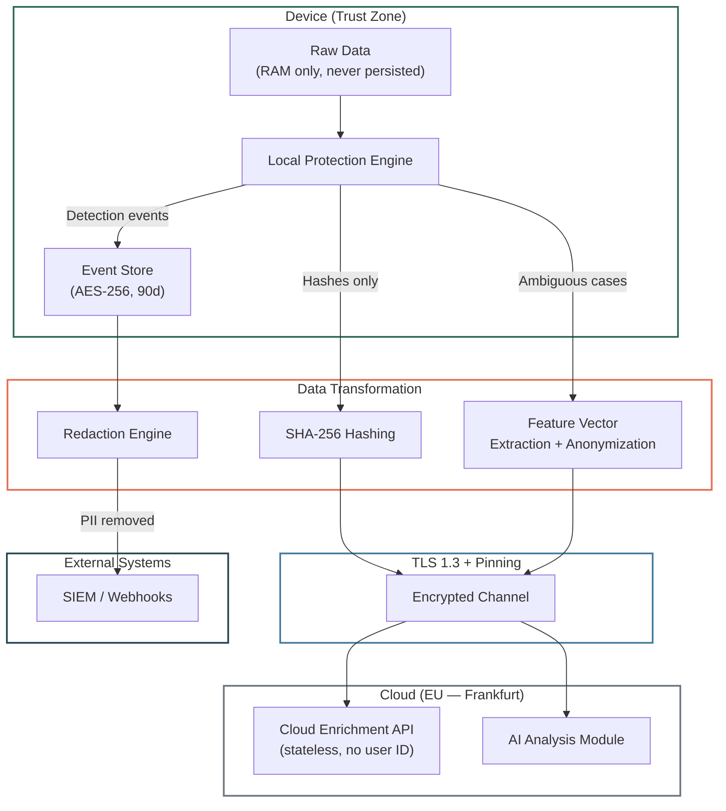

## Purpose

This specification defines the Superheld privacy model: data inventory, trust boundary data flows, retention policies, feature vector transforms, and what data leaves the device under what conditions.

**Audience:** Privacy/security engineers, compliance officers, auditors.

---

## In-Scope / Out-of-Scope

| In-Scope | Out-of-Scope |
|---|---|
| Data inventory with classification | Implementation of encryption algorithms |
| Trust boundary data flow diagram | Cloud infrastructure security controls |
| Retention policy per data type | Legal compliance analysis (GDPR, DSGVO) |
| Feature vector transformation guarantees | Marketing privacy claims |
| Voice/audio handling | Content moderation decisions |

---

## Data Minimization Principles

1. **Minimum collection:** Only data required for threat detection is accessed
2. **Minimum retention:** Data retained only as long as operationally necessary
3. **Minimum transmission:** Only cryptographic hashes and anonymized feature vectors leave the device
4. **No tracking, no ads:** No analytics trackers, ad SDKs, or third-party pixels
5. **Opt-in for extended:** Additional data sharing requires explicit user consent

---

## Data Inventory

### Raw Data (Never Leaves Device)

| Data Type | Access Pattern | Storage | Retention |
|---|---|---|---|
| Message/email content | Read in RAM, analyzed, discarded | Volatile RAM only | Immediate (discarded after analysis) |
| Audio/call content | Processed in RAM only | Volatile RAM only | Immediate (discarded after analysis) |
| Files/attachments | Scanned in RAM | Volatile RAM only | Immediate (discarded after analysis) |
| Contact information | Read for caller ID context | Not stored by agent | N/A |
| Browsing history | Not accessed | N/A | N/A |
| Keystroke data | Not accessed | N/A | N/A |
| Screen recordings | Not accessed | N/A | N/A |
| Biometric data | Not accessed | N/A | N/A |
| Location data | Not accessed (regular operation) | N/A | N/A |

### Derived Data (Stays on Device)

| Data Type | Derivation | Storage | Retention |
|---|---|---|---|
| Detection events | Policy Engine output | AES-256 encrypted, append-only | 90 days (`TODO-ENG-034`) |
| Threat classifications | Detection Pipeline output | AES-256 encrypted | 90 days (`TODO-ENG-034`) |
| User decisions (dismiss/proceed) | User interaction | Local feedback loop | 90 days (`TODO-ENG-034`) |
| Threat signatures (cache) | Downloaded from Cloud | Local storage | Until next update |

### Data That Leaves Device

| Data Type | Form When Leaving | Purpose | Destination | Linkable? |
|---|---|---|---|---|
| Phone number hashes | SHA-256 hash | Threat intelligence lookup | Cloud Enrichment API | No (stateless) |
| App signature hashes | SHA-256 hash | Malicious app detection | Cloud Enrichment API | No (stateless) |
| Domain/URL hashes | SHA-256 hash | Phishing/malware lookup | Cloud Enrichment API | No (stateless) |
| Feature vectors | Anonymized, dimensionality-reduced | Complex case escalation (deepfake, advanced NLP) | AI Analysis Module | No (stateless) |
| Detection events (filtered) | Redacted event objects | Reporting, SIEM, webhooks | Cloud relay → external | Per-org (tenant-isolated) |
| Device identifiers | Encrypted | License management | Cloud | Per-device (licensing only) |
| Aggregated telemetry | Anonymized statistics | Collective threat intelligence | Cloud | No (opt-in, aggregated) |

**Core invariant:** Audio and message plaintext NEVER leave the device under any circumstances.

---

## Trust Boundary Data Flow

---

## Feature Vector Transforms

Feature vectors are sent to the Cloud AI Analysis Module when local detection yields ambiguous results. Before transmission, vectors undergo irreversible transformation:

| Property | Value | Status |
|---|---|---|
| **Dimensionality** | `TODO-ENG-044` | Unknown |
| **Transformation method** | Dimensionality-reduced, irreversibly transformed | `TODO-ENG-044` |
| **Specific techniques** | `TODO-ENG-044` (hashing, random projection, quantization?) | Unknown |
| **Reconstruction feasibility** | "Not practically feasible per current state of art" (documented claim) | `TODO-ENG-044` |
| **Differential Privacy** | `TODO-ENG-045` | Unknown |
| **DP parameters (ε, δ)** | `TODO-ENG-045` | Unknown |
| **Features included** | `TODO-ENG-044` | Unknown |

> `TODO-ENG-044`: Provide feature vector specification: feature list, dimensionality, transformation method(s), and reconstruction resistance guarantee with formal parameters.
> `TODO-ENG-045`: If Differential Privacy is applied to feature vectors, provide ε and δ parameters. If not, remove DP language from documentation and replace with accurate description.

:::caution
The current documentation claims feature vectors are "irreversibly transformed" and reconstruction is "not practically feasible." Without formal parameters (transformation method, DP bounds), these claims cannot be independently verified. This is a **P1 engineering input requirement**.
:::

---

## Voice / Audio Handling

| Question | Answer | Status |
|---|---|---|
| Does the agent access audio/microphone? | Microphone access patterns analyzed (when microphone is accessed by other apps) | Confirmed |
| Does the agent record audio? | No. Audio content processed in RAM only, immediately discarded. | Confirmed |
| Does the agent transcribe calls? | `TODO-ENG-046` | Unknown |
| What call metadata is analyzed? | Phone number, timestamp, duration, STIR/SHAKEN attestation | Confirmed |
| Does any audio data leave the device? | No | Confirmed |

> `TODO-ENG-046`: Confirm whether any audio transcription occurs (even locally). Confirm whether "voice patterns" refers to audio analysis, metadata analysis, or transcript analysis.

---

## Location / Geofencing

| Question | Answer | Status |
|---|---|---|
| Does the agent access location? | Not in regular operation | Confirmed |
| Family profiles: location notifications? | Documented as optional capability | `TODO-ENG-047` |
| If location is used: local-only or cloud-transmitted? | `TODO-ENG-047` | Unknown |
| Location storage/retention | `TODO-ENG-047` | Unknown |

> `TODO-ENG-047`: Confirm family profile location notification implementation. If location data is transmitted to cloud, document privacy implications and consent mechanism.

---

## Retention Policy

| Data Type | Location | Retention | Configurable? | Status |
|---|---|---|---|---|
| Account data | EU (Frankfurt) | Until deletion + 30 days | No | `TODO-ENG-034` |
| Device metadata | EU | 90 days | `TODO-ENG-034` | `TODO-ENG-034` |
| Detection events (local) | Device | 90 days | `TODO-ENG-034` | `TODO-ENG-034` |
| Detection events (cloud) | EU | 180 days | `TODO-ENG-034` | `TODO-ENG-034` |
| Audit logs | EU | 12 months | `TODO-ENG-034` | `TODO-ENG-034` |
| Aggregated metrics | EU | 24 months (then anonymized) | `TODO-ENG-034` | `TODO-ENG-034` |
| Threat signatures | Device | Until next update | No | Confirmed |
| AI analysis data | Never persisted | Immediate | N/A | Confirmed |

> `TODO-ENG-034`: Confirm all retention periods, configurability, and hard deletion SLA.

**Account deletion:** Complete removal within 30 days. Backup overwrite within 90 days.

---

## Encryption

| Layer | Method | Details |
|---|---|---|
| **At rest** (device) | AES-256 | Keys in secure enclave (iOS) or keystore (Android) |
| **In transit** | TLS 1.3 | Certificate pinning, Perfect Forward Secrecy, replay protection, downgrade prohibited |
| **Event Store** | AES-256 + cryptographic chaining | Append-only, tamper-evident |

---

## Cloud Enrichment Statelessness

The Cloud Enrichment API operates statelessly:

| Property | Guarantee | Status |
|---|---|---|
| No device ID in requests | Requests not linkable to specific device | `TODO-ENG-001` |
| No user ID in requests | Requests not linkable to specific user | `TODO-ENG-001` |
| No session token | No cross-request correlation | `TODO-ENG-001` |
| No IP logging | Client IP not stored | `TODO-ENG-048` |

> `TODO-ENG-001`: Confirm no anonymized token or session identifier enables cross-request correlation.
> `TODO-ENG-048`: Confirm whether client IP is logged by cloud infrastructure (load balancer, CDN) and retention of access logs.

---

## Redaction Rules (External Delivery)

| Data Type | Redaction Method |
|---|---|
| PII (email, name, phone) | Replaced with placeholder tokens |
| Message content | Not included in any external telemetry |
| URLs | Transmitted as SHA-256 hashes; full URL stays local |
| IP addresses | Truncated to /24 (IPv4) or /48 (IPv6) |

Applies to: Cloud transmission and external delivery (webhooks, API). Local Event Store retains full unredacted data.

---

## Failure Modes

| Failure | Impact | Mitigation |
|---|---|---|
| Encryption key unavailable | Cannot read/write Event Store | Agent enters safe mode. Events buffered in memory. |
| Secure enclave / keystore breach | Key material exposed | Defense-in-depth: per-event encryption, chain integrity verification. Key rotation on suspicion. |
| Accidental PII in telemetry | Privacy violation | Redaction Engine processes all events before external delivery. Automated PII scanning in CI. |
| Feature vector de-anonymization | Re-identification risk | Irreversible transformation + DP (if implemented). Formal analysis required. |

---

## Related Specifications

- [System Overview](/experts/spec/system-overview) — Trust boundaries and component map
- [Event Pipeline](/experts/spec/event-pipeline) — Retention enforcement and redaction
- [Data Flows](/experts/data-flows) — Public data flow documentation
- [Privacy & Security](/experts/privacy-security) — Public privacy documentation
