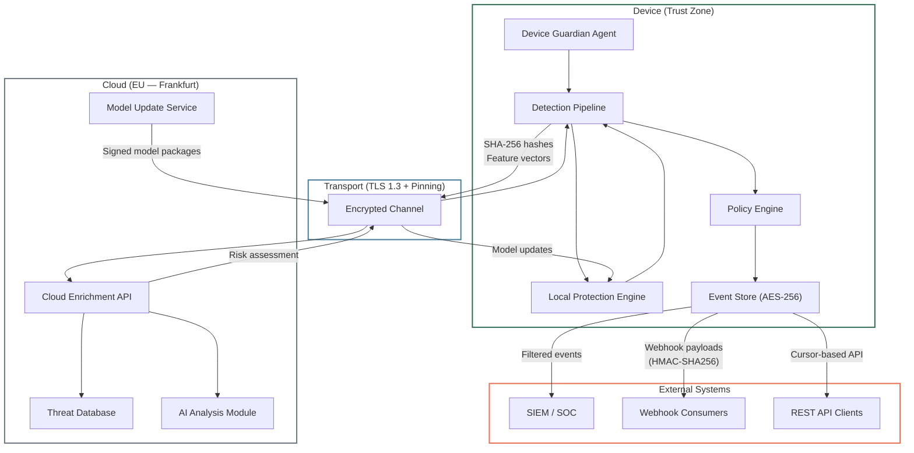

## Purpose

This specification defines the Superheld platform architecture at component level: what each component does, where it runs, what trust boundaries exist, and how data flows between them.

**Audience:** Engineers, security auditors, integration architects.

---

## In-Scope / Out-of-Scope

| In-Scope | Out-of-Scope |
|---|---|
| Component responsibilities and interfaces | Implementation code or internal APIs |
| Trust boundaries and data classification | Network firewall / IDS / EDR functionality |
| Deployment topology | Physical device security |
| Failure modes and mitigations | Supply-chain / OS-level attacks |

---

## Component Map

### On-Device Components

| Component | Responsibility | Runtime |
|---|---|---|
| **Device Guardian Agent** | Lightweight system service. Real-time monitoring of communication channels (email, messenger, browser, file downloads). Content extraction, prefiltering, threat notifications. | Local device process |
| **Local Protection Engine** | Compact ML models for on-device inference. NLP for social engineering, image classification, URL analysis, behavioral analysis. | Local device process |
| **Detection Pipeline** | 6-stage signal processing: Signal Collection → Local Detection → Cloud Enrichment → Policy Decision → Event Generation → Alert Exposure. | Local device process (Stages 1–2, 4–6), Cloud (Stage 3 optional) |
| **Policy Engine** | Evaluates threat candidates against configured policies. Deterministic, auditable, fail-closed. | Local device process |
| **Event Store** | Append-only, cryptographically chained log of all detection events. AES-256 encrypted. | Local device storage |

### Cloud Components

| Component | Responsibility | Runtime |
|---|---|---|
| **Threat Database** | Distributed database of anonymized threat signatures and IoCs. Continuously updated from anonymized agent reports. | Cloud (EU — Frankfurt) |
| **Model Update Service** | ML pipeline for model training. Distributes signed model packages to device agents. | Cloud |
| **AI Analysis Module** | GPU cluster for complex analysis (deepfake detection, advanced NLP). Processes only anonymized feature vectors. Never receives plaintext. | Cloud |
| **Cloud Enrichment API** | Stateless lookup service. Receives SHA-256 hashes and anonymized feature vectors. Returns risk assessments and campaign attribution. | Cloud |

---

## Architecture Diagram

---

## Trust Boundaries

### Boundary 1: Device (Trust Zone)

- **Contains:** User data, Local Protection Engine, Detection Pipeline, Policy Engine, Event Store
- **Characteristic:** All personalized data exists only here. Cloud has no access to decrypted contents.
- **Encryption at rest:** AES-256, keys in secure enclave (iOS) or keystore (Android)

### Boundary 2: Transport (TLS 1.3 + Pinning)

- **Protection:** Certificate pinning prevents MITM attacks
- **Version:** TLS 1.3 enforced, downgrade prohibited
- **Perfect Forward Secrecy:** Yes
- **Replay protection:** Yes

### Boundary 3: Cloud (EU — Frankfurt)

- **Receives:** (1) SHA-256 hashes for threat intelligence lookups, (2) Anonymized feature vectors for complex case escalation
- **Never receives:** Plaintext content, phone numbers, user data, filenames
- **Stateless:** Cloud requests contain no device ID or user ID; lookups are not linkable across requests

> `TODO-ENG-001`: Confirm that cloud requests contain no anonymized token or session identifier that could enable cross-request correlation.

### Boundary 4: External Systems

- **Exposure:** Filtered events only (no plaintext)
- **Channels:** REST API (cursor-based), Webhooks (HMAC-SHA256 signed), Push notifications (OS-level)

---

## Data Flow Summary

| Data Type | Stays on Device | Leaves Device | Form When Leaving |
|---|---|---|---|
| Message/email content | Yes | No | — |
| Audio/call content | Yes (RAM only) | No | — |
| Files/attachments | Yes | No | — |
| Phone numbers | Yes | Yes (hashes only) | SHA-256 hash |
| App signatures | Yes | Yes (hashes only) | SHA-256 hash |
| Complex analysis cases | Yes (original) | Yes (transformed) | Anonymized feature vectors |
| Detection events | Yes (90 days) | Yes (filtered) | Redacted event objects |
| Device identifiers | Yes | Yes (encrypted) | License management only |
| Aggregated telemetry | Yes | Yes (opt-in) | Anonymized statistics |

**Core principle:** Audio and message plaintext NEVER leave the device. Cloud receives ONLY (1) SHA-256 hashes and (2) anonymized feature vectors.

---

## Failure Modes

| Failure | Impact | Mitigation |
|---|---|---|
| Cloud unreachable | No Cloud Enrichment (Stage 3 skipped) | Local detection continues with reduced accuracy for novel threats. Offline buffering for events. |
| Model update failure | Agent runs with last known-good model | Signed packages with rollback protection. Agent rejects older model versions. |
| Policy file corruption | Policy unparseable | Fail-closed: unparseable policy defaults to Block. Checksum verification at load. |
| Event Store full | Cannot persist new events | Ring buffer with configurable retention. Oldest events overwritten. |
| Permission denied (OS) | Signal source unavailable | Graceful degradation per signal. User notified of reduced protection scope. |

---

## Deployment Topology

| Component | Location | Scaling | Redundancy |
|---|---|---|---|
| Device Agent | Per-device | 1 instance per device | N/A (device-local) |
| Cloud Enrichment API | EU (Frankfurt) | Horizontal | Multi-AZ |
| Threat Database | EU (Frankfurt) | Distributed | Replicated |
| Model Update Service | EU (Frankfurt) | On-demand | Redundant pipeline |
| AI Analysis Module | EU (Frankfurt) | GPU cluster | Load-balanced |

> `TODO-ENG-002`: Confirm deployment topology details (cloud provider, AZ count, failover strategy).

---

## Related Specifications

- [Device Agent](/experts/spec/device-agent) — Signal collection and platform constraints
- [Detection Engine](/experts/spec/detection-engine) — Classification methods and confidence scoring
- [Policy Engine](/experts/spec/policy-engine) — Evaluation model and action catalog
- [Event Pipeline](/experts/spec/event-pipeline) — Event lifecycle and delivery guarantees
- [Privacy Model](/experts/spec/privacy-model) — Data inventory and retention
