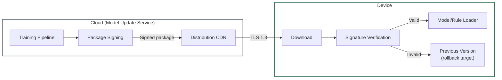
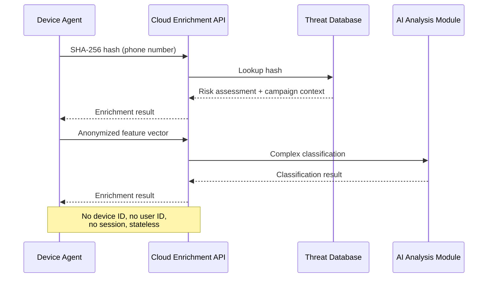

## Purpose

This specification defines the threat intelligence subsystem: feed ingestion, signed update distribution, cloud enrichment statelessness guarantees, and attack surface analysis.

**Audience:** Backend/security engineers, threat intelligence analysts.

---

## In-Scope / Out-of-Scope

| In-Scope | Out-of-Scope |
|---|---|
| Threat intelligence feed types and ingestion | Specific feed vendor names or contracts |
| Signed update distribution and rollback protection | ML model training pipeline details |
| Cloud enrichment request/response model | Detection algorithm internals |
| Poisoning and feed compromise mitigations | Event persistence and delivery |

---

## Intelligence Inputs

### Feed Types

| Feed | Content | Update Frequency | Delivery |
|---|---|---|---|
| Phone number reputation | Known fraud/scam numbers, campaign attribution | Continuous | Cloud Enrichment API lookup |
| Domain/URL reputation | Known phishing, malware, C2 domains | Continuous | Cloud Enrichment API lookup |
| App signature database | Known malware signatures, suspicious app hashes | Continuous | Cloud Enrichment API lookup |
| Threat signature packages | Heuristic rules, IOC patterns | Periodic | Signed OTA packages to device |
| ML model updates | Updated model weights | Periodic | Signed OTA packages to device |

> `TODO-ENG-050`: Confirm feed sources (internal, commercial, open-source, community). Confirm update frequencies (hourly, daily, weekly).

---

## Update Distribution

### Signed Package Model



### Package Properties

| Property | Value | Status |
|---|---|---|
| **Signing algorithm** | `TODO-ENG-051` | Unknown |
| **Signature verification** | On-device, before loading | Confirmed |
| **Rollback protection** | Agent rejects packages with version ≤ current | Confirmed |
| **Transport** | TLS 1.3 + certificate pinning | Confirmed |
| **Package contents** | Model weights + heuristic rules (no user data) | Confirmed |
| **Package size** | < 50 MB (model constraint) | Documented |
| **Integrity check** | `TODO-ENG-051` (checksum algorithm) | Unknown |

> `TODO-ENG-051`: Confirm signing algorithm (RSA, ECDSA, Ed25519?), key management, and checksum algorithm.

### Rollback Strategy

| Scenario | Behavior |
|---|---|
| New model performs worse (detected by validation) | `TODO-ENG-052` |
| Signing key compromised | `TODO-ENG-052` |
| Package corrupted during download | Re-download from CDN. Agent continues with previous version. |
| Model file corrupted on disk | Agent falls back to rule-based detection only. Triggers re-download. |

> `TODO-ENG-052`: Confirm rollback strategy for model regression and key compromise scenarios.

---

## Cloud Enrichment

### Request Model (Stateless)

| Property | Value | Status |
|---|---|---|
| **Input types** | SHA-256 hashes, anonymized feature vectors | Confirmed |
| **No device ID** | Requests not linkable to device | `TODO-ENG-001` |
| **No user ID** | Requests not linkable to user | `TODO-ENG-001` |
| **No session** | Each request independent | `TODO-ENG-001` |
| **No IP logging** | `TODO-ENG-048` | Unknown |
| **Response** | Risk assessment, campaign attribution, IOCs | Confirmed |

### Enrichment Flow



### Response Schema

```json
{
  "hash": "sha256:a1b2c3d4...",
  "risk_level": "high",
  "category": "phone_scam",
  "campaign_id": "camp_eu_2026_03",
  "first_seen": "2026-03-01T00:00:00Z",
  "report_count": 1247,
  "confidence": 0.92
}
```

> `TODO-ENG-053`: Confirm enrichment response schema. Confirm all fields and their semantics.

---

## Attack Surface Analysis

### Feed Poisoning

| Attack | Description | Impact | Mitigation |
|---|---|---|---|
| **False positive injection** | Attacker reports legitimate numbers/domains as malicious | Legitimate services blocked | Multi-source validation. Minimum report threshold. Manual review for high-impact entries. |
| **False negative suppression** | Attacker floods reports for known-malicious entities as legitimate | Malicious entities escape detection | Reports weighted by source reputation. Verified feeds take precedence. |
| **Feed compromise** | External feed source compromised | Corrupted threat intelligence | Multiple independent feed sources. Cross-validation. Anomaly detection on feed updates. |

### Model Poisoning

| Attack | Description | Impact | Mitigation |
|---|---|---|---|
| **Training data manipulation** | Adversarial examples in training data | Model learns incorrect classifications | `TODO-ENG-054` (data validation, adversarial training?) |
| **Model extraction** | Reverse-engineering model via API queries | Model capabilities exposed | Rate limiting on enrichment API. No model internals exposed. |
| **Model substitution** | Replace signed model package on device | Arbitrary detection behavior | Cryptographic signing + verification. Rollback protection. |

> `TODO-ENG-054`: Confirm training data validation and adversarial robustness measures.

### Update Distribution Attacks

| Attack | Description | Impact | Mitigation |
|---|---|---|---|
| **MITM on update** | Intercept and modify update package | Malicious model deployed | TLS 1.3 + certificate pinning. Package signature verification. |
| **Replay attack** | Re-deliver old (vulnerable) model | Agent downgrades to weaker detection | Rollback protection: agent rejects version ≤ current. |
| **CDN compromise** | Distribution infrastructure compromised | Malicious packages served | Package signing independent of CDN. Verification on device. |

---

## SLA and Freshness

| Metric | Target | Status |
|---|---|---|
| **Phone number reputation freshness** | `TODO-ENG-055` | Unknown |
| **Domain reputation freshness** | `TODO-ENG-055` | Unknown |
| **Model update latency** | `TODO-ENG-055` | Unknown |
| **Threat signature update frequency** | `TODO-ENG-055` | Unknown |
| **Cloud enrichment availability** | `TODO-ENG-055` | Unknown |
| **Cloud enrichment latency (P95)** | `TODO-ENG-055` | Unknown |

> `TODO-ENG-055`: Confirm SLA targets for threat intelligence freshness and cloud enrichment performance.

---

## Failure Modes

| Failure | Impact | Mitigation |
|---|---|---|
| All feeds unavailable | No new threat intelligence | Device continues with cached data. Last-known-good signatures. |
| Cloud Enrichment API down | No reputation lookups | Local detection continues. Ambiguous signals default to Warn. |
| Signing key rotation | Devices temporarily reject new packages | Graceful key rotation: dual-sign during transition period. |
| Feed data quality degradation | Increased false positives/negatives | Anomaly detection on feed updates. Automatic rollback on quality metrics. |

---

## Related Specifications

- [Detection Engine](/experts/spec/detection-engine) — Consumes threat intelligence for detection
- [Privacy Model](/experts/spec/privacy-model) — Cloud enrichment data handling
- [System Overview](/experts/spec/system-overview) — Component architecture
