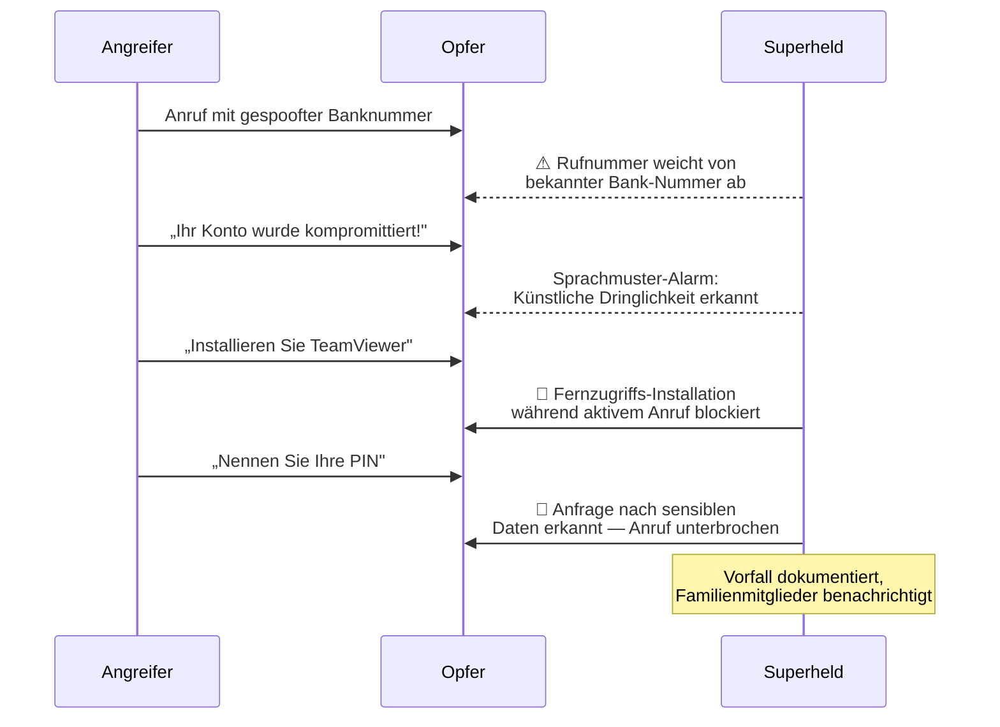

Dieses Dokument beschreibt das Bedrohungsmodell von Superheld nach etablierter Sicherheitsarchitektur-Praxis. Es definiert Schutzobjekte, Angreifer, Angriffsflächen, Bedrohungskategorien, Gegenmaßnahmen sowie Annahmen und Grenzen des Systems.

---

## Assets — Was Superheld schützt

Superheld schützt die folgenden Werte seiner Nutzer:

- **Endgeräte** — Smartphones und Tablets vor unbefugtem Fernzugriff und schädlicher Software
- **Persönliche Daten** — Kontakte, Nachrichten, Fotos, Standortdaten und Zugangsdaten
- **Finanzkonten** — Bankkonten, Kreditkarten und Zahlungsdienste vor betrügerischen Transaktionen
- **Digitale Identität** — E-Mail-Konten, Social-Media-Profile und behördliche Zugänge (z. B. eID)
- **Familienmitglieder** — insbesondere ältere oder weniger technikaffine Angehörige, die überproportional häufig Ziel von Betrug werden

---

## Adversaries — Wer angreift

| Angreifertyp | Motivation | Fähigkeiten |
|---|---|---|
| **Scam-Callcenter** | Finanzieller Gewinn | Massenanrufe, Rufnummernspoofing, einstudierte Skripte |
| **Social Engineers** | Gezielter Datendiebstahl | OSINT-Recherche, Personalisierung, psychologische Manipulation |
| **Malware-Verbreiter** | Datenexfiltration, Erpressung | Tarnung als legitime Apps, Exploit-Kits, Sideloading |
| **Staatlich unterstützte Akteure** | Überwachung, Spionage | Fortgeschrittene Werkzeuge, Zero-Day-Exploits, langfristige Kampagnen |
| **Opportunistische Angreifer** | Schneller Gewinn | Massen-Phishing, bekannte Schwachstellen, automatisierte Tools |

---

## Attack Surfaces — Wo Angriffe stattfinden

Angriffe erreichen Nutzer über verschiedene Kanäle:

1. **Telefonanrufe** — Spoofed-Nummern, VoIP-Anrufe, KI-generierte Stimmen
2. **SMS und Messaging** — Smishing-Nachrichten, gefälschte Paketbenachrichtigungen, WhatsApp-Betrug
3. **E-Mail** — Phishing-Mails, gefälschte Rechnungen, CEO-Fraud
4. **App Stores** — Gefälschte oder trojanisierte Apps in offiziellen und inoffiziellen Stores
5. **Browser** — Drive-by-Downloads, gefälschte Anmeldeseiten, bösartige Werbung
6. **Fernzugriffs-Tools** — TeamViewer, AnyDesk, QuickSupport als Einfallstor
7. **Netzwerk** — Rogue-Hotspots, DNS-Manipulation, Man-in-the-Middle-Angriffe

---

## Bedrohungskategorien

### Fernzugriffsbetrug (Remote Access Scams)

**Beschreibung:** Der Angreifer überzeugt das Opfer, eine Fernsteuerungssoftware zu installieren, und erlangt damit vollständige Kontrolle über das Gerät.

**Typischer Ablauf:** Anruf mit vorgetäuschtem Support-Anliegen → Erzeugung von Dringlichkeit → Aufforderung zur Installation von Fernzugriffs-Software → Übernahme des Geräts → Zugriff auf Banking-Apps und Passwörter.

**Erkennung:** Superheld erkennt die Installation von Fernsteuerungs-Tools im zeitlichen Zusammenhang mit aktiven Anrufen. Session-Monitoring identifiziert nicht vom Nutzer initiierte Verbindungen.

**Mitigation:** Automatische Blockierung der Fernzugriffs-Session, sofortige Benachrichtigung des Nutzers, Dokumentation des Vorfalls zur Beweissicherung.

### Social Engineering

**Beschreibung:** Der Angreifer nutzt öffentlich verfügbare Informationen und psychologische Taktiken, um das Vertrauen des Opfers zu gewinnen und es zu schädlichen Handlungen zu bewegen.

**Typischer Ablauf:** OSINT-Recherche über das Opfer → Kontaktaufnahme unter falschem Vorwand → Aufbau von Vertrauen durch korrekte persönliche Details → Aufforderung zur Herausgabe sensibler Daten oder Überweisung.

**Erkennung:** Verhaltensanalyse identifiziert ungewöhnliche Kommunikationsmuster, z. B. wenn ein vermeintlicher Bekannter plötzlich per SMS nach Zugangsdaten fragt. Kontextprüfung erkennt Inkonsistenzen.

**Mitigation:** Echtzeit-Warnung bei verdächtigen Anfragen, Verifizierungsaufforderung über einen alternativen Kanal, Handlungsempfehlungen für den Nutzer.

### Schädliche Anwendungen (Malicious Applications)

**Beschreibung:** Apps, die unter dem Deckmantel legitimer Funktionalität Berechtigungen missbrauchen, Daten exfiltrieren oder als Trojaner fungieren.

**Typischer Ablauf:** Nutzer installiert scheinbar harmlose App → App fordert übermäßige Berechtigungen → Hintergrundaktivität: Auslesen von Kontakten, SMS, Standort → Weiterleitung der Daten an Command-and-Control-Server.

**Erkennung:** Berechtigungs-Audit analysiert installierte Apps auf unverhältnismäßige Zugriffsrechte. Verhaltens-Monitoring erkennt ungewöhnliche Hintergrundaktivitäten wie Kamera-/Mikrofon-Zugriff oder Datenübertragung.

**Mitigation:** Deinstallationsempfehlung, Berechtigungsentzug, Benachrichtigung über verdächtige Aktivitäten.

### Phishing-Links

**Beschreibung:** Gefälschte Webseiten, die legitime Dienste imitieren, um Zugangsdaten, Zahlungsinformationen oder persönliche Daten abzugreifen.

**Typischer Ablauf:** Empfang einer Nachricht mit dringendem Handlungsbedarf → Link führt zu täuschend echter Nachbildung einer Bank- oder Paketdienstseite → Nutzer gibt Zugangsdaten ein → Angreifer übernimmt das Konto.

**Erkennung:** URL-Analyse prüft Links in Nachrichten und E-Mails auf bekannte Phishing-Muster, Homoglyph-Angriffe und verdächtige Domain-Registrierungen. Cloud-Intelligence gleicht mit aktuellen Bedrohungsdatenbanken ab.

**Mitigation:** Blockierung des Zugriffs auf erkannte Phishing-Seiten, Warnung vor dem Öffnen verdächtiger Links, Anzeige der tatsächlichen Ziel-URL.

### Gerätemanipulation (Device Manipulation)

**Beschreibung:** Direkte oder indirekte Manipulation des Geräts durch Änderung von Systemeinstellungen, Installation von Zertifikaten oder Aktivierung von Entwickleroptionen.

**Typischer Ablauf:** Angreifer instruiert Opfer telefonisch, Sicherheitseinstellungen zu deaktivieren → Installation von Profilen oder Zertifikaten → Umgehung der regulären Schutzmechanismen → Vollzugriff auf verschlüsselte Kommunikation.

**Erkennung:** Monitoring von Systemeinstellungsänderungen, Erkennung neuer Zertifikate oder Profile, Alarm bei Deaktivierung von Sicherheitsfunktionen.

**Mitigation:** Sofortige Warnung bei sicherheitskritischen Einstellungsänderungen, Anleitung zur Wiederherstellung sicherer Konfiguration, automatische Benachrichtigung verknüpfter Familienmitglieder.

---

## Typischer Angriffsablauf mit Superheld-Intervention

Das folgende Diagramm zeigt einen typischen Telefonbetrug und wie Superheld in Echtzeit eingreift:

---

## Mitigations — Übergreifende Schutzmaßnahmen

Superheld setzt auf vier zentrale Verteidigungsschichten, die bedrohungsübergreifend wirken:

| Schicht | Funktion | Wirkungsbereich |
|---|---|---|
| **Lokale KI** | On-Device-Analyse von Anrufen, Nachrichten und App-Verhalten in Echtzeit | Alle Bedrohungskategorien |
| **Cloud-Intelligence** | Abgleich mit aktuellen Bedrohungsdatenbanken, Rufnummern-Blacklists und Phishing-URLs | Telefonbetrug, Phishing, Malware |
| **Policy Engine** | Regelbasierte Entscheidungslogik für automatische Blockierung und Eskalation | Fernzugriff, Gerätemanipulation |
| **Nutzerwarnungen** | Kontextbezogene, verständliche Hinweise und Handlungsempfehlungen | Alle Bedrohungskategorien |

Die lokale KI-Analyse stellt sicher, dass Anrufinhalte und persönliche Daten das Gerät nicht verlassen. Cloud-Intelligence beschränkt sich auf den Abgleich anonymisierter Signaturen.

---

## Annahmen

:::caution
Das Bedrohungsmodell von Superheld basiert auf folgenden Sicherheitsannahmen. Wenn diese nicht zutreffen, kann der Schutz eingeschränkt sein.

- **Geräteintegrität** — Das Gerät ist nicht gerootet oder gejailbreakt. Der Bootloader ist gesperrt und die Firmware unverändert.
- **Betriebssystem-Integrität** — Das Betriebssystem ist aktuell und seine Sicherheitsmechanismen (Sandbox, Berechtigungssystem) funktionieren ordnungsgemäß.
- **Lesefähigkeit des Nutzers** — Der Nutzer kann angezeigte Warnungen lesen und grundlegend verstehen. Für Nutzer mit Einschränkungen bietet Superheld akustische Warnungen.
- **Aktive Netzwerkverbindung** — Für Cloud-Intelligence-Abgleiche ist eine Internetverbindung erforderlich. Ohne Verbindung arbeitet Superheld ausschließlich mit lokaler Analyse.
- **Superheld-App ist aktiv** — Die App muss im Hintergrund laufen und über die notwendigen Betriebssystem-Berechtigungen verfügen.
:::

---

## Out of Scope — Grenzen des Schutzes

Folgende Bedrohungen liegen außerhalb des Schutzbereichs von Superheld:

- **Physischer Zugriff** — Wenn ein Angreifer physischen Zugang zum entsperrten Gerät hat, kann Superheld keinen vollständigen Schutz gewährleisten.
- **Nation-State Zero-Days** — Hochentwickelte, bisher unbekannte Exploits auf Betriebssystem-Ebene (z. B. Pegasus-artige Angriffe) können nicht durch eine App-basierte Lösung abgefangen werden.
- **Hardware-Implantate** — Kompromittierte Hardware-Komponenten (z. B. manipulierte Ladekabel, Baseband-Chips) liegen außerhalb der Software-Erkennungsebene.
- **Insider-Angriffe mit physischem Gerätezugang** — Manipulation durch Personen mit legitimem Zugang zum Gerät und Kenntnis der Entsperrmethode.
- **Verschlüsselte Kanäle Dritter** — Inhalte in Ende-zu-Ende-verschlüsselten Drittanbieter-Apps können systembedingt nicht analysiert werden, sofern keine Betriebssystem-Integration besteht.

---

## Weiterführende Informationen

- [Privatsphäre & Sicherheit](/experts/privacy-security) — Verschlüsselung und Datenschutz im Detail
- [Konfiguration](/experts/configuration) — Schutzeinstellungen anpassen
- [Responsible Disclosure](/experts/responsible-disclosure) — Sicherheitslücken melden
- [Häufige Fragen](/getting-started/faq) — Antworten auf Sicherheitsfragen
