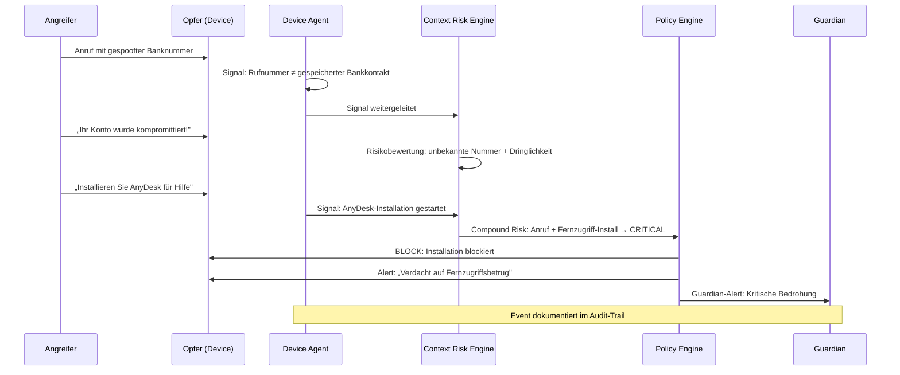

Dieses Dokument beschreibt das Bedrohungsmodell von Superheld nach etablierter Sicherheitsarchitektur-Praxis. Es definiert Schutzobjekte, Angreifer, Angriffsoberflächen, Bedrohungskategorien mit Erkennungssignalen und Mitigationen sowie die Annahmen und Grenzen des Systems.

---

## Assets — Was Superheld schützt

| Asset | Beschreibung | Typische Angriffsvektoren |
|---|---|---|
| **Endgeräte** | Smartphones, Tablets, Desktops | Fernzugriff, Malware, Gerätemanipulation |
| **Persönliche Daten** | Kontakte, Nachrichten, Fotos, Zugangsdaten | Datenexfiltration, Phishing |
| **Finanzkonten** | Bankkonten, Kreditkarten, Zahlungsdienste | Telefonbetrug, Remote-Access-Betrug |
| **Digitale Identität** | E-Mail, Social Media, behördliche Zugänge (z. B. eID) | Credential Theft, Account Takeover |
| **Familienmitglieder** | Ältere oder weniger technikaffine Angehörige | Social Engineering, Enkeltrick, Autoritätsimitation |

> TODO: Welche Aspekte der digitalen Identität werden konkret durch Superheld geschützt?

---

## Adversaries — Wer angreift

| Angreifertyp | Motivation | Fähigkeiten | Primäre Bedrohungskategorien |
|---|---|---|---|
| **Scam-Callcenter** | Finanzieller Gewinn | Massenanrufe, Rufnummernspoofing, einstudierte Skripte, KI-Stimmsynthese | `phone_scam`, `remote_control` |
| **Social Engineers** | Gezielter Datendiebstahl | OSINT-Recherche, Personalisierung, psychologische Manipulation | `social_engineering`, `phishing` |
| **Malware-Verbreiter** | Datenexfiltration, Erpressung | Tarnung als legitime Apps, Exploit-Kits, Sideloading | `malicious_app` |
| **Staatlich unterstützte Akteure** | Überwachung, Spionage | Zero-Day-Exploits, langfristige Kampagnen | Out of scope (siehe Grenzen) |
| **Opportunistische Angreifer** | Schneller Gewinn | Massen-Phishing, bekannte Schwachstellen | `phishing`, `malicious_app` |
| **KI-gestützte Angreifer** | Skalierter Betrug | Deepfake-Stimmen, KI-generierte Texte, automatisierte Personalisierung | `deepfake`, `social_engineering` |

> TODO: Erkennungsraten je Angreifertyp mit Security-Team quantifizieren

---

## Attack Surfaces — Wo Angriffe stattfinden

| Angriffsoberfläche | Beispiele | Bedrohungskategorien | Erkennungsstufe |
|---|---|---|---|
| **Telefonanrufe** | Spoofed-Nummern, VoIP, KI-Stimmen | `phone_scam`, `deepfake` | Stufe 1 + 2 (lokal) + Stufe 3 (Cloud) |
| **SMS und Messaging** | Smishing, Paketbetrug, WhatsApp-Scam | `social_engineering`, `phishing` | Stufe 1 + 2 (lokal) |
| **E-Mail** | Phishing, CEO-Fraud, gefälschte Rechnungen | `phishing` | Stufe 2 (lokal) + Stufe 3 (Cloud) |
| **App Stores** | Trojanisierte Apps, Fake-Apps | `malicious_app` | Stufe 1 + 2 (lokal) + Stufe 3 (Cloud) |
| **Browser** | Drive-by-Downloads, gefälschte Login-Seiten | `phishing` | Stufe 2 (lokal) + Stufe 3 (Cloud) |
| **Fernzugriffs-Tools** | TeamViewer, AnyDesk, QuickSupport | `remote_control` | Stufe 1 + 2 (lokal) |
| **Systemeinstellungen** | Zertifikatsinstallation, Entwickleroptionen | Gerätemanipulation | Stufe 1 + 2 (lokal) |

Die Erkennungsstufen referenzieren die [Erkennungspipeline](/experts/detection-pipeline).

> TODO: Vollständige Angriffsoberflächen-Analyse mit Security-Team durchführen

---

## Bedrohungskategorien

### `remote_control` — Fernzugriffsbetrug

| | |
|---|---|
| **Beschreibung** | Der Angreifer überzeugt das Opfer, eine Fernsteuerungssoftware zu installieren, und erlangt damit vollständige Kontrolle über das Device. |
| **Typischer Ablauf** | Anruf mit vorgetäuschtem Support-Anliegen → Erzeugung von Dringlichkeit → Aufforderung zur Installation von Fernzugriffs-Software → Übernahme des Device → Zugriff auf Banking-Apps und Passwörter |
| **Schweregrad** | Critical |

**Erkennungssignale:**

| Signal | Quelle | Gewicht |
|---|---|---|
| Installation einer bekannten Fernzugriffs-App | App-Monitor (Stufe 1) | Hoch |
| Aktiver Telefonanruf während Installation | Call-Monitor (Stufe 1) | Multiplikator |
| Fernzugriffs-Session wird aufgebaut | Prozess-Monitor (Stufe 1) | Hoch |
| Banking-App geöffnet während Remote-Session | App-Monitor (Stufe 1) | Multiplikator |
| Rufnummer in Scam-Datenbank bekannt | Cloud Enrichment (Stufe 3) | Bestätigung |

**Mitigationsstrategie:**

- **Block** — Fernzugriffs-Installation wird blockiert, wenn ein aktiver Anruf erkannt wird
- **Alert** — Sofortige Warnung an den Benutzer mit Handlungsempfehlung ("Legen Sie auf")
- **Guardian-Alert** — Automatische Benachrichtigung an verknüpfte Vertrauenspersonen
- **Event** — Vorfall wird im Audit-Trail dokumentiert

Details: [Fernzugriffsschutz](/experts/remote-access-protection)

---

### `social_engineering` — Social Engineering

| | |
|---|---|
| **Beschreibung** | Der Angreifer nutzt psychologische Manipulation, um das Opfer zu schädlichen Handlungen zu bewegen — Herausgabe von Daten, Überweisungen oder Installation von Software. |
| **Typischer Ablauf** | OSINT-Recherche → Kontaktaufnahme unter falschem Vorwand → Aufbau von Vertrauen durch korrekte persönliche Details → Aufforderung zu sensiblen Aktionen |
| **Schweregrad** | High |

**Erkennungssignale:**

| Signal | Quelle | Gewicht |
|---|---|---|
| Anruf von unbekannter Nummer mit langer Dauer | Call-Monitor (Stufe 1) | Mittel |
| Kommunikationsmuster mit Dringlichkeitsmerkmalen | ML-Modell (Stufe 2) | Hoch |
| Verdächtige Kombination: Anruf + sensible Aktion | Context Risk Engine (Stufe 2) | Multiplikator |
| Absender-Reputation niedrig | Cloud Enrichment (Stufe 3) | Bestätigung |

> TODO: Spezifische ML-Signale für Social-Engineering-Erkennung mit Engineering dokumentieren

**Mitigationsstrategie:**

- **Warn** — Kontextbezogene Warnung ("Dieser Anruf zeigt Merkmale eines Betrugsversuchs")
- **Empfehlung** — Verifizierung über alternativen Kanal vorschlagen
- **Guardian-Alert** — Bei Familienprofilen Eskalation an Vertrauensperson

Details: [Schutz vor Manipulation](/experts/manipulation-protection)

---

### `phone_scam` — Telefonbetrug

| | |
|---|---|
| **Beschreibung** | Betrügerische Anrufe, bei denen sich der Angreifer als Behörde, Bank, Enkel oder technischer Support ausgibt, um Geld oder Daten zu erlangen. |
| **Typischer Ablauf** | Anruf mit gespoofter oder unterdrückter Nummer → Vorwand (Polizei, Bank, Enkel in Not) → Erzeugung von Zeitdruck → Aufforderung zu Überweisung oder Bargeldübergabe |
| **Schweregrad** | High–Critical (abhängig von Kontext) |

**Erkennungssignale:**

| Signal | Quelle | Gewicht |
|---|---|---|
| Rufnummernspoofing erkannt (STIR/SHAKEN) | Call-Monitor (Stufe 1) | Hoch |
| Rufnummer in Scam-Datenbank | Cloud Enrichment (Stufe 3) | Hoch |
| Anruf von unbekannter Nummer an Senior-Profil | Context Risk Engine (Stufe 2) | Mittel |
| Anrufdauer > Schwellenwert bei unbekannter Nummer | Call-Monitor (Stufe 1) | Mittel |
| Banking-App geöffnet während Anruf | App-Monitor (Stufe 1) | Multiplikator |

**Mitigationsstrategie:**

- **Warn** — Echtzeit-Warnung während des Anrufs
- **Block** — Automatische Blockierung bei hoher Konfidenz (bekannte Scam-Nummern)
- **Guardian-Alert** — Vertrauensperson wird benachrichtigt
- **Kontext-Hilfe** — Anzeige: "Ihre Bank würde Sie niemals telefonisch nach Ihrer PIN fragen"

---

### `phishing` — Phishing

| | |
|---|---|
| **Beschreibung** | Gefälschte Webseiten oder Nachrichten, die legitime Dienste imitieren, um Zugangsdaten, Zahlungsinformationen oder persönliche Daten abzugreifen. |
| **Typischer Ablauf** | Nachricht mit dringendem Handlungsbedarf → Link zu täuschend echter Nachbildung → Nutzer gibt Daten ein → Account-Übernahme |
| **Schweregrad** | High |

**Erkennungssignale:**

| Signal | Quelle | Gewicht |
|---|---|---|
| URL mit Homoglyph-Angriff erkannt | ML-Modell (Stufe 2) | Hoch |
| Domain kürzlich registriert (< 30 Tage) | Cloud Enrichment (Stufe 3) | Mittel |
| URL in Phishing-Datenbank bekannt | Cloud Enrichment (Stufe 3) | Hoch |
| SSL-Zertifikat verdächtig (DV-only, kurze Laufzeit) | Netzwerk-Monitor (Stufe 1) | Mittel |
| Nachricht mit Dringlichkeitsmerkmal + URL | ML-Modell (Stufe 2) | Multiplikator |

> TODO: URL-Analyse-Verfahren und False-Positive-Rate dokumentieren

**Mitigationsstrategie:**

- **Block** — Zugriff auf erkannte Phishing-Seiten wird blockiert
- **Anzeige** — Tatsächliche Ziel-URL wird dem Benutzer angezeigt
- **Alert** — Warnung mit Erklärung, warum die Seite als Phishing eingestuft wurde

> TODO: Präzisieren, ob Blockierung auf DNS-Ebene, Browser-Ebene oder App-Ebene erfolgt

---

### `malicious_app` — Schädliche Anwendungen

| | |
|---|---|
| **Beschreibung** | Apps, die unter dem Deckmantel legitimer Funktionalität Berechtigungen missbrauchen, Daten exfiltrieren oder als Trojaner fungieren. |
| **Typischer Ablauf** | Installation einer scheinbar harmlosen App → Übermäßige Berechtigungsanforderung → Hintergrundaktivität: Auslesen von Kontakten, SMS, Standort → Datenweiterleitung an C2-Server |
| **Schweregrad** | High |

**Erkennungssignale:**

| Signal | Quelle | Gewicht |
|---|---|---|
| App fordert übermäßige Berechtigungen | App-Monitor (Stufe 1) | Mittel |
| Unerwartete Hintergrundaktivität (Kamera, Mikrofon, Netzwerk) | System-Monitor (Stufe 1) | Hoch |
| App-Signatur in Malware-Datenbank | Cloud Enrichment (Stufe 3) | Hoch |
| Installation aus unbekannter Quelle (Sideload) | App-Monitor (Stufe 1) | Mittel |
| App kommuniziert mit bekanntem C2-Server | Netzwerk-Monitor (Stufe 1) + Cloud (Stufe 3) | Hoch |

> TODO: Aktualisierungsfrequenz der Threat-Datenbank dokumentieren

**Mitigationsstrategie:**

- **Warn** — Sicherheitsbewertung mit Risikoerklärung bei Installation
- **Block** — Automatische Blockierung bei bekannter Malware-Signatur
- **Empfehlung** — Deinstallationsempfehlung bei verdächtigem Verhalten
- **Event** — Detaillierte Dokumentation der erkannten Indikatoren

> TODO: Klären, ob automatischer Berechtigungsentzug technisch möglich ist

---

### `deepfake` — KI-generierte Täuschung

| | |
|---|---|
| **Beschreibung** | Einsatz von KI-generierter Stimm- oder Videoimitation zur Identitätstäuschung — z. B. synthetische Stimme eines Familienmitglieds bei einem Betrugsanruf. |
| **Typischer Ablauf** | Angreifer klont Stimme eines Angehörigen → Anruf mit geklonter Stimme → Vorwand (Notfall, Unfall, Verhaftung) → Aufforderung zu sofortiger Überweisung |
| **Schweregrad** | Critical |

**Erkennungssignale:**

| Signal | Quelle | Gewicht |
|---|---|---|
| Stimmsynthese-Artefakte erkannt | ML-Modell (Stufe 2) | Hoch |
| Rufnummer stimmt nicht mit Kontakt überein | Call-Monitor (Stufe 1) | Mittel |
| Dringlichkeitsmuster in Kombination mit bekanntem Kontaktnamen | Context Risk Engine (Stufe 2) | Hoch |

> TODO: Existiert ein Deepfake-Erkennungsmodell im Device Agent? Siehe [IMPLEMENTATION_FACTS §2](/IMPLEMENTATION_FACTS.md). Falls nicht: Kategorie als "geplant" markieren und Erkennungssignale auf Metadaten-basierte Heuristiken beschränken.

**Mitigationsstrategie:**

- **Warn** — "Dieser Anruf könnte eine KI-generierte Stimmimitation verwenden"
- **Empfehlung** — Rückruf über gespeicherte Kontaktnummer vorschlagen
- **Guardian-Alert** — Alle Vertrauenspersonen benachrichtigen

---

## Typischer Angriffsablauf mit Superheld-Intervention

Das folgende Diagramm zeigt einen typischen Telefonbetrug und wie Superheld über die [Erkennungspipeline](/experts/detection-pipeline) in Echtzeit eingreift:

---

## Mitigations — Übergreifende Schutzmaßnahmen

Superheld setzt auf vier Verteidigungsschichten:

| Schicht | Funktion | Wirkungsbereich |
|---|---|---|
| **Device Agent (Lokal)** | On-Device-Analyse von Anrufen, Apps und Systemverhalten; erzeugt Signals in Echtzeit | Alle Bedrohungskategorien |
| **Context Risk Engine** | Korrelation mehrerer Signals zu Compound-Risk-Bewertungen; erkennt Muster, die Einzelsignale nicht aufdecken | `remote_control`, `phone_scam`, `social_engineering` |
| **Cloud Enrichment** | Abgleich von SHA-256-Hashes mit Threat-Datenbanken, Rufnummern-Blacklists und Phishing-URLs | `phone_scam`, `phishing`, `malicious_app` |
| **Guardian Network** | Eskalation an Vertrauenspersonen bei kritischen Bedrohungen auf Geräten vulnerabler Nutzer | Alle Bedrohungskategorien bei Familienprofilen |

> TODO: Effektivität je Verteidigungsschicht quantifizieren (Detection Rate, False Positive Rate)

---

## Annahmen

:::caution
Das Bedrohungsmodell basiert auf folgenden Sicherheitsannahmen. Wenn diese nicht zutreffen, kann der Schutz eingeschränkt sein.
:::

| Annahme | Begründung | Auswirkung bei Verletzung |
|---|---|---|
| **Geräteintegrität** | Device ist nicht gerootet/gejailbreakt, Bootloader gesperrt | Device Agent kann umgangen oder manipuliert werden |
| **OS-Integrität** | Betriebssystem ist aktuell, Sandbox und Berechtigungssystem funktionieren | Malware kann Erkennungsmechanismen umgehen |
| **Lesefähigkeit** | Nutzer kann Alerts lesen und grundlegend verstehen | Schutzmaßnahmen werden ignoriert (akustische Warnungen als Fallback) |
| **Netzwerkverbindung** | Für Cloud Enrichment ist Internet erforderlich | Erkennung basiert nur auf lokalem Modellstand |
| **App aktiv** | Device Agent läuft im Hintergrund mit notwendigen Berechtigungen | Keine Erkennung möglich |
| **Modellintegrität** | ML-Modelle sind signiert und gegen Manipulation geschützt | Adversarial Attacks könnten Erkennung umgehen |

> TODO: Sicherheitsannahmen durch Penetrationstest validieren. Adversarial-Robustness-Tests dokumentieren.

---

## Out of Scope — Grenzen des Schutzes

| Bedrohung | Begründung |
|---|---|
| **Physischer Zugriff auf entsperrtes Device** | App-basierter Schutz kann physischen Zugriff nicht verhindern |
| **Nation-State Zero-Days** | OS-Ebene-Exploits (Pegasus-artig) liegen außerhalb der App-Sandbox |
| **Hardware-Implantate** | Manipulierte Hardware (Ladekabel, Baseband-Chips) ist softwareseitig nicht erkennbar |
| **Insider mit Gerätezugang + Entsperrmethode** | Legitimer physischer Zugang kann nicht von Missbrauch unterschieden werden |
| **Inhalte in E2E-verschlüsselten Drittanbieter-Apps** | Systembedingt nicht analysierbar ohne OS-Integration |
| **Supply-Chain-Angriffe auf Model-Updates** | TODO: Supply-Chain-Sicherheit des Model Update Service dokumentieren |

Für die vollständige Abgrenzung siehe [Scope und Nicht-Ziele](/experts/scope-non-goals).

---

## Weiterführende Informationen

- [Erkennungspipeline](/experts/detection-pipeline) — Die sechs Stufen der Signalverarbeitung
- [Context Risk Engine](/experts/context-risk-engine) — Korrelation von Signalen zu Compound-Risk-Bewertungen
- [Schutz vor Manipulation](/experts/manipulation-protection) — Erkennung psychologischer Manipulation
- [Fernzugriffsschutz](/experts/remote-access-protection) — Schutz vor Remote-Access-Betrug
- [Guardian-Netzwerk](/experts/guardian-network) — Schutz durch Vertrauenspersonen
- [Datenflüsse und Vertrauensgrenzen](/experts/data-flows) — Welche Daten das Device verlassen
- [Privatsphäre & Sicherheit](/experts/privacy-security) — Verschlüsselung und Datenschutz
- [Scope und Nicht-Ziele](/experts/scope-non-goals) — Was Superheld schützt und was nicht
- [Responsible Disclosure](/experts/responsible-disclosure) — Sicherheitslücken melden
