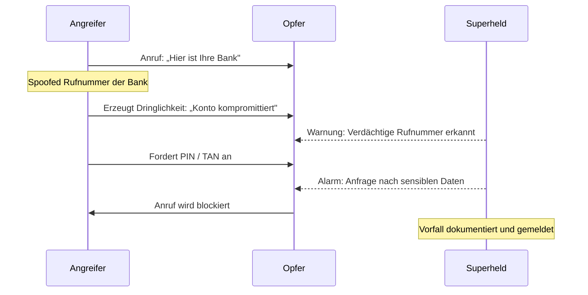

## Übersicht

Superheld schützt Nutzer vor einer wachsenden Zahl digitaler Bedrohungen, die gezielt menschliches Vertrauen ausnutzen. Klassische Sicherheitssoftware erkennt Malware und Viren — aber sie versagt bei Angriffen, die auf Manipulation statt auf Code setzen.

Dieses Bedrohungsmodell beschreibt die sechs zentralen Angriffskategorien, die Superheld adressiert, und erklärt, wie jede Bedrohung erkannt und abgewehrt wird.

:::note
Über 80 % aller erfolgreichen Cyberangriffe beginnen nicht mit einem technischen Exploit, sondern mit einem Anruf, einer Nachricht oder einem gefälschten Dialog. Superheld setzt genau dort an.
:::

---

## Angriffskategorien

| Kategorie | Beschreibung | Beispiel |
|---|---|---|
| **Telefonbetrug** | Anrufe, die sich als Bank, Behörde oder Polizei ausgeben | „Ihre Kreditkarte wurde gesperrt – bestätigen Sie Ihre PIN." |
| **Social Engineering** | Gezielte Manipulation über persönliche Informationen | Angreifer kennt deinen Namen und Arbeitgeber aus Social Media. |
| **Fake-Support-Anrufe** | Vorgetäuschter technischer Support von Microsoft, Apple etc. | „Ihr Computer hat einen Virus. Wir helfen Ihnen jetzt." |
| **Schädliche Apps** | Apps, die Berechtigungen missbrauchen oder Daten exfiltrieren | Eine Taschenlampen-App, die Kontakte und SMS ausliest. |
| **Fernzugriffsbetrug** | Aufforderung, Fernsteuerungssoftware zu installieren | „Installieren Sie TeamViewer, damit wir Ihr Problem beheben." |
| **KI-generierte Täuschung** | Deepfake-Stimmen oder -Videos, die echte Personen imitieren | Anruf mit der geklonten Stimme eines Familienmitglieds. |

---

## Typischer Angriffsablauf

Die meisten Angriffe folgen einem vorhersehbaren Muster. Das folgende Diagramm zeigt den Ablauf eines typischen Telefonbetrugs:

:::caution
Banken, Behörden und seriöse Unternehmen fragen niemals am Telefon nach PINs, TANs oder Passwörtern. Jede solche Anfrage ist ein Betrugsversuch.
:::

---

## Wie Superheld Bedrohungen erkennt

Superheld kombiniert mehrere Erkennungsmethoden, um Angriffe in Echtzeit zu identifizieren.

### Telefonbetrug & Fake-Support-Anrufe

- **Rufnummern-Analyse** — Abgleich eingehender Nummern mit bekannten Betrugsmustern und Spoofing-Datenbanken
- **Sprachmuster-Erkennung** — Identifikation typischer Drucktaktiken wie künstliche Dringlichkeit, Autoritätsansprüche und emotionale Manipulation
- **Kontextprüfung** — Automatische Warnung, wenn ein Anrufer nach sensiblen Daten fragt

### Social Engineering

- **Verhaltensanalyse** — Erkennung ungewöhnlicher Kommunikationsmuster, z. B. wenn ein vermeintlicher Kollege plötzlich per SMS nach Zugangsdaten fragt
- **Informationsabgleich** — Prüfung, ob übermittelte Informationen konsistent sind oder auf zusammengetragene öffentliche Daten hindeuten

### Schädliche Apps

- **Berechtigungs-Audit** — Analyse installierter Apps auf übermäßige oder verdächtige Berechtigungen
- **Verhaltens-Monitoring** — Erkennung von Apps, die im Hintergrund ungewöhnliche Aktivitäten ausführen (Datenexfiltration, Kamera-/Mikrofon-Zugriff)

### Fernzugriffsbetrug

- **Installations-Erkennung** — Warnung bei Installation von Fernsteuerungs-Tools im Zusammenhang mit einem aktiven Anruf
- **Session-Überwachung** — Erkennung aktiver Remote-Desktop-Sitzungen, die nicht vom Nutzer initiiert wurden

### KI-generierte Täuschung (Deepfakes)

- **Stimm-Authentizitätsprüfung** — Analyse von Audiomustern auf Artefakte synthetischer Sprachgenerierung
- **Plausibilitätsprüfung** — Abgleich des Anrufkontexts mit bekannten Verhaltensmustern der vorgeblichen Person

---

## Schutzmechanismen

Superheld setzt auf mehrere Verteidigungsebenen, die zusammenwirken:

| Bedrohung | Erkennung | Abwehr |
|---|---|---|
| **Telefonbetrug** | Rufnummern-Analyse, Sprachmuster | Anruf-Blockierung, Echtzeit-Warnung |
| **Social Engineering** | Verhaltensanalyse, Kontextprüfung | Benachrichtigung, Handlungsempfehlung |
| **Fake-Support** | Skript-Erkennung, Spoofing-Check | Automatische Blockierung, Meldung |
| **Schädliche Apps** | Berechtigungs-Audit, Monitoring | Deinstallationsempfehlung, Berechtigungsentzug |
| **Fernzugriffsbetrug** | Installations-Erkennung, Session-Check | Blockierung der Fernsteuerung, Alarmierung |
| **KI-Täuschung** | Stimm-Analyse, Plausibilitätsprüfung | Verifizierungsaufforderung, Warnhinweis |

### Defense-in-Depth

Der Schutz erfolgt auf drei Ebenen:

1. **Prävention** — Bekannte Bedrohungen werden blockiert, bevor sie den Nutzer erreichen. Dazu gehören Rufnummern-Blacklists, App-Berechtigungsprüfungen und proaktive Warnungen.

2. **Erkennung** — Laufende Analyse von Anrufen, Nachrichten und App-Verhalten identifiziert Angriffe in Echtzeit, auch wenn sie bisher unbekannt sind.

3. **Reaktion** — Bei erkannten Bedrohungen erhält der Nutzer klare Handlungsanweisungen. Kritische Aktionen (z. B. Fernzugriff) werden automatisch unterbunden.

:::note
Superheld arbeitet lokal auf dem Gerät. Anrufinhalte und persönliche Daten werden nicht an externe Server übertragen. Die Analyse erfolgt in Echtzeit auf dem Gerät selbst.
:::

---

## Weiterführende Informationen

- [Privatsphäre & Sicherheit](/experts/privacy-security) — Verschlüsselung und Datenschutz im Detail
- [Konfiguration](/experts/configuration) — Schutzeinstellungen anpassen
- [Häufige Fragen](/getting-started/faq) — Antworten auf Sicherheitsfragen
