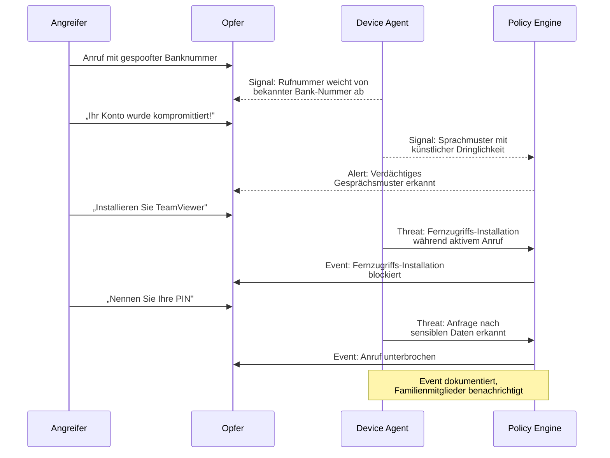

Dieses Dokument beschreibt das Bedrohungsmodell von Superheld nach etablierter Sicherheitsarchitektur-Praxis. Es definiert Schutzobjekte, Angreifer, Angriffsoberflächen, Bedrohungskategorien, Gegenmaßnahmen sowie Annahmen und Grenzen des Systems.

---

## Assets — Was Superheld schützt

Superheld schützt die folgenden Werte seiner Nutzer:

- **Endgeräte** — Smartphones und Tablets vor unbefugtem Fernzugriff und schädlicher Software
- **Persönliche Daten** — Kontakte, Nachrichten, Fotos, Standortdaten und Zugangsdaten
- **Finanzkonten** — Bankkonten, Kreditkarten und Zahlungsdienste vor betrügerischen Transaktionen
- **Digitale Identität** — E-Mail-Konten, Social-Media-Profile und behördliche Zugänge (z. B. eID). TODO: Welche Aspekte der digitalen Identität werden konkret geschützt?
- **Familienmitglieder** — insbesondere ältere oder weniger technikaffine Angehörige, die überproportional häufig Ziel von Betrug werden

---

## Adversaries — Wer angreift

TODO: Erkennungsraten je Angreifertyp mit Security-Team quantifizieren

| Angreifertyp | Motivation | Fähigkeiten |
|---|---|---|
| **Scam-Callcenter** | Finanzieller Gewinn | Massenanrufe, Rufnummernspoofing, einstudierte Skripte |
| **Social Engineers** | Gezielter Datendiebstahl | OSINT-Recherche, Personalisierung, psychologische Manipulation |
| **Malware-Verbreiter** | Datenexfiltration, Erpressung | Tarnung als legitime Apps, Exploit-Kits, Sideloading |
| **Staatlich unterstützte Akteure** | Überwachung, Spionage | Fortgeschrittene Werkzeuge, Zero-Day-Exploits, langfristige Kampagnen |
| **Opportunistische Angreifer** | Schneller Gewinn | Massen-Phishing, bekannte Schwachstellen, automatisierte Tools |

---

## Attack Surfaces — Wo Angriffe stattfinden

Angriffe erreichen Nutzer über verschiedene Kanäle:

1. **Telefonanrufe** — Spoofed-Nummern, VoIP-Anrufe, KI-generierte Stimmen
2. **SMS und Messaging** — Smishing-Nachrichten, gefälschte Paketbenachrichtigungen, WhatsApp-Betrug
3. **E-Mail** — Phishing-Mails, gefälschte Rechnungen, CEO-Fraud
4. **App Stores** — Gefälschte oder trojanisierte Apps in offiziellen und inoffiziellen Stores
5. **Browser** — Drive-by-Downloads, gefälschte Anmeldeseiten, bösartige Werbung
6. **Fernzugriffs-Tools** — TeamViewer, AnyDesk, QuickSupport als Einfallstor
7. **Netzwerk** — Rogue-Hotspots, DNS-Manipulation, Man-in-the-Middle-Angriffe

TODO: Vollständige Angriffsoberflächen-Analyse mit Security-Team durchführen

---

## Bedrohungskategorien

### Fernzugriffsbetrug (Remote Access Scams)

**Beschreibung:** Der Angreifer überzeugt das Opfer, eine Fernsteuerungssoftware zu installieren, und erlangt damit vollständige Kontrolle über das Device.

**Typischer Ablauf:** Anruf mit vorgetäuschtem Support-Anliegen → Erzeugung von Dringlichkeit → Aufforderung zur Installation von Fernzugriffs-Software → Übernahme des Device → Zugriff auf Banking-Apps und Passwörter.

**Erkennung:** Der Device Agent überwacht App-Installationen und korreliert diese zeitlich mit aktiven Anrufen. TODO: Spezifische Signals dokumentieren, die der Device Agent bei der Erkennung von Fernzugriffs-Software erfasst. Die Detection Pipeline klassifiziert die Kombination aus aktivem Anruf und Fernzugriffs-Installation als Threat. TODO: Genaue Klassifikationsregeln und Schwellenwerte mit Security-Team dokumentieren.

**Mitigation:** Der Device Agent löst einen Alert aus und blockiert die Fernzugriffs-Session. Der Nutzer erhält eine Warnung mit Handlungsempfehlung. Das Event wird zur Beweissicherung dokumentiert. TODO: Unterscheidung zwischen automatischer Blockierung und Warnung je nach Konfiguration präzisieren.

### Social Engineering

**Beschreibung:** Der Angreifer nutzt öffentlich verfügbare Informationen und psychologische Taktiken, um das Vertrauen des Opfers zu gewinnen und es zu schädlichen Handlungen zu bewegen.

**Typischer Ablauf:** OSINT-Recherche über das Opfer → Kontaktaufnahme unter falschem Vorwand → Aufbau von Vertrauen durch korrekte persönliche Details → Aufforderung zur Herausgabe sensibler Daten oder Überweisung.

**Erkennung:** Der Device Agent erfasst Signals aus Kommunikationsmustern. TODO: Spezifische Signals für Social-Engineering-Erkennung dokumentieren (z. B. Analyse von Nachrichteninhalten, Absender-Reputation, Kontextwechsel). Die Detection Pipeline klassifiziert verdächtige Kommunikationsmuster als Threat. TODO: Detektionsmechanismen und deren Grenzen mit Security-Team verifizieren.

**Mitigation:** Der Nutzer erhält einen Alert mit einer Warnung bei verdächtigen Anfragen. Das System empfiehlt eine Verifizierung über einen alternativen Kanal. TODO: Klären, ob automatische Blockierung oder ausschließlich Warnungen erfolgen.

### Schädliche Anwendungen (Malicious Applications)

**Beschreibung:** Apps, die unter dem Deckmantel legitimer Funktionalität Berechtigungen missbrauchen, Daten exfiltrieren oder als Trojaner fungieren.

**Typischer Ablauf:** Nutzer installiert scheinbar harmlose App → App fordert übermäßige Berechtigungen → Hintergrundaktivität: Auslesen von Kontakten, SMS, Standort → Weiterleitung der Daten an Command-and-Control-Server.

**Erkennung:** Der Device Agent führt ein Berechtigungs-Audit installierter Apps durch und überwacht Hintergrundaktivitäten als Signals (z. B. Kamera-/Mikrofon-Zugriff, unerwartete Datenübertragung). TODO: Spezifische Signals und Schwellenwerte für die Erkennung schädlicher App-Aktivitäten dokumentieren. Cloud Enrichment gleicht App-Signaturen mit bekannten Threat-Datenbanken ab. TODO: Abgleichmechanismus und Aktualisierungsfrequenz der Threat-Datenbank dokumentieren.

**Mitigation:** Das System gibt eine Deinstallationsempfehlung aus und warnt vor verdächtigen Aktivitäten. TODO: Klären, ob automatischer Berechtigungsentzug technisch möglich ist oder nur empfohlen wird.

### Phishing-Links

**Beschreibung:** Gefälschte Webseiten, die legitime Dienste imitieren, um Zugangsdaten, Zahlungsinformationen oder persönliche Daten abzugreifen.

**Typischer Ablauf:** Empfang einer Nachricht mit dringendem Handlungsbedarf → Link führt zu täuschend echter Nachbildung einer Bank- oder Paketdienstseite → Nutzer gibt Zugangsdaten ein → Angreifer übernimmt das Konto.

**Erkennung:** Der Device Agent extrahiert URLs aus Nachrichten und E-Mails als Signals. Die Detection Pipeline prüft diese auf bekannte Phishing-Muster, Homoglyph-Angriffe und verdächtige Domain-Registrierungen. Cloud Enrichment gleicht URLs mit aktuellen Threat-Datenbanken ab. TODO: Spezifische URL-Analyse-Verfahren und False-Positive-Raten dokumentieren.

**Mitigation:** Das System blockiert den Zugriff auf erkannte Phishing-Seiten und zeigt die tatsächliche Ziel-URL an. Der Nutzer erhält einen Alert mit einer Warnung vor dem Öffnen verdächtiger Links. TODO: Präzisieren, ob Blockierung auf DNS-Ebene, Browser-Ebene oder App-Ebene erfolgt.

### Gerätemanipulation (Device Manipulation)

**Beschreibung:** Direkte oder indirekte Manipulation des Device durch Änderung von Systemeinstellungen, Installation von Zertifikaten oder Aktivierung von Entwickleroptionen.

**Typischer Ablauf:** Angreifer instruiert Opfer telefonisch, Sicherheitseinstellungen zu deaktivieren → Installation von Profilen oder Zertifikaten → Umgehung der regulären Schutzmechanismen → Vollzugriff auf verschlüsselte Kommunikation.

**Erkennung:** Der Device Agent überwacht sicherheitskritische Systemeinstellungen als Signals (z. B. neue Zertifikate, Profile, deaktivierte Sicherheitsfunktionen). Die Detection Pipeline klassifiziert Änderungen an diesen Einstellungen als Threat, wenn sie mit einer Policy kollidieren. TODO: Vollständige Liste der überwachten Systemeinstellungen und zugehörigen Policies dokumentieren.

**Mitigation:** Der Nutzer erhält einen sofortigen Alert bei sicherheitskritischen Einstellungsänderungen mit Anleitung zur Wiederherstellung. Verknüpfte Familienmitglieder werden automatisch benachrichtigt. TODO: Klären, ob Einstellungsänderungen automatisch rückgängig gemacht werden können oder nur gewarnt wird.

---

## Typischer Angriffsablauf mit Superheld-Intervention

Das folgende Diagramm zeigt einen typischen Telefonbetrug und wie Superheld in Echtzeit eingreift:

---

## Mitigations — Übergreifende Schutzmaßnahmen

Superheld setzt auf vier Verteidigungsschichten:

| Schicht | Funktion | Wirkungsbereich |
|---|---|---|
| **Lokale KI (Device Agent)** | On-Device-Analyse von Anrufen, Nachrichten und App-Verhalten; erzeugt Signals in Echtzeit | Alle Bedrohungskategorien. TODO: Effektivität je Bedrohungskategorie quantifizieren |
| **Cloud Enrichment** | Abgleich anonymisierter Signaturen mit Threat-Datenbanken, Rufnummern-Blacklists und Phishing-URLs | Telefonbetrug, Phishing, Malware. TODO: Effektivität und Latenz des Cloud-Abgleichs dokumentieren |
| **Policy Engine** | Regelbasierte Entscheidungslogik für automatische Blockierung und Eskalation basierend auf konfigurierten Policies | Fernzugriff, Gerätemanipulation. TODO: Vollständige Policy-Liste und deren Auswirkungen dokumentieren |
| **Alerts und Warnungen** | Kontextbezogene, verständliche Hinweise und Handlungsempfehlungen für den Nutzer | Alle Bedrohungskategorien. TODO: Effektivität der Nutzerwarnungen evaluieren |

Die lokale KI-Analyse durch den Device Agent stellt sicher, dass Anrufinhalte und persönliche Daten das Device nicht verlassen. Cloud Enrichment beschränkt sich auf den Abgleich anonymisierter Signaturen.

---

## Annahmen

:::caution
Das Bedrohungsmodell von Superheld basiert auf folgenden Sicherheitsannahmen. Wenn diese nicht zutreffen, kann der Schutz eingeschränkt sein.

- **Geräteintegrität** — Das Device ist nicht gerootet oder gejailbreakt. Der Bootloader ist gesperrt und die Firmware unverändert.
- **Betriebssystem-Integrität** — Das Betriebssystem ist aktuell und seine Sicherheitsmechanismen (Sandbox, Berechtigungssystem) funktionieren ordnungsgemäß.
- **Lesefähigkeit des Nutzers** — Der Nutzer kann angezeigte Alerts lesen und grundlegend verstehen. Für Nutzer mit Einschränkungen bietet Superheld akustische Warnungen.
- **Aktive Netzwerkverbindung** — Für Cloud Enrichment ist eine Internetverbindung erforderlich. Ohne Verbindung arbeitet der Device Agent ausschließlich mit lokaler Analyse.
- **Superheld-App ist aktiv** — Der Device Agent muss im Hintergrund laufen und über die notwendigen Betriebssystem-Berechtigungen verfügen.
- **Adversarial Robustness** — Die lokalen ML-Modelle sind gegen Adversarial Attacks gehärtet. TODO: Adversarial-Robustness-Tests dokumentieren.

TODO: Sicherheitsannahmen formell durch Penetrationstest validieren
:::

---

## Out of Scope — Grenzen des Schutzes

Folgende Bedrohungen liegen außerhalb des Schutzbereichs von Superheld:

- **Physischer Zugriff** — Wenn ein Angreifer physischen Zugang zum entsperrten Device hat, kann Superheld keinen vollständigen Schutz gewährleisten.
- **Nation-State Zero-Days** — Hochentwickelte, bisher unbekannte Exploits auf Betriebssystem-Ebene (z. B. Pegasus-artige Angriffe) können nicht durch eine App-basierte Lösung abgefangen werden.
- **Hardware-Implantate** — Kompromittierte Hardware-Komponenten (z. B. manipulierte Ladekabel, Baseband-Chips) liegen außerhalb der Software-Erkennungsebene.
- **Insider-Angriffe mit physischem Gerätezugang** — Manipulation durch Personen mit legitimem Zugang zum Device und Kenntnis der Entsperrmethode.
- **Verschlüsselte Kanäle Dritter** — Inhalte in Ende-zu-Ende-verschlüsselten Drittanbieter-Apps können systembedingt nicht analysiert werden, sofern keine Betriebssystem-Integration besteht.
- **Supply-Chain-Angriffe auf das Modell-Update-System** — Angriffe auf die Lieferkette des Systems, über das ML-Modelle aktualisiert werden. TODO: Supply-Chain-Sicherheit des Model Update Service dokumentieren

---

## Weiterführende Informationen

- [Privatsphäre & Sicherheit](/experts/privacy-security) — Verschlüsselung und Datenschutz im Detail
- [Konfiguration](/experts/configuration) — Schutzeinstellungen anpassen
- [Responsible Disclosure](/experts/responsible-disclosure) — Sicherheitslücken melden
- [Häufige Fragen](/getting-started/faq) — Antworten auf Sicherheitsfragen
