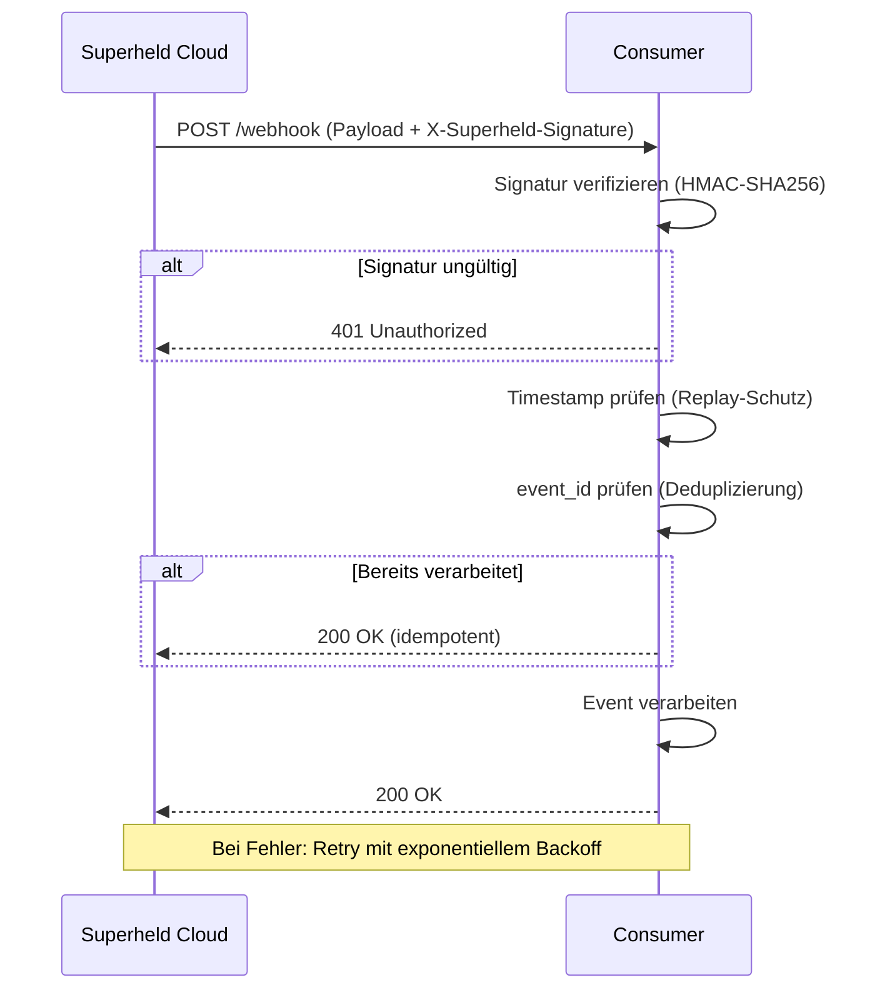

## Übersicht

Superheld liefert Detection Events in Echtzeit per Webhook an externe Systeme. Diese Seite dokumentiert die Sicherheitsmechanismen, Zustellsemantik und Empfehlungen für idempotente Consumer.

## Zustellsemantik

- **At-least-once Delivery** — Webhooks werden mindestens einmal zugestellt. Consumer müssen mit Duplikaten umgehen können.
- **Keine Reihenfolgegarantie** — Events können in abweichender Reihenfolge eintreffen. Consumer sollten `timestamp` zur Sortierung verwenden.

## Signaturverifizierung

Jeder Webhook-Request enthält einen HMAC-SHA256-Signatur-Header, mit dem Consumer die Authentizität und Integrität des Payloads prüfen können.

| Parameter       | Wert                                                     |
| --------------- | -------------------------------------------------------- |
| Header          | `X-Superheld-Signature`                                  |
| Algorithmus     | HMAC-SHA256                                               |
| Signing Input   | Der vollständige Request Body (UTF-8-kodiert)             |
| Signing Secret  | Wird bei der Webhook-Konfiguration generiert              |

**Beispiel (bash):**

```bash
echo -n "$PAYLOAD" | openssl dgst -sha256 -hmac "$SIGNING_SECRET"
```

:::caution
**Sicherheitshinweise:**
- Verwenden Sie einen zeitkonstanten Vergleich (constant-time comparison) zur Signaturprüfung, um Timing-Angriffe zu verhindern.
- Prüfen Sie die Signatur **vor** der Verarbeitung des Payloads.
- Speichern Sie den Signing Secret nicht in Klartext-Logs.
:::

## Replay-Schutz

:::note[TODO]
Klären ob Superheld einen Timestamp-Header (z.B. `X-Superheld-Timestamp`) mitsendet.
:::

**Empfohlene Implementierung (Consumer-seitig):**

1. Prüfen Sie den Zeitstempel im Payload (`timestamp`-Feld) gegen die aktuelle Uhrzeit.
2. Lehnen Sie Events ab, die älter als 5 Minuten sind (konfigurierbar).
3. Speichern Sie verarbeitete `event_id`-Werte für mindestens 24 Stunden zur Deduplizierung.

## Idempotenz

- Jedes Event enthält eine eindeutige `event_id`.
- Consumer sollten `event_id` als Idempotenz-Schlüssel verwenden.
- Empfohlener Ablauf: Vor Verarbeitung prüfen ob `event_id` bereits verarbeitet wurde.

:::note[TODO]
Klären ob Superheld einen dedizierten Idempotency-Key-Header mitsendet.
:::

## Retry-Verhalten und Dead Letter Queue

| Versuch | Wartezeit |
| ------- | --------- |
| 1       | 10 s      |
| 2       | 30 s      |
| 3       | 90 s      |
| 4       | 270 s     |
| 5       | 810 s     |

- Bei HTTP-Status >= 400: bis zu **5 Retries** mit exponentiellem Backoff (siehe Tabelle).
- Nach 5 Fehlversuchen: Event wird in die **Dead-Letter-Queue** verschoben.
- Im Dashboard als *unzustellbar* markiert.

:::note[TODO]
Klären ob fehlgeschlagene Webhooks manuell erneut ausgelöst werden können (Replay aus DLQ).
:::

## Payload-Format

Jeder Webhook-Request enthält ein JSON-Objekt mit dem kanonischen Event-Schema:

```json
{
  "event_id": "evt_7f2a9c",
  "timestamp": "2026-03-14T14:32:08Z",
  "device_id": "dev_3c8a1f",
  "threat_category": "phishing",
  "confidence": 0.94,
  "action_taken": "block",
  "policy_id": "pol_default",
  "severity": "high",
  "description": "Gefälschte Login-Seite erkannt und blockiert.",
  "indicators": ["sha256:a1b2c3d4e5f6..."],
  "metadata": {
    "agent_version": "2.4.1",
    "model_version": "detect-v3.2",
    "device_platform": "macos",
    "tenant_id": "org_5e9d2a"
  }
}
```

Kanonische `threat_category`-Werte: `phone_scam`, `social_engineering`, `malicious_app`, `phishing`, `remote_control`, `deepfake`.

## Webhook-Ablauf



## Konfiguration

- Dashboard: **Einstellungen &rarr; Integrationen &rarr; SIEM &rarr; Webhook**
- HTTPS-Endpunkt erforderlich
- Schweregrad-Filter: `low`, `medium`, `high`, `critical`

## Weiterführende Seiten

- [SIEM-Integration](/experts/siem-integration) — Vollständiger SIEM-Workflow
- [Telemetrie & Logging](/experts/telemetry) — Event-Schema und Aufbewahrung
- [API-Übersicht](/experts/api) — REST-API als Alternative zu Webhooks
- [OpenAPI-Spezifikation](/openapi.yaml)
