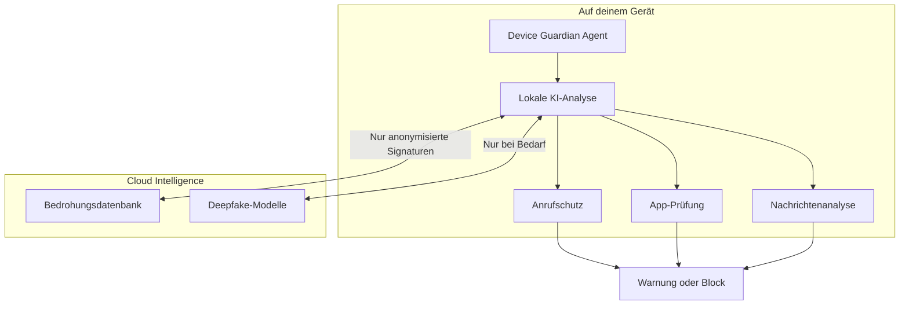

import { Steps } from '@astrojs/starlight/components';

Superheld ist eine digitale Schutzplattform. Sie erkennt und verhindert Betrug, Social Engineering, KI-Manipulation und gefährliche App-Installationen — bevor Schaden entsteht.

:::note
**In einem Satz:** Superheld ist ein Echtzeit-Schutzschild gegen die häufigsten digitalen Bedrohungen, denen Privatpersonen und Unternehmen heute ausgesetzt sind.
:::

---

## Warum gibt es Superheld?

Digitale Bedrohungen haben sich verändert. Die größten Risiken kommen nicht mehr von Viren auf der Festplatte — sie kommen von Menschen und Maschinen, die andere Menschen täuschen:

- **Telefonbetrug** verursacht in Deutschland jährlich Schäden in Milliardenhöhe. Opfer verlieren Ersparnisse durch gefälschte Bankanrufe.
- **Social Engineering** umgeht jede Firewall, weil es den Menschen angreift — nicht das System.
- **KI-generierte Deepfakes** machen es möglich, die Stimme eines Familienmitglieds oder Vorgesetzten in Echtzeit zu imitieren.
- **Fernsteuerungsbetrug** bringt Opfer dazu, Angreifern freiwillig Zugang zum eigenen Gerät zu geben.

Klassische Virenscanner und Spam-Filter erkennen diese Angriffe nicht. Superheld wurde entwickelt, um genau diese Lücke zu schließen.

---

## Für wen ist Superheld?

| Zielgruppe | Typisches Szenario |
|---|---|
| **Privatpersonen** | Schutz vor Phishing, Telefonbetrug und gefälschten Nachrichten |
| **Familien** | Kinder und ältere Familienmitglieder vor Betrug und gefährlichen Apps schützen |
| **Unternehmen** | Mitarbeiter gegen CEO-Fraud, Spear-Phishing und Social Engineering absichern |
| **Freiberufler** | Kundendaten und Geschäftskonten vor gezielten Angriffen schützen |
| **IT-Administratoren** | Schutzrichtlinien zentral verwalten und Bedrohungen über Geräteflotten hinweg erkennen |

---

## Kernfähigkeiten

  <a class="sh-feature-card">
    
Betrugsanruf-Erkennung

    
Analysiert eingehende Anrufe auf bekannte Betrugsmuster und warnt in Echtzeit.

  </a>
  <a class="sh-feature-card">
    
Social-Engineering-Schutz

    
Erkennt Manipulationstechniken in E-Mails, Nachrichten und Gesprächen.

  </a>
  <a class="sh-feature-card">
    
KI-Deepfake-Erkennung

    
Identifiziert synthetische Stimmen und KI-generierte Inhalte.

  </a>
  <a class="sh-feature-card">
    
App-Sicherheitsprüfung

    
Blockiert die Installation von Malware und warnt vor gefährlichen Apps.

  </a>
  <a class="sh-feature-card">
    
Fernsteuerungsschutz

    
Erkennt und blockiert Remote-Access-Versuche durch Betrüger.

  </a>
  <a class="sh-feature-card">
    
Gefährliche-Aktionen-Warnung

    
Warnt vor riskanten Überweisungen, Downloads und Berechtigungsänderungen.

  </a>

---

## Wie schützt Superheld?

Superheld kombiniert mehrere Schutzschichten, die zusammenarbeiten:

<Steps>
1. **Device Guardian Agent**

   Ein lokaler Schutzprozess auf deinem Gerät überwacht Anrufe, App-Installationen und Netzwerkaktivität.

2. **Lokale KI-Analyse**

   Bedrohungen werden direkt auf dem Gerät analysiert — deine Daten verlassen das Gerät nicht. Die lokale KI erkennt Betrugsmuster, Manipulationstechniken und verdächtige App-Aktivität.

3. **Cloud Intelligence (optional)**

   Für komplexe Bedrohungen wie neue Deepfake-Varianten fragt der Agent anonymisiert die Cloud-Datenbank ab. Es werden keine persönlichen Daten übertragen — nur kryptographische Signaturen.

4. **Warnung oder Block**

   Der Nutzer wird gewarnt und kann die Aktion bestätigen oder abbrechen. Bei eindeutigen Bedrohungen (bekannte Malware, aktive Fernsteuerung) wird automatisch blockiert.
</Steps>

---

## Was unterscheidet Superheld?

| | Superheld | Virenscanner | Spam-Filter | Call-Blocker |
|---|---|---|---|---|
| **Telefonbetrug** | Erkennt Muster in Echtzeit | Kein Schutz | Kein Schutz | Nur Nummernlisten |
| **Social Engineering** | Analysiert Manipulationstechniken | Kein Schutz | Teilweise | Kein Schutz |
| **KI-Deepfakes** | Erkennt synthetische Stimmen | Kein Schutz | Kein Schutz | Kein Schutz |
| **Malware** | Blockiert vor Installation | Nach Infektion | Kein Schutz | Kein Schutz |
| **Fernsteuerung** | Blockiert Remote-Access | Teilweise | Kein Schutz | Kein Schutz |
| **Datenschutz** | Lokale Analyse, kein Tracking | Cloud-basiert | Cloud-basiert | Daten an Dritte |

:::note
**Kein Tracking, keine Werbung.** Superheld finanziert sich durch Subscriptions. Deine Daten werden weder verkauft noch für Werbung genutzt.
:::

---

## Nächster Schritt

  <a href="/getting-started/installation" class="sh-feature-card" style="background: radial-gradient(ellipse at 50% 80%, rgba(16,185,129,0.10), transparent);">
    
Schutz aktivieren

    
In 5 Minuten auf deinem Gerät installiert.

  </a>
  <a href="/experts/threat-model" class="sh-feature-card" style="background: radial-gradient(ellipse at 50% 80%, rgba(37,99,235,0.10), transparent);">
    
Bedrohungsmodell

    
Welche Angriffe Superheld erkennt und wie.

  </a>

